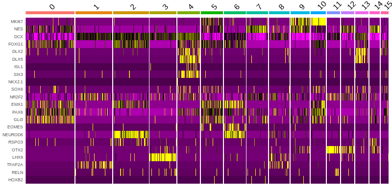
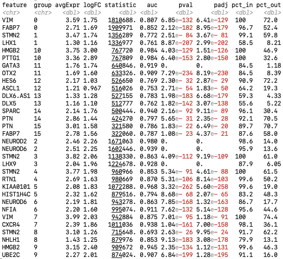

# Tutorial of single-cell RNA-seq data analysis in R
#### Compiled by Zhisong He (2020-04-25)
### Table of Content
  * [Introduction](#introduction)
  * [Preparation](#preparation)
  * [Now let's start Part 1](#now-lets-start-part-1)
    * [Step 0. Import Seurat package](#step-0-import-seurat-package)
    * [Step 1. Create a Seurat object](#step-1-create-a-seurat-object)
    * [Step 2. Quality control](#step-2-quality-control)
    * [Step 3. Normalization](#step-3-normalization)
    * [Step 4. Feature selection for following heterogeneity analysis](#step-4-feature-selection-for-following-heterogeneity-analysis)
    * [Step 5. Data scaling](#step-5-data-scaling)
    * [(Optional and advanced) Alternative step 3-5: to use SCTransform](#optional-and-advanced-alternative-step-3-5-to-use-sctransform)
    * [Step 6. Linear dimension reduction using principal component analysis (PCA)](#step-6-linear-dimension-reduction-using-principal-component-analysis-pca)
    * [Step 7. Non-linear dimension reduction for visualization](#step-7-non-linear-dimension-reduction-for-visualization)
    * [Step 8. Cluster the cells](#step-8-cluster-the-cells)
    * [Step 9. Annotate cell clusters](#step-9-annotate-cell-clusters)
    * [Step 10. Pseudotemporal cell ordering](#step-10-pseudotemporal-cell-ordering)
    * [Step 11. Save the result](#step-11-save-the-result)
    * [What else?](#what-else)
  * [Now starts Part 2: when you need to jointly analyze multiple scRNA-seq data sets](#now-starts-part-2-when-you-need-to-jointly-analyze-multiple-scRNA-seq-data-sets)
    * [Step 0. Load data](#step-0-load-data)
    * [Step 1. Merge the two data sets](#step-1-merge-the-two-data-sets)
    * [Step 2-1. Data integration using Seurat](#step-2-1-data-integration-using-seurat)
    * [Step 2-2. Data integration using Harmony](#step-2-2-data-integration-using-harmony)
    * [Step 2-3. Data integration using LIGER](#step-2-3-data-integration-using-liger)
    * [Step 2-4. Data integration using RSS to BrainSpan](#step-2-4-data-integration-using-rss-to-brainspan)
    * [Step 2-5. Data integration using CSS](#step-2-5-data-integration-using-css)
    * [Step 3. How shall we compare different data integration methods](#step-3-how-shall-we-compare-different-data-integration-methods)


## Introduction
After getting the scRNA-seq data of your samples, you will want to analyze it properly.

Multiple toolkits and analytic frameworks have been developed to facilitate scRNA-seq data analysis. These options include but are not limit to [Seurat](https://satijalab.org/seurat/), developed by Rahul Satija's Lab in R, and [scanpy](https://icb-scanpy.readthedocs-hosted.com/en/stable/), developed by Fabian Theis's Lab in Python. Both toolkits provide functions and rich parameter sets that serve most of the routine analysis that one usually does on scRNA-seq data. However, one should be aware that these analytic frameworks do not cover all the interesting analyses that one can do when analyzing data. It is also important to get to know other tools for scRNA-seq data analysis.

Since this is a tutorial for beginners, we will mostly introduce how to use Seurat to analyze your scRNA-seq data in R. At the end, we will also mention some other additional tools (e.g. presto, destiny, Harmony, simspec, etc.), which provide additional functionalities that you may miss if you only use Seurat.

## Preparation
This tutorial assumes that the sequencing data preprocessing steps, including base calling, mapping and read counting, have been done. 10x Genomics has its own analysis pipeline [Cell Ranger](https://support.10xgenomics.com/single-cell-gene-expression/software/pipelines/latest/what-is-cell-ranger) for data generated with the 10x Genomics Chromium Single Cell Gene Expression Solution. At the end of the Cell Ranger pipeline, a count matrix is generated. If your scRNA-seq data is generated using another technology (e.g. well-based experiments using Smart-Seq2 and others), the Cell Ranger pipeline is likely unapplicable, and you will have to find another solution to generate the count matrix.

As part of this tutorial, we are providing two data sets (DS1 and DS2), both generated using 10x Genomics and preprocessed using Cell Ranger. They are both public scRNA-seq data of human cerebral organoids and are part of the data presented in this [paper](https://www.nature.com/articles/s41586-019-1654-9). The first part of this tutorial, which includes most of the general analysis pipeline, is based on DS1, while the second part, which focuses on data integration and batch effect correction, is based on both data sets.

As a test for yourself, please try to apply what is learned in the first part to DS2 and only then continue with part 2 of the vignette. This will also give you an idea which types of cells are in DS2 and how comparable it is to DS1, before doing any data integration of both data sets.

## Now let's start Part 1
### Step 0. Import Seurat package
First of all, please make sure that Seurat is installed in your R.
```R
library(Seurat)
```
This imports your installed Seurat package into your current R session. No error should be seen but some verbose information is likely. If it warns you that the package is unavailable, please install Seurat first
```R
install.packages("Seurat")
library(Seurat)
```
### Step 1. Create a Seurat object
Seurat implements a new data type which is named 'Seurat'. It allows Seurat to store all the steps and results along the whole analysis. Therefore, the first step is to read in the data and create a Seurat object. Seurat has an easy solution for data generated using the 10x Genomics platform.
```R
counts <- Read10X(data.dir = "data/DS1/")
seurat <- CreateSeuratObject(counts, project="DS1")
```
What the ```Read10X``` function does is to read in the matrix and rename its row names and col names by gene symbols and cell barcodes, respectively. Alternatively, one can do this manually, which is probably what one would do when the data is not generated using 10x.
```R
library(Matrix)
counts <- readMM("data/DS1/matrix.mtx.gz")
barcodes <- read.table("data/DS1/barcodes.tsv.gz", stringsAsFactors=F)[,1]
features <- read.csv("data/DS1/features.tsv.gz", stringsAsFactors=F, sep="\t", header=F)
rownames(counts) <- make.names(features[,2], unique=T)
colnames(counts) <- barcodes

seurat <- CreateSeuratObject(counts, project="DS1")
```
If you look at the [Seurat tutorial](https://satijalab.org/seurat/v3.1/pbmc3k_tutorial.html), you would notice that some extra options are added to the ```CreateSeuratObj``` function, such as ```min.cells``` and ```min.features```. When these two parameters are set, an initial filtering is applied to the data, removing right from the beginning all genes with reads detected in too few cells, as well as cells with too few genes detected. This is fine, but I personally recommend to keep all genes (i.e. default or ```min.cells = 0```)

### Step 2. Quality control
After creating the Seurat object, the next step is to do quality control on the data. The most common quality control is to filter out
1. Cells with too few genes detected. They usually represent cells which are not sequenced deep enough for reliable characterization.
2. Cells with too many genes detected. They may represent doublets or multiplets (i.e. two or more cells in the same droplet, therefore sharing the same cell barcode).
3. Cells with high mitochondrial transcript percentage. As most of the scRNA-seq experiments use oligo-T to capture mRNAs, mitochondrial transcripts should be relatively under-representative due to their lack of poly-A tails, but it is unavoidable that some mitochondrial transcripts are captured. Meanwhile, there is also some evidence that stable poly-A tails exist in some mitochondrial transcripts but serve as a marker for degradation (e.g. this [paper](https://mcb.asm.org/content/25/15/6427.long)). Together, cells with high mitochondrial transcript percentage likely represent cells under stress (e.g. hypoxia) which produce a lot of mitochondria, or which produce an abnormally high amount of truncated mitochondrial transcripts.

While numbers of detected genes are summarized by Seurat automatically when creating the Seurat object (with nFeature_RNA being the number of detected genes/features; nCount_RNA being the number of detected transcripts), one needs to calculate mitochondial transcript percentages manually. Still, Seurat provides an easy solution
```R
seurat[["percent.mt"]] <- PercentageFeatureSet(seurat, pattern = "^MT[-\\.]")
```

Please note that there is no one-size-fits-all filtering criteria, as the normal ranges of these metrics can vary dramatically from one experiment to another, depending on sample origin as well as reagents and sequencing depths. One suggestion here is to **ONLY FILTER OUT OUTLIER CELLS**, i.e. the **minority** of cells with certain QC metrics clearly above or below the majority of cells. To do that, one needs to first know how these values are distributed in the data. One can look at the distribution by creating a violin plot for each of the metrics.
```R
VlnPlot(seurat, features = c("nFeature_RNA", "nCount_RNA", "percent.mt"), ncol = 3)
```
<br/><br/>
Or if you don't like the dots (individual cells)
```R
VlnPlot(seurat, features = c("nFeature_RNA", "nCount_RNA", "percent.mt"), ncol = 3, pt.size=0)
```
<br/><br/>

And as one would expect, number of detected genes and number of detected transcripts are well correlated across cells while mitochondrial transcript percentage is not.
```R
library(patchwork)
plot1 <- FeatureScatter(seurat, feature1 = "nCount_RNA", feature2 = "percent.mt")
plot2 <- FeatureScatter(seurat, feature1 = "nCount_RNA", feature2 = "nFeature_RNA")
plot1 + plot2
```
<span style="font-size:0.8em">*P.S. patchwork is an R package developed to facilitate layout of plots produced by ggplot2 (Seurat uses ggplot2 to produce plots if you use the plotting functions in the Seurat package). Without patchwork, it is illegal to run ```plot1 + plot2```.*</span>
<br/><br/>

Due to the correlation of gene number and transcript number, we only need to set a cutoff to either one of these metrics, combined with an upper threshold of mitochondrial transcript percentage, for the QC. For instance, for this data set, a detected gene number between 500 and 5000, and a mitochondrial transcript percentage lower than 5% would be quite reasonable, but it is fine to use different thresholds.
```R
seurat <- subset(seurat, subset = nFeature_RNA > 500 & nFeature_RNA < 5000 & percent.mt < 5)
```

It is worth to mention that sometimes more QC may need to be applied. One potential issue is the presence of doublets. As the amount of captured RNA varies a lot from cell to cell, doublets don't always show a higher number of detected genes or transcripts. There are several tools available now, which are designed to predict whether a 'cell' is indeed a singlet or actually a doublet/multiplet. [DoubletFinder](https://github.com/chris-mcginnis-ucsf/DoubletFinder), for instance, predicts doublets by first constructing artificial doublets by randomly averaging cells in the data, and then for each cell testing whether it is more similar to the artificially doublets or not. This helps with the decision whether a cell is likely a doublet or not. Similarly, mitochondrial transcript percentage may not be sufficient to filter out stressed or unhealthy cells. Sometimes one would needs to do extra filtering, e.g. based on [the machine learning based prediction](https://www.nature.com/articles/s41586-019-1654-9#Sec2).


### Step 3. Normalization
Similar to bulk RNA-seq, the amount of captured RNA is different from cell to cell, and one should therefore not directly compare the number of captured transcripts for each gene between cells. A normalization step, aiming to make gene expression levels between different cells comparable, is therefore necessary. The most commonly used normalization in scRNA-seq data analysis is very similar to the concept of TPM (Transcripts Per Million reads) - one normalizes the feature expression measurements for each cell to the total expression, and then multiplies this by a scale factor (10000 by default). At the end, the resulting expression levels are log-transformed so that the expression values better fit a normal distribution. It is worth to mention that before doing the log-transformation, one pseudocount is added to every value so that genes with zero transcripts detected in a cell still present values of zero after log-transform.
```R
seurat <- NormalizeData(seurat)
```
In principle there are several parameters one can set in the ```NormalizeData``` function, but most of the time the default settings are good.

### Step 4. Feature selection for following heterogeneity analysis
The biggest advantage of single-cell as compared to bulk RNA-seq is the potential to look into cellular heterogeneity of samples, by looking for cell groups with distinct molecular signatures. However, not every gene has the same level of information and the same contribution when trying to identify different cell groups. For instance, genes with low expression levels, and those with similar expression levels across all cells, are not very informative and may dilute differences between distinct cell groups. Therefore, it is necessary to perform a proper feature selection before further exploring the scRNA-seq data.

In Seurat, or more general in scRNA-seq data analysis, this step usually refers to the identification of highly variable features/genes, which are genes with the most varied expression levels across cells.
```R
seurat <- FindVariableFeatures(seurat, nfeatures = 3000)
```
By default, Seurat calculates the standardized variance of each gene across cells, and picks the top 2000 ones as the highly variable features. One can change the number of highly variable features easily by giving the ```nfeatures``` option (here the top 3000 genes are used).

There is no good criteria to determine how many highly variable features to use. Sometimes one needs to do some iterations to pick the number that gives the most clear and interpretable result. Most often, a value between 2000 to 5000 is OK and using a different value usually don't affect the results too much.

One can visualize the result in a variable feature plot, but this is optional.
```R
top_features <- head(VariableFeatures(seurat), 20)
plot1 <- VariableFeaturePlot(seurat)
plot2 <- LabelPoints(plot = plot1, points = top_features, repel = TRUE)
plot1 + plot2
```
<br/><br/>

### Step 5. Data scaling
Since different genes have different base expression levels and distributions, their contribution to the analysis is different if no data transformation is performed. This is something we do not want as we don't want our analysis to only depend on highly expressed genes. Therefore a scaling is applied to the data using the selected features, just like one usually does in any data science field.
```R
seurat <- ScaleData(seurat)
```

At this step, one can also remove unwanted source of variation from the data set by setting the parameter ```var.to.regress```. For instance,
```R
seurat <- ScaleData(seurat, vars.to.regress = c("nFeature_RNA", "percent.mt"))
```
Variables which are commonly considered to regress out include the number of detected genes/transcripts (nFeature_RNA / nCount_RNA), mitochondrial transcript percentage (percent.mt), and cell cycle related varaibles (see below). What it tries to do is to firstly fit a linear regression model, using the normalized expression level of a gene as the dependent variable, and the variables to be regressed out as the independent variables. Residuals of the linear model are then taken as the signals with the linear effect of the considered variables removed. However, doing so dramatically slow down the whole process, and the result is not necessarily improved as the unwanted variation may be far from linear. Therefore, a common suggestion is to first of all not to do any regress-out, check the result, and if the unwanted variation source dominated the heterogeneity, try to regress out the variable and see whether the result improves.

### (Optional and advanced) Alternative step 3-5: to use SCTransform
One problem of doing the typical log-normalization is [introducing the zero-inflation artifact](https://genomebiology.biomedcentral.com/articles/10.1186/s13059-019-1874-1) to the scRNA-seq data. To better resolve this issue, Hafemeister and Satija introduced an R package ```sctransform```, which uses a regularized negative binomial regression model to normalize scRNA-seq data. Seurat has a wrapper function ```SCTransform```.
```R
seurat <- SCTransform(seurat, variable.features.n = 3000)
```
The ```variable.features.n``` controls the number of highly variable features to identify. One can also put in unwanted variation source to the model to try to remove them. For instance,
```R
seurat <- SCTransform(seurat,
                      vars.to.regress = c("nFeature_RNA", "percent.mt"),
                      variable.features.n = 3000)
```
This operation combines normalization, scaling and highly variable feature identification so it essentially replaces the above Step 3 to step 5. Drawbacks of running ```SCTransform``` include
1. It is slow.
2. It makes the normalized expression measurements data-dependent. In the typical procedure, the normalization only relies on the cell itself; in ```SCTransform```, however, information from the other cells in the same data set is involved during normalization. This potentially introduces problems when multiple data sets are needed to be compared, as technically speaking, the normalized expression measurements of two data sets normalized using ```SCTransform``` on their own are not comparable.
3. There are steps in ```SCTransform``` which involve random sampling to speed up the computation. It means there is stochastics in ```SCTransform``` so the result is different from one time to another, even if it is applied to the same data set.

Therefore, use it wisely. There are some scenarios that SCTransform would be recommended to try. For instance, when you do differential expression analysis between cells of two conditions, and get results with dramatic biased DE directionality, i.e. huge amount of genes with increased expression but very few with decreased expression, if at the same time the two conditions have every different data coverage (e.g. the condition with a lof of decreased expression have significantly smaller number of detected gene/transcript numbers), such a biased DE result may be indeed artifacts introduced during typical normalization procedure. In that case, using SCTransform may help to reduce such an artifact.

### Step 6. Linear dimension reduction using principal component analysis (PCA)
In principle one can start to look at cell heterogeneity after identification of highly variable genes and scaling the data. However, applying a linear dimension reduction before doing any further analysis is strongly recommended and sometimes even seen as compulsory. The benefit of doing such a dimension reduction includes but not limits to:
1. The data becomes much more compact so that computation becomes much faster.
2. As scRNA-seq data is intrincically sparse, summarizing measurements of related features greatly enhances the signal robustness

Drawback? Basically nothing. Well, one needs some extra lines in the script and needs to decide the number of reduced dimension to use in the following analysis, but that's it. If so, what's the point not to do it?

For scRNA-seq data, the linear dimension reduction mostly refers to principal component analysis, or PCA.
```R
seurat <- RunPCA(seurat, npcs = 50)
```
In principle, the number of PCs in your data that one can calculate is the smaller value between the number of highly variable genes and the number of cells. However, most of these PCs are not informative and only represent random noise. Only the top PCs are informative and represent differences among cell groups. Therefore, instead of calculating all possible PCs, Seurat uses truncated PCA to only calculate the first PCs, by default the top 50 PCs. One can change that by setting the ```npcs``` parameter.

Even then, one doesn't necessarily use all the calculated PCs. Indeed, determinting how many top PCs to use is an art. There is no golden standard, and everyone has his/her own understanding. Usually, people use the elbowplot to assist making the decision.
```R
ElbowPlot(seurat, ndims = ncol(Embeddings(seurat, "pca")))
```
<span style="font-size:0.8em">*P.S. ```Embeddings``` is the function in Seurat to obtain the dimension reduction result given the name of the dimension reduction of interest. By default, the ```RunPCA``` function stores the PCA result in the embedding called 'pca', with each column being one PC. So here it tells Seurat to make the elbowplots to show the standarized variation of all the PCs that are calculated*</span>

<br/><br/>

As it's defined, low-rank PCs have smaller standard deviations. However, such decrease of standard deviation is not linear. It drops dramatically at the very beginning, and then slow down and soon becomes pretty flat. One would then assume that the first phase of the curve represent the 'real' signal related to cell group differences, while the second phase represent mostly fluctuation of measurement or the stochastic nature of individual cells. To that perspective, choosing the top-15 PCs is probably good and PCs ranked lower than 20 look quite unnecessary. However, even though this is a pretty good reference, it is far from perfect:
  * It is very difficult to precisely define the elbow point or turning point of the curve, as it is usually not a perfect elbow.
  * Higher-ranked PCs do explain more variation than lower-ranked PCs, but in real world more explained variations don't necessaily mean more informative. Sometimes there are interesting but weak signals buried among noises and can only recovered in some lower-ranked PCs.

There is another procedure implemented in Seurat called ```JackStraw``` which can also serve as another reference. However, to our experience, it is very slow because it relies on data permutations and essentially it does not provide much more information than the elbow plot. It does estimates statistical significance of each PC but similarly, a 'significant' PC doesn't mean it is informative. And when cell number increases, more and more PCs become statistically 'significant' even though their explained variation is not substantial. People interested in this method can take a look at the Seurat [vignette](https://satijalab.org/seurat/v3.1/pbmc3k_tutorial.html).

Besides making the decision unbiasly, one can also check for each of the top PCs which genes are mostly contributing. This can be informative if one knows these genes and the biology behind. This gives opportunities to understand or guess the biological implication of each of the top PCs, so that one can pick those representing useful information. 
```R
PCHeatmap(seurat, dims = 1:20, cells = 500, balanced = TRUE, ncol = 4)
```
<br/><br/>
Please be aware that it is not recommended to choose ONLY PCs represented by the "interesting" genes. There is a huge chance one misses interesting but unexpected phenomena by doing that.

In this example, we would use the top-20 PCs for the following analysis. Again, it is absolutely fine to use more or fewer PCs, and in practice this sometimes needs some iteration to make the final decision. Meanwhile, for most of the data, a PC number ranging from 10 to 50 would be reasonable and in many cases it won't affect the conclusion very much (but sometimes it will, so still be cautious).

### Step 7. Non-linear dimension reduction for visualization
A linear dimension reduction has both pros and cons. The good side is that every PC is a linear combination of gene expression so interpretation of PCs are straightforward. Also the data is compressed but not disorted, therefore information in the data is largely remained. The bad side, on the other hand, is that one usually needs more than 10 PCs to cover most of the information. This is fine for most of the analysis, but not for visualization where it is impossible to go over three dimensions for ordinary persons.

To overcome this issue, non-linear dimension reductions is introduced. The most commonly used non-linear dimension reduction methods in scRNA-seq data analysis are t-distributed Stochastic Neighbor Embedding (t-SNE) and Uniform Manifold Approximation and Projection (UMAP). Both methods try to place every sample in a low-dimensional space (2D/3D), so that distances or neighborhood relationships between different samples (here cells) in the original space are largely retained in the low-dimensional space. The detailed mathematically descriptions of the two methods are out of the scope of this tutorial, but for those who are interested in, you may check this [video](https://www.youtube.com/watch?v=RJVL80Gg3lA&list=UUtXKDgv1AVoG88PLl8nGXmw) for tSNE, and this [blog](https://towardsdatascience.com/how-exactly-umap-works-13e3040e1668) of Nikolay Oskolkov for UMAP. There are also more methods to create other low-dimensional embeddings for visualization, including but not limiting to [SPRING](https://kleintools.hms.harvard.edu/tools/spring.html), [PHATE](https://phate.readthedocs.io/en/stable/). Now let's focus on tSNE and UMAP which Seurat has included. The top PCs in the PCA analysis are used as the input to create a tSNE and UMAP embedding of the data.
```R
seurat <- RunTSNE(seurat, dims = 1:20)
seurat <- RunUMAP(seurat, dims = 1:20)
```
<span style="font-size:0.8em">*P.S. technically one can directly use the scaled expression of highly variable genes for these. It is however not recommended, as it is much slower and probably more noisy.*</span>

The results can be then visualized:
```R
plot1 <- TSNEPlot(seurat)
plot2 <- UMAPPlot(seurat)
plot1 + plot2
```
<br/><br/>
It is a hot topic whether tSNE or UMAP is superior to the other (for instance, this [blog](https://towardsdatascience.com/tsne-vs-umap-global-structure-4d8045acba17) of Nikolay Oskolkov and this [paper](https://www.biorxiv.org/content/10.1101/2019.12.19.877522v1) by Kobak and Linderman). To our experience, they both have their pros and cons and neither always work better than the other one. TSNE provides great visualization when cells form distinct cell groups, while UMAP perserves trajectory-like structure better when data contains 'continuum', e.g. the continuous cell state change during development and differentiation. It is therefore good to try both, and choose the one works better for your data.

Once the tSNE or UMAP embedding is created, one can start to check whether certain cell types or cell states exist in the data, by doing feature plots of some known canonical markers of the cell types of interest.
```R
plot1 <- FeaturePlot(seurat, c("MKI67","NES","DCX","FOXG1","DLX2","EMX1","OTX2","LHX9","TFAP2A"),
                     ncol=3, reduction = "tsne")
plot2 <- FeaturePlot(seurat, c("MKI67","NES","DCX","FOXG1","DLX2","EMX1","OTX2","LHX9","TFAP2A"),
                     ncol=3, reduction = "umap")
plot1 / plot2
```
<span style="font-size:0.8em">*P.S. with ```patchwork``` imported, ```plot1 / plot2``` generates the plotting layout that plot1 is put above plot2.*</span>

<br/><br/>
For people who are not familiar with those genes:
  * MKI67: a marker of G2M phase of cell cycle
  * NES: a neural progenitor marker
  * DCX: a pan-neuron marker
  * FOXG1: a telencephalon marker
  * DLX2: a ventral telencephalon marker
  * EMX1: a dorsal telencephalon (cortex) marker
  * OTX2: a diencephalon and midbrain inhibitory neuron marker
  * LHX9: a diencephalon and midbrain excitatory neuron marker
  * TFAP2A: a midbrain-hindbrain boundary and hindbrain marker

So now we have some idea about what kinds of cells exist in this data.

### Step 8. Cluster the cells
Doing feature plot of markers is usually a good way to start with when exploring scRNA-seq data. However, to more comprehensively understand the underlying heterogeneity in the data, it is necessary to identify cell groups with an unbiased manner. This is what clustering does. In principle, one can apply any clustering methods, including those widely used in bulk RNA-seq data analysis such as hierarchical clustering and k-means, to the scRNA-seq data. However, in practice, this is very difficult, as the sample size in scRNA-seq data is too much larger (one 10x experiment usually gives several thousands of cells). It would be extremely slow to use these methods. In addition, due to the intrinsic sparseness of scRNA-seq data, even if data is denoised by dimension reduction like PCA, differences between different cells are not as well quantitative as those of bulk RNA-seq data. Therefore, the more commonly used clustering methods in scRNA-seq data analysis is graph-based community identification algorithm. Here, graph is the mathematical concept, where there is a set of objects, and some pairs of these objects are related with each other; or in a simplified way, a network of something, and here, a network of cells.

First of all, a k-nearest neighbor network of cells is generated. Every cells is firstly connected to cells with the shortest distances, based on their corresponding PC values. Only cell pairs which are neighbors of each other are considered as connected. Proportion of shared neighbors between every cell pairs is then calculated and used to describe the strength of the connection between two cells. Weak connections are trimmed. This gives the resulted Shared Nearest Neighbor (SNN) network. In practice, this is very simple in Seurat.
```R
seurat <- FindNeighbors(seurat, dims = 1:20)
```

With the network constructed, the louvain community identification algorithm is applied to the netowkr to look for communities in the network, i.e. cell groups that cells in the same group tend to connect with each other, while connections between cells in different groups are sparse.
```R
seurat <- FindClusters(seurat, resolution = 1)
```
Here, the ```resolution``` parameter is used to control whether the major and coarsed cell groups (e.g. major cell types), or the smaller but finer cell groups are returned (e.g. cell subtypes). The commonly used resolution ranges between 0.1 and 1, and which is the best option largely depends on the aim of the analysis. Here, a high resolution parameter is used to get a finer clustering. One can run multiple times of the ```FindClusters``` function with different resolutions. The newest clustering result can be obtained by ```Idents(seurat)``` or ```seurat@active.ident```. Other clustering results are also stored, as different columns in the meta.data slot (```seurat@meta.data```)

Next is to visualize the clustering result using the tSNE and UMAP embeddings that are generated before.
```R
plot1 <- DimPlot(seurat, reduction = "tsne", label = TRUE)
plot2 <- DimPlot(seurat, reduction = "umap", label = TRUE)
plot1 + plot2
```
<span style="font-size:0.8em">*P.S. if you don't want to see the cluster labels, set ```label = FALSE``` or remove it (by default ```label``` is set to FALSE).*</span>

<br/><br/>

### Step 9. Annotate cell clusters
Clustering the cells gives a identity label to each cell, and we can assume that cells with the same label are similar to each other and therefore can be seen to be of the same cell type or cell state. The next question is which exact cell types or cell states these cell clusters are representing. This is not an easy question to answer, and usually there is no perfect answer. There are several options one can try to resolve this issue. For instance,
1. Check the expression of canonical cell type and cell state markers in these clusters;
2. Identify signature genes, or marker genes, of each identified cell cluster. Based on the identified cluster marker genes, one can do literature search, enrichment analysis or do experiment (or ask people around) for annotation;
3. For each cluster, compare its gene expression profile with existing reference data.

Obviously, the first method requires some prior knowledge of the system being measured. One needs to have a list of convincing markers which are well accepted by the field. Particularly for the system of the example data set (cerebral organoid), some of the markers have been listed above. Some more markers include 
  * GLI3: dorsal telencephalic NPC marker
  * EOMES: dorsal intermediate progenitor (IP) marker
  * NEUROD6: dorsal excitatory neuron marker
  * DLX5: ganglionic eminence (GE) marker
  * ISL1: lateral ganglionic eminence (LGE) inhibitory neuron marker
  * SIX3 / NKX2-1 / SOX6: medial ganglionic eminence (MGE) inhibitory neuron marker
  * NR2F2: caudal ganglionic eminence (CGE) inhibitory neuron marker
  * RSPO3: diencephalon marker
  * RELN: Cajal-Retzius cell marker
  * HOXB2 & HOXB5: hindbrain marker

The easiest to visualize expression of marker genes of interest across cell clusters is probably by a heatmap.
```R
ct_markers <- c("MKI67","NES","DCX","FOXG1", # G2M, NPC, neuron, telencephalon
                "DLX2","DLX5","ISL1","SIX3","NKX2.1","SOX6","NR2F2", # ventral telencephalon related
                "EMX1","PAX6","GLI3","EOMES","NEUROD6", # dorsal telencephalon related
                "RSPO3","OTX2","LHX9","TFAP2A","RELN","HOXB2","HOXB5") # non-telencephalon related
DoHeatmap(seurat, features = ct_markers) + NoLegend()
```
<br/><br/>
Next, in order to do annotation in a more unbiased way, we should firstly identify cluster markers for each of the cell cluster identified. In Seurat, this can be done using the ```FindAllMarkers``` function. What it does is for cell cluster, to do differential expression analysis (with Wilcoxon's rank sum test) between cells in the cluster and cells in other clusters.
```R
cl_markers <- FindAllMarkers(seurat, only.pos = TRUE, min.pct = 0.25, logfc.threshold = log(1.2))
library(dplyr)
cl_markers %>% group_by(cluster) %>% top_n(n = 2, wt = avg_logFC)
```
<br/><br/>
Because of the nature of large sample size in scRNA-seq data (one cell is one sample), it is strongly recommended to not only look at p-values, but also detection rate of the gene in the cluster (```pct```) and fold change (```logfc```) between cells in and outside the cluster. That's why there are options ```min.pct``` and ```logfc.threshold``` in the function to require threshold on the effect size.

<span style="font-size:0.8em">*P.S. you need to have ```dplyr``` package installed and imported to use the pipe feature. Alternatively, one can use the old-school ```lapply``` combinations, e.g. ```do.call(rbind, lapply(split(cl_markers, cl_markers$cluster), function(x) x[order(x$avg_logFC, decreasing=T)[1:2],]))```, but probably not many people like it.*</span>

You may have felt that this process takes quite a while. There is a faster solution by the other package called "presto".
```R
library(presto)
cl_markers_presto <- wilcoxauc(seurat)
cl_markers_presto %>%
    filter(logFC > log(1.2) & pct_in > 20 & padj < 0.05) %>%
    group_by(group) %>%
    arrange(desc(logFC), .by_group=T) %>%
    top_n(n = 2, wt = logFC) %>%
    print(n = 40, width = Inf)
```
<br/><br/>
<span style="font-size:0.8em">*P.S. The latest presto requires DESeq2 to be installed. If you think Wilcoxon test is sufficient, an older version of presto would be enough. Do it by ```devtools::install_github("immunogenomics/presto", ref = "4b96fc8")```.*</span>

The ```presto``` output is very similar to the native solution of Seurat, but with some additional metrics.

No matter with which method, the identified top cluster markers can be next visualized by a heatmap
```R
top10_cl_markers <- cl_markers %>% group_by(cluster) %>% top_n(n = 10, wt = avg_logFC)
DoHeatmap(seurat, features = top10_cl_markers$gene) + NoLegend()
```
<br/><br/>
One can also check those markers of different clusters in more details, by doing feature plot or violin plot for them. For instance, we can use NEUROD2 and NEUROD6 as very strong markers of cluster 2, so let's take a closer look
```R
plot1 <- FeaturePlot(seurat, c("NEUROD2","NEUROD6"), ncol = 1)
plot2 <- VlnPlot(seurat, features = c("NEUROD2","NEUROD6"), pt.size = 0)
plot1 + plot2 + plot_layout(widths = c(1, 2))
```
<br/><br/>
<br/><br/>
So it seems that NEUROD2 and NEUROD6 are not only highly expressed in cluster 2, but also in cluster 6. And if you still remember where these clusters are in the tSNE/UMAP embedding, you will find that these two clusters are next to each other, suggesting that they may represent cell types related to each other and both show strong dorsal telencephalon identity. Their separation likely represents their maturity states. Neurons in cluster 6 is probably less mature as they are connected to cluster 0, which is likely dorsal telencephalic NPCs. In addition, cluster 6 show high expression of EOMES, a dorsal telencephalic IP marker. Taken them all together, we can quite confidently say, that cluster 0, 6, and 2 all represent dorsal telencephalic cells, cluster 0 is the progenitors, cluster 6 is the intermediate progenitors and cluster 2 is the neurons.

If we look at the other side of cluster 0, there is cluster 5 connected, and then it is cluster 10. Now look at the heatmap again, you will find that although they have their distinct markers and expression patterns, they all present similar signatures of dorsal telencephalic NPCs. On top of it, cells in cluster 5 and cluster 10 show high expression of cell cycle G2M phase markers. This suggests that cluster 5 and cluster 10 are also dorsal telencephalic NPCs, and their separation from cluster 0 is likely due to their difference on cell cycle phases.

Interesting, all these cells in cluster 10, 5, 0, 6 and 2 form a trajectory-like structure in the UMAP. It likely reflects the differentiation and neuron maturation process. We will come back to this soon.

This is how cell cluster annotation is usually done. You may feel it too subjective and too much rely on personal judgement. In that case, there are also more objective and unbiased ways to do automated or semi-automated annotation. There are tools emerging, such as [Garnett](https://cole-trapnell-lab.github.io/garnett/) developed by Cole Trapnell's lab, and [Capybara](https://github.com/morris-lab/Capybara) developed by Samantha Morris' lab. These tools use similar strategy, to firstly standarize cell type annotations of existing scRNA-seq data, train one or multiple prediction model using the annotated data, and then apply the models to a new data set for the automated annotation. Currently, those tools have limitations. Their application is usually limited to major cell types of commonly studied organs, and their performance largely depends on data and annotation quality of the training data sets. Details of using these tools won't be discussed here, but for people who are interested, it is good to try.

It is worth to mention that one doesn't always need to use a complex machine learning model trained on other scRNA-seq data to assist annotation of cell clusters. Caculating correlations of gene expression profiles of cells or cell clusters in the scRNA-seq data to those of bulk references can also be very informative. One example is [VoxHunt](https://github.com/quadbiolab/VoxHunt) developed by our group, which correlates expression profiles of cells or cell clusters to the in situ hybridization atlas of developing mouse brain in Allen Brain Atlas. This can be very helpful for annotating scRNA-seq data of cerebral organoid samples.

<span style="font-size:0.8em">*P.S. To do this the voxhunt package needs to be installed first. Please follow the instruction on the page and don't forget to also download the ABA ISH data, which also has a link on the page. Replace ```ABA_data``` below by the path towards the folder of the downloaded data.*</span>
```R
library(voxhunt)
load_aba_data('ABA_data')
genes_use <- variable_genes('E13', 300)$gene
vox_map <- voxel_map(seurat, genes_use=genes_use)
plot_map(vox_map)
```
<br/><br/>

From the projection we can also make similar conclusion, that cluster 10, 5, 0, 6 and 2 are belong to dorsal telencephalon. At the end, we can do a rough annotation for all clusters.
<style>
td {
  font-size: 0.8em
}
</style>

| Cluster | Annotation |
|---------|:----------:|
| 0 | Dorsal telen. NPC |
| 1 | Midbrain-hindbrain boundary neuron |
| 2 | Dorsal telen. neuron |
| 3 | Dien. and midbrain excitatory neuron |
| 4 | MGE neuron |
| 5 | G2M dorsal telen. NPC |
| 6 | Dorsal telen. IP |
| 7 | Dien. and midbrain NPC |
| 8 | Dien. and midbrain IP and excitatory early neuron |
| 9 | G2M Dien. and midbrain NPC |
| 10 | G2M dorsal telen. NPC |
| 11 | Dien. and midbrain inhibitory neuron |
| 12 | Dien. and midbrain IP and early inhibitory neuron |
| 13 | Ventral telen. neuron |
| 14 | Unknown 1 |
| 15 | Unknown 2 |

We can replace the cell cluster labels by the annotation, but this is optional
```R
new_ident <- setNames(c("Dorsal telen. NPC",
                        "Midbrain-hindbrain boundary neuron",
                        "Dorsal telen. neuron",
                        "Dien. and midbrain excitatory neuron",
                        "MGE neuron","G2M dorsal telen. NPC",
                        "Dorsal telen. IP","Dien. and midbrain NPC",
                        "Dien. and midbrain IP and excitatory early neuron",
                        "G2M Dien. and midbrain NPC",
                        "G2M dorsal telen. NPC",
                        "Dien. and midbrain inhibitory neuron",
                        "Dien. and midbrain IP and early inhibitory neuron",
                        "Ventral telen. neuron",
                        "Unknown 1",
                        "Unknown 2"),
                      levels(seurat))
seurat <- RenameIdents(seurat, new_ident)
DimPlot(seurat, reduction = "umap", label = TRUE) + NoLegend()
```
<br/><br/>

### Step 10. Pseudotemporal cell ordering
We finally move to the next step. As mentioned above, the trajectory-like structure formed by cells in the dorsal telencephalon clusters we can see in the UMAP embedding likely represents differentiation and maturation of dorsal telencephalic excitatory neurons. This is likely a continuous process, and therefore it is more proper to consider it as a continuous trajectory rather than distinct clusters. In that case, it is more informative to perform so-called pseudotemporal cell ordering, or pseudotime analysis on those cells.

So far, there are quite a lot of different methods for pseudotime analysis. Commonly used methods include diffusion map (implemented in ```destiny``` package in R) and [monocle](http://cole-trapnell-lab.github.io/monocle-release/). Here, we will show the example of using ```destiny``` to do pseudotime analysis on the dorsal telencephalic cells in the data. The mathematics of diffusion map and diffusion pseudotime (dpt) is out of the scope of this tutorial, but for those who are interested, please refer to the [DPT paper](https://www.nature.com/articles/nmeth.3971) by Fabian Theis's lab.

First of all, cells of interest are extracted. Afterwards, we re-identify highly variable genes for the subset cells, as genes representing differences between dorsal telencephalic cells and other cells are no longer informative
```R
seurat_dorsal <- subset(seurat, subset = RNA_snn_res.1 %in% c(0,2,5,6,10))
seurat_dorsal <- FindVariableFeatures(seurat_dorsal, nfeatures = 2000)
```
<span style="font-size:0.8em">*P.S. if you are sure that the clustering result you want to use to subset cells is the newest one, using ```seurat_dorsal <- subset(seurat, idents = c(0,2,5,6,10))``` gives you the same result. With this way it looks for cells in the active clustering result in the Seurat object, which is stored as ```seurat@active.ident```. In the metadata table (```seurat@meta.data```), there is also a column called ```seurat_clusters``` which shows the newest clustering result, and is updated every time when a new clustering is done. However, be careful. In real world when many iterations of parameter tryings are done, it is very common that one gets lost. So if you want to do it in this way, double check before doing the subset, to make sure that the active clustering result is the one to use.*</span>

As you may have noticed, there are two clusters of dorsal telencephalic NPCs separated from the third cluster because they are at different phase of cell cycle. Since we are interested in the general molecular changes during differentiation and maturation, the cell cycle changes may strongly confound the analysis. We can try to reduce cell cycle effect by excluding cell cycle related genes from the identified highly variable gene list.
```R
VariableFeatures(seurat) <- setdiff(VariableFeatures(seurat), unlist(cc.genes))
```
<span style="font-size:0.8em">*P.S. ```cc.genes``` is a list that is automatically imported by Seurat when the package is imported. It includes genes reported in this [paper](https://genome.cshlp.org/content/25/12/1860).*</span>

We can then check how the data look like, by creating a new UMAP embedding and do some feature plots
```R
seurat_dorsal <- RunPCA(seurat_dorsal) %>% RunUMAP(dims = 1:20)
FeaturePlot(seurat_dorsal, c("MKI67","GLI3","EOMES","NEUROD6"), ncol = 4)
```
<br/><br/>

Not so great. The G2M cells are no longer in separated clusters, but it still confounds the cell type differentiation trajectory. For instance, EOMES+ cells are distributed separately in two groups. We need to further reduce the cell cycle effect.

As briefly mentioned above, the ```ScaleData``` function has the option to include variables representing sources of unwanted variations. We can try to use that to further reduce the cell cycle influence; but before that, we need to generate cell-cycle-related scores for every cell to describe their cell cycle status.
```R
seurat_dorsal <- CellCycleScoring(seurat_dorsal,
                                  s.features = cc.genes$s.genes,
                                  g2m.features = cc.genes$g2m.genes,
                                  set.ident = TRUE)
seurat_dorsal <- ScaleData(seurat_dorsal, vars.to.regress = c("S.Score", "G2M.Score"))
```

We can then check how the data look like, by creating a new UMAP embedding and do some feature plots
```R
seurat_dorsal <- RunPCA(seurat_dorsal) %>% RunUMAP(dims = 1:20)
FeaturePlot(seurat_dorsal, c("MKI67","GLI3","EOMES","NEUROD6"), ncol = 4)
```
<br/>

It is not perfect, but at least we no longer see two separated EOMES+ groups.

Now let's try to run diffusion map to get the cells ordered.
```R
library(destiny)
dm <- DiffusionMap(Embeddings(seurat_dorsal, "pca")[,1:20])
dpt <- DPT(dm)
seurat_dorsal$dpt <- rank(dpt$dpt)
FeaturePlot(seurat_dorsal, c("dpt","GLI3","EOMES","NEUROD6"), ncol=4)
```
<span style="font-size:0.8em">*P.S. Here the rank of the estimated dpt, instead of the dpt itself, is used as the final pseudotime. Both options have pros and cons. In principle, the raw dpt contains not only the ordering, but also how big the difference is. However, its value range is usually dominated by some 'outliers' on both sides which are less represented by the data. Using the rank helps to restore those changes at medium dpt. Feel free to try both.*</span>

<br/><br/>
<span style="font-size:0.8em">*P.S. Unlike the example here where NPCs have smaller pseudotime, it is possible that one gets a pseudotime series starting from neuron. This is because diffusion pseudotime, as well as most of other similarity-based pseudotime analysis methods, is undirected. It estimates the gradient but doesn't know which end is the source if you don't tell it. Therefore, if you find the constructed pseudotime goes to the wrong direction, flip it (e.g. ```seurat_dorsal$dpt <- rank(-dpt$dpt)```)*</span>


To visualize expression changes along the constructed pseudotime, a scatter plot with fitted curve is usually a straightforward way.
```R
library(ggplot2)
plot1 <- qplot(seurat_dorsal$dpt, as.numeric(seurat_dorsal@assays$RNA@data["GLI3",]),
               xlab="Dpt", ylab="Expression", main="GLI3") +
         geom_smooth(se = FALSE, method = "loess") + theme_bw()
plot2 <- qplot(seurat_dorsal$dpt, as.numeric(seurat_dorsal@assays$RNA@data["EOMES",]),
               xlab="Dpt", ylab="Expression", main="EOMES") +
         geom_smooth(se = FALSE, method = "loess") + theme_bw()
plot3 <- qplot(seurat_dorsal$dpt, as.numeric(seurat_dorsal@assays$RNA@data["NEUROD6",]),
               xlab="Dpt", ylab="Expression", main="NEUROD6") +
         geom_smooth(se = FALSE, method = "loess") + theme_bw()
plot1 + plot2 + plot3
```
<br/><br/>

### Step 11. Save the result
These are basically everything in the Part 1 of this tutorial, covering most of the basic analysis one can do to a single scRNA-seq data set. At the end of the analysis, we of course wants to save the result, probably the Seurat object we've played around with for a while, so that next time we don't need to rerun all the analysis again. The way to save the Seurat object is the same as saving any other R object. One can either use ```saveRDS```/```readRDS``` to save/load every Seurat object separately,
```R
saveRDS(seurat, file="DS1/seurat_obj_all.rds")
saveRDS(seurat_dorsal, file="DS1/seurat_obj_dorsal.rds")

seurat <- readRDS("DS1/seurat_obj_all.rds")
seurat_dorsal <- readRDS("DS1/seurat_obj_dorsal.rds")
```

or use ```save```/```load``` to save multiple objects together
```R
save(seurat, seurat_dorsal, file="DS1/seurat_objs.rdata")
load("DS1/seurat_objs.rdata")
```

### What else?
There are of course more one can do, but it is impossible to involve everything here. One of them is RNA velocity analysis (see this [paper](https://www.nature.com/articles/s41586-018-0414-6)). This is a very cool concept jointly proposed by Sten Linnarsson's lab and Peter Kharchenko's lab, that while the exonic transcriptome represents the current state of a cell, the intronic transcriptome represents what the cell is going to be in the near future. By introducing a transcriptional dynamic model, RNA velocity analysis predicts the directional 'flow' of cell state transition, which greatly expands the application of scRNA-seq to capture dynamics of molecular changes. Fabian Theis's lab further improved the method by introducing a better transcriptional dynamic model and implemented [scVelo](https://scvelo.readthedocs.io/), which is faster and more accurate than the original [velocyto](http://velocyto.org/), and can do more analysis including estimating the directional velocity pseudotime.

Branching point analysis can be also interesting and informative. Particularly in many differentiation- or development-related systems, one stem cell can specify its fate into one of multiple possible options. This decision process can be in principle captured by scRNA-seq data, if the sample contains cells before fate specification and cells in all the specified fates. Branching point analysis is to identify the point on the cell fate specification trajectory where cell fate specification happens, so that one can get the cell fate specification tree or network. [PAGA](https://github.com/theislab/paga) and [monocle](http://cole-trapnell-lab.github.io/monocle-release/) are among the most widely used tools for this purpose. Another related analysis is to estimate fate bias in multipotent progenitors. [FateID](https://github.com/dgrun/FateID) developed by Dominic Gruen's lab is a tool for such an analysis.

There are also some more specific and detailed statistical analysis, e.g. to identify genes with significant expression changes along the pseudotime. Many of them may not have any good tool or algorithm available. What's described in this tutorial is just the beginning. To master the analysis of scRNA-seq data, we shall all never stop learning, and never stop innovating.

## Now starts Part 2: when you need to jointly analyze multiple scRNA-seq data sets
Nowadays, it is very rare that one would only do one scRNA-seq experiment and generate only one scRNA-seq data. The reasons are simple. First of all, current scRNA-seq technology only provides a molecular snapshot on limited measured samples at one time. To measure many samples across multiple experiments and different conditions, joint analysis of scRNA-seq data of multiple experiment on different samples is usually required. Although some experimental strategy, e.g. [cell hashing](https://genomebiology.biomedcentral.com/articles/10.1186/s13059-018-1603-1), as well as computational demultiplexing methods such as [demuxlet](https://github.com/statgen/demuxlet) and [scSplit](https://github.com/jon-xu/scSplit) to some extend allow pooling multiple samples together for the scRNA-seq library preparation and sequencing, it is unavoidable that certain steps, e.g. tissue dissociation, would have to be done separately for diffent samples. Therefore, just like when dealing with bulk RNA-seq data, batch effect is usually a critical confounder of the result that one has to resolve.

In this part of the tutorial, several scRNA-seq integration methods would be introduced. We will use DS1 which has been described in the first part of the tutorial, together with DS2 which you should have analyzed following this vignette. Please be aware that so far there is no 'best' integration method for all scenarios. It is therefore important to try different methods and compare, to at the end choose the one that works the best for every specific case.

### Step 0. Load data
Let's start with importing Seurat and load the saved Seurat object.
```R
library(Seurat)
library(dplyr)
library(patchwork)
seurat_DS1 <- readRDS("DS1/seurat_obj_all.rds")
seurat_DS2 <- readRDS("DS2/seurat_obj_all.rds")
```

### Step 1. Merge the two data sets
First of all, there is some chances that batch effect is small so that no integration is necessary. Therefore, we should firstly take a look at the two data sets by simply merging them together.
```R
seurat <- merge(seurat_DS1, seurat_DS2) %>%
    FindVariableFeatures(nfeatures = 3000) %>%
    ScaleData() %>%
    RunPCA(npcs = 50) %>%
    RunUMAP(dims = 1:20)
plot1 <- DimPlot(seurat, group.by="orig.ident")
plot2 <- FeaturePlot(seurat, c("FOXG1","EMX1","DLX2","LHX9"), ncol=2, pt.size = 0.1)
plot1 + plot2 + plot_layout(widths = c(1.5, 2))
```
<br/><br/>
Obviously, the two data sets separate from each other on the embedding. However, the marker expression patterns suggest that the two data sets indeed share quite many cell types. Ideally, cells of the same cell type in the two data sets should be mixed with each other. However, because of the batch effect, this is not happening. So we need to do data integration. What we hope is that after the integration, cells of the same cell type in the two data sets intermix, while cells of different cell types/states still separate.

Here we will try different methods, including
1. Seurat
2. Harmony
3. RSS to BrainSpan
3. CSS

### Step 2-1. Data integration using Seurat
Seurat has its own data integration procedure implemented. In brief, it firstly applies canonical correlation analaysis (CCA) to the data sets that need to be integrated, rotating them separately so that the covariance of the two data sets is maximized. In other words, Seurat uses CCA to find the way maximizing the similarities between data sets. Next, Seurat introduces an anchoring mechanism, looking for cell anchors in the two data sets. Cell anchors are cell pairs with each cell in a different data set. The two cells are one of the nearest neighbors of each other in the CCA space, while the nearest neighbors of one cell in its own data set also tend to be neighbors of the nearest neighbors of the other cell of the cell pair. The two anchored cells are seen as corresponding cells from one data set to the other, and an integration procedure is then applied by subtracting expression of one data set by the transformation matrix calculated by comparing the anchoring cell pairs in the two data sets. People interested in its detailed methodology can read its [paper](https://www.sciencedirect.com/science/article/pii/S0092867419305598).

To do integration using Seurat, one needs to firstly normalize and identify highly variable genes for each of data set to be integrated (which should have been done). If it hasn't been done, do it first:
```R
seurat_DS1 <- NormalizeData(seurat_DS1) %>% FindVariableFeatures(nfeatures = 3000)
seurat_DS2 <- NormalizeData(seurat_DS2) %>% FindVariableFeatures(nfeatures = 3000)
```

Next, we identify anchors of data sets. At this step, Seurat takes a list of Seurat objects as the input. Please note that Seurat allows integration of more than two samples. One just needs to put them into a list.
```R
seurat_objs <- list(DS1 = seurat_DS1, DS2 = seurat_DS2)
anchors <- FindIntegrationAnchors(object.list = seurat_objs, dims = 1:30)
```
<span style="font-size:0.8em">*P.S. The ```dims``` parameter determines the number of CC components to take into account, and one should try different values to fine-tune the results.*</span>

Next, the identified anchor set is passed to the the ```IntegrateData``` function to do the expression level correction.
```R
seurat <- IntegrateData(anchors, dims = 1:30)
```

Running the ```IntegrateData``` function creates a new ```Assay``` object (by default it is called ```integrated```), where the batch-corrected expression matrix is stored. The uncorrected values are not lost, but store in the original ```Assay``` object (called ```RNA``` by default). The default assay of the resulted Seurat object is automatically set to ```integrated```, but one can switch to the other one by using e.g. ```DefaultAssay(seurat) <- "RNA"```.

Next, we just take the corrected Seurat object and re-run the procedure in Part 1, except for the first two steps (normalization and highly variable gene identification) which should be skipped here.
```R
seurat <- ScaleData(seurat)
seurat <- RunPCA(seurat, npcs = 50)
seurat <- RunUMAP(seurat, dims = 1:20)
seurat <- FindNeighbors(seurat, dims = 1:20) %>% FindClusters(resolution = 0.6)

# You may also want to save the object
saveRDS(seurat, file="integrated_seurat.rds")
```

Please be aware, that while the tSNE/UMAP embedding and clustering should be done with the ```integrated``` assay, the corrected values are no longer very reliable as the quantitative measure of gene expression. It is recommended that for the other analysis such as cluster marker identification and visualization, to use the uncorrected expression values instead, by setting the ```DefaultAssay``` back to ```RNA```
```R
DefaultAssay(seurat) <- "RNA"
plot1 <- UMAPPlot(seurat, group.by="orig.ident")
plot2 <- UMAPPlot(seurat, label = T)
plot3 <- FeaturePlot(seurat, c("FOXG1","EMX1","DLX2","LHX9"), ncol=2, pt.size = 0.1)
((plot1 / plot2) | plot3) + plot_layout(width = c(1,2))
```
<br/><br/>
It is not perfect but it does help to make the two data sets more comparable.

If you want to further improve the result, there are several parameters that one may consider to tune (all parameters above are either default or by gut feeling so there should be space for improvement). First of all, the ```FindIntegrationAnchors``` function chooses genes for integration based on their frequencies being identified as highly variable genes in individual data sets. Therefore, the ```nfeatures``` parameter when doing ```FindVariableFeatures``` on the two data sets definitely influence the gene set for integration. Next, since the anchoring step is the crucial step in Seurat integration, any parameter substantially affect the anchoring procedure can change the final integration. For instance, the ```FindIntegrationAnchors``` function chooses 2000 genes with the highest frequencies of being highly variable genes in individual data sets for integration by default, and this number of genes for integration can be changed by setting the ```anchor.features``` parameter in the ```FindIntegrationAnchors``` function. Similar to the issue of how many PCs to use for making tSNE/UMAP and clustering, one needs to decide which CCs to use to define cross-data-set neighbors, as set in the ```dims``` parameter. This is another parameter which can influence the result. There are more parameters which can affect in the same function, including ```k.anchor```, ```k.filter``` and ```k.score```, although they may not be the first parameters that you want to start with. Similarly, in thefunction  ```IntegrateData``` used at the next step there is also the ```dims``` parameter, that you may want to change as well.

It is worth to mention that Seurat also provides another strategy for integrative analysis, which is data transfer. It is used when there is an existed annotated reference data, and one wants to use the reference data to assist cell type/state annotation of a new query data. The major differences between data integration and data transfer include:
1. Instead of generating a joint space using CCA when doing data integration, data transfer by default applies the same PCA transformation in the reference data to the query data set to identify anchors
2. No expression value is corrected, and therefore no joint embedding of the two data sets is created; instead, one can project cells in the query data to the reference embedding. Besides the embedding, cell labels can also be projected so that one can 'transfer' labels in the reference atlas to the query data set for annotation.

This tutorial won't cover this part as it doesn't match with the data set we have in hand. For people would like to try, it won't be difficult to follow the respective [Seurat tutorial](https://satijalab.org/seurat/v3.1/integration.html).

### Step 2-2. Data integration using Harmony
Besides Seurat, there are more data integration methods available now. [Harmony](https://github.com/immunogenomics/harmony), developed by Soumya Raychaudhurils lab, is one of them. It is also the most highlighted integration method in the [recent benchmark](https://genomebiology.biomedcentral.com/articles/10.1186/s13059-019-1850-9) on scRNA-seq batch effect correction tools. In brief, Harmony uses fuzzy clustering to assign every cell to multiple clusters. For each cluster, it then calculates a correction factor for each data set to move the centroid of the cluster of this data set towards the global centroid of the cluster. Since every cell is represented as a combination of multiple clusters, a cell-specific correction factor is calculated by averaging the correction factors of clusters that the cell belongs to while weighting by the cluster assignment ratio. This process will be iterated until convergence happens or reaching the iteration limits. To get more details of the method, please refer to the [paper](https://www.nature.com/articles/s41592-019-0619-0).

Harmony provides a simple API for Seurat object, which is a function called ```RunHarmony```, so it is very easy to use. It takes the merged Seurat object (the one generated at Step 1) as the input and one needs to tell the function which metadata feature to use as the batch identity. It returns a Seurat object, with a more reduction called ```harmony``` added. It is like the corrected PCA so one should then explicitly tell Seurat to use the ```harmony``` reduction for following analysis including making UMAP embedding and identifying cell clusters.
```R
seurat <- merge(seurat_DS1, seurat_DS2) %>%
    FindVariableFeatures(nfeatures = 3000) %>%
    ScaleData() %>%
    RunPCA(npcs = 50)
library(harmony)
seurat <- RunHarmony(seurat, group.by.vars = "orig.ident", dims.use = 1:20, max.iter.harmony = 50)
seurat <- RunUMAP(seurat, reduction = "harmony", dims = 1:20)
seurat <- FindNeighbors(seurat, reduction = "harmony", dims = 1:20) %>% FindClusters(resolution = 0.6)

# You may also want to save the object
saveRDS(seurat, file="integrated_harmony.rds")
```
<span style="font-size:0.8em">*P.S. The ```dims.use``` parameter determines which dimensions (by default, of PCA) to be used for the fuzzy clustering and to be corrected. By default it uses all the calculated dimensions. The ```max.iter.harmony``` controls the maximum number of iterations to be done. By default it is 10 but since ```Harmony``` is pretty fast, it is completely fine to increase the limit so that convergence can be ensured.*</span>

We can then visualize the integration results similar to before
```R
plot1 <- UMAPPlot(seurat, group.by="orig.ident")
plot2 <- UMAPPlot(seurat, label = T)
plot3 <- FeaturePlot(seurat, c("FOXG1","EMX1","DLX2","LHX9"), ncol=2, pt.size = 0.1)
((plot1 / plot2) | plot3) + plot_layout(width = c(1,2))
```
<br/><br/>
Not bad. Cells of the two samples are quite nicely mixed, and we can see some nice trajectories. Question marks may need to put at some of the mixed groups, particularly those of non-dorsal-telencephalic cells, whether or not they are indeed cells of the same cell type that should be mixed.

As you may have noticed, Harmony by default takes the PCA result as the input and iterations of correction are done to the PCs of each cell. Therefore, parameters affecting original PCA, including ```nfeatures``` in ```FindVariableFeatures``` to identify highly variable genes, should have effect on the integration. Next, when there is not specified parameter provided, the ```RunHarmony``` function takes all the available dimensions in the provided input (PCA by default). One can specify which dimensions to use by setting the ```dims.use``` parameter (this parameter is similar to the ```dims``` parameters in many Seurat functions).

### Step 2-3. Data integration using LIGER
Together with Harmony and Seurat, [LIGAR](https://macoskolab.github.io/liger/), developed by Evan Macosko's lab, is another data integration tool that was highlighted by the benchmark paper. It adapts integrative non-negative matrix factorization to identifying shared and dataset-specific factors for joint analysis. The detailed mathematics of the method can be found in the [paper](https://www.cell.com/cell/fulltext/S0092-8674%2819%2930504-5). It is implemented as the ```liger``` package in R, and it provides a wrapper for Seurat object, which relies also on the additional package ```SeuratWrappers``` in R.
```R
library(liger)
library(SeuratWrappers)

seurat <- merge(seurat_DS1, seurat_DS2) %>%
    FindVariableFeatures(nfeatures = 3000)
seurat <- ScaleData(seurat, split.by = "orig.ident", do.center = FALSE)
seurat <- RunOptimizeALS(seurat, k = 20, lambda = 5, split.by = "orig.ident")
seurat <- RunQuantileAlignSNF(seurat, split.by = "orig.ident")
seurat <- RunUMAP(seurat, dims = 1:ncol(seurat[["iNMF"]]), reduction = "iNMF")
seurat <- FindNeighbors(seurat, reduction = "iNMF", dims = 1:ncol(Embeddings(seurat, "iNMF"))) %>%
    FindClusters(resolution = 0.6)

# You may also want to save the object
saveRDS(seurat, file="integrated_liger.rds")
```
<span style="font-size:0.8em">*P.S. To install LIGER, do ```devtools::install_github('MacoskoLab/liger')```. If you have a Mac machine and there is any error happened, there are some suggestions on its page. To install ```SeuratWrappers```, do ```devtools::install_github('satijalab/seurat-wrappers')```*</span>

Similar to above, we next visualize the integration results with the UMAP showing data sets, clusters and also some feature plots.
```R
plot1 <- UMAPPlot(seurat, group.by="orig.ident")
plot2 <- UMAPPlot(seurat, label = T)
plot3 <- FeaturePlot(seurat, c("FOXG1","EMX1","DLX2","LHX9"), ncol=2, pt.size = 0.1)
((plot1 / plot2) | plot3) + plot_layout(width = c(1,2))
```
<br/><br/>
The result doesn't seem to be very easy to understand.

In case you want to improve the LIGER integration, besides the ```nfeatures``` parameter in the ```FindVariableFeatures``` function just like all the other methods, parameters in the ```RunOptimizeALS``` function also matters, such as ```k``` and ```lambda```. LIGER has two functions called ```suggestK``` and ```suggestLambda``` to help to set these two parameters. Unfortunately these two parameters don't have their corresponding Seurat wrapper functions, or one would have to use the standalone ```liger``` package with its LIGER data type in order to use these two functions, and they are actually pretty slow. One can also change by guess with some principles, such as a larger ```k```would be needed when there are more sub-structure of the data; a larger ```lambda``` penalizes dataset-specific effects more strongly, so should better mixing cells from different data sets but potentially at the cost of over-integration (e.g. mixing cells with different expression signatures).


### Step 2-4. Data integration using RSS to BrainSpan
Seurat, Harmony and LIGER are probably the most commonly used methods designed for generic scRNA-seq data integration, but there are also more methods and concepts available which can be applied to data integration. One of the concept is, if there is a reference data set with multiple sample, where differences among those samples contain information of the cell type heterogeneity in the samples, representing each cell by its transcriptome similarities to those reference samples rather than its transcriptome profile itself may efficiently clean up technical noise while preserving the essential information. The method derived from this concept is called [reference component analysis (RCA)](https://www.nature.com/articles/ng.3818) or [reference similarity spectrum](https://www.nature.com/articles/s41586-019-1654-9).

To do this analysis, one firstly needs a good reference. For cerebral organoid samples, the BrainSpan bulk RNA-seq data set of human brains from early fetal development to adult by Allen Brain Atlas is a very good one.
```R
ref_brainspan <- readRDS("data/ext/brainspan_fetal.rds")
```

Next we need to calculate similarity, or normalized Pearson's correlation between every cell and samples in the reference. There is a wrapper function for this step in the [*simspec*](https://github.com/quadbiolab/simspec) package. The resulted representation is stored as one dimension reduction in the Seurat object (called ```rss``` by default). One can then use this dimension reduction for analysis including tSNE/UMAP and clustering.
```R
library(simspec)
seurat <- merge(seurat_DS1, seurat_DS2)
seurat <- ref_sim_spectrum(seurat, ref)
seurat <- RunUMAP(seurat, reduction="rss", dims = 1:ncol(Embeddings(seurat, "rss")))
seurat <- FindNeighbors(seurat, reduction = "rss", dims = 1:ncol(Embeddings(seurat, "rss"))) %>%
    FindClusters(resolution = 0.6)

plot1 <- UMAPPlot(seurat, group.by="orig.ident")
plot2 <- UMAPPlot(seurat, label = T)
plot3 <- FeaturePlot(seurat, c("FOXG1","EMX1","DLX2","LHX9"), ncol=2, pt.size = 0.1)
((plot1 / plot2) | plot3) + plot_layout(width = c(1,2))
```
<span style="font-size:0.8em">*P.S. If you don't have ```simspec``` package, install it via ```devtools::install_github("quadbiolab/simspec")```*</span>
<br/><br/>

We got nice trajectories and cells from the two samples seem to mix in a reasonable way. Still, you may have realized problems when comparing the clustering results and for instance LHX9 expression.

Even if you like this result very much, there is a very obvious limitation of RCA/RSS, that there has to be a nice reference data set available so that one can calculate the similarities without lossing too much information. If your data set happened to have some interesting signals which are unavailable at all in the reference data, you would very likely miss it. As RSS represents the data purely by similarities to the reference data, if there is no change applied to the reference data, there is no much space for improving its result. The only effective parameter in the function which could be beneficial to change is the ```method``` parameter in the ```ref_sim_spectrum``` which defines the type of correlation to calculate. By default it is Pearson correlation (```method = "pearson"```) but using Spearman correlation is also possible (```method = "spearman"```).

### Step 2-5. Data integration using CSS
At the end we would try the last data integration method in this tutorial, which is the extended version of RCA/RSS, which is [cluster similarity spectrum (CSS)](https://github.com/quadbiolab/simspec) developed by our group. Instead of using external reference data set to represent cells in the data by similarities, it firstly does cell clustering to scRNA-seq data of each sample to be integrated, and uses the average expression profiles of the resulted clusters as the reference to calculate these similarities. More detailed description of the method can be seen in this [paper](https://www.biorxiv.org/content/10.1101/2020.02.27.968560v1).
```R
library(simspec)
seurat <- merge(seurat_DS1, seurat_DS2) %>%
    FindVariableFeatures(nfeatures = 3000) %>%
    ScaleData() %>%
    RunPCA(npcs = 50)
seurat <- cluster_sim_spectrum(seurat, label_tag = "orig.ident", cluster_resolution = 0.3)
seurat <- RunUMAP(seurat, reduction="css", dims = 1:ncol(Embeddings(seurat, "css")))
seurat <- FindNeighbors(seurat, reduction = "css", dims = 1:ncol(Embeddings(seurat, "css"))) %>%
    FindClusters(resolution = 0.6)

plot1 <- UMAPPlot(seurat, group.by="orig.ident")
plot2 <- UMAPPlot(seurat, label = T)
plot3 <- FeaturePlot(seurat, c("FOXG1","EMX1","DLX2","LHX9"), ncol=2, pt.size = 0.1)
((plot1 / plot2) | plot3) + plot_layout(width = c(1,2))
```
<br/><br/>
The result doesn't seem to be worse than the others, but the trajectories look a bit odds.

Since CSS does clustering on each data set using the PCA defined when data sets were merged, ```nfeatures``` in the ```FindVaraibleFeatures```, as well as the ```dims``` parameter in the ```cluster_sim_spectrum``` both affect the used PCs. In addition, CSS applies clustering to each data set separately, with the cluster resolution defined in the ```cluster_resolution``` parameter in the ```cluster_sim_spectrum``` function (by default ```cluster_resolution = 0.6```). A higher resolution considers finer structure of the data which may enhance the capacity of retaining data structure but potentially at the cost of keeping more data-set-specific differences.

### Step 3. How shall we compare different data integration methods
With data sets successfully integrated, we can next continue to do more analysis, which could cover anything mentioned in Part 1, including cell clustering, marker identification, re-annotation of cell clusters, pseudotime analysis, branching point analysis and RNA velocity analysis. More analysis can also be done, such as differential expression analysis between cells of the same cluster but from different samples/conditions.

However, before going further, a decision has to be made which data integration method to be used. As you may have noticed, none of the methods seems to be perfect for the two example data sets, and this is very common when doing data integration. So how shall we make the judgement which result is better? There is no clear answer to that. Every method has its pros and cons, and your requirement is likely also different from time to time. Still, there are some general guidelines that one may consider.

1. You do data integration expecting cells from different data sets mixed. Unless the data sets have no shared cell type at all, there should be partial or complete mixed of cells from different data sets;
2. You do data integration expecting more than just mixing cells from different data sets. You only want cells of the same cell types/states mixed. The intuitive solution is then of course to check cell type marker expression in the joint embedding (e.g. tSNE/UMAP), but for each data set separately. For instance, the ```cells``` parameter in the ```FeaturePlot```function could be useful. We can take the Seurat integration result as the example here.
```R
seurat <- readRDS("integrated_seurat.rds")
plot1 <- FeaturePlot(seurat, c("EMX1","DLX2"), ncol=1, pt.size = 0.1)
plot2 <- FeaturePlot(seurat, c("EMX1","DLX2"), ncol=1,
                     cells=colnames(seurat)[seurat$orig.ident == "DS1"], pt.size = 0.1)
plot3 <- FeaturePlot(seurat, c("EMX1","DLX2"), ncol=1,
                     cells=colnames(seurat)[seurat$orig.ident == "DS2"], pt.size = 0.1)
plot1 + plot2 + plot3
```
<br/><br/>
3. You want the heterogeneity structures of different data sets being preserved after integration. If you see a trajectory in one data set, you probably expect the same trajectory exists after the integration. The intuitive way is check this is of course to do some feature plots on each data set separately as well as in the joint analysis. We can take Seurat integration result again as the example.
```R
plot1 <- FeaturePlot(seurat, c("EMX1","DLX2"), ncol=1, pt.size = 0.1)
plot2 <- FeaturePlot(seurat_DS1, c("EMX1","DLX2"), ncol=1, pt.size = 0.1)
plot3 <- FeaturePlot(seurat_DS2, c("EMX1","DLX2"), ncol=1, pt.size = 0.1)
plot1 + plot2 + plot3
```
<br/><br/>
Be aware that sometimes existed trajectories may seem to be broken at the embedding due to data distortion and information compression. This is particularly common in t-SNE, especially if there were not many cells of the intermediate cell states at the middle of the trajectory. Therefore, be cautious when making judgement.
4. There are for sure more aspects and ways that one can use for the comparison. Be open and creative.

It is worth to mention, that people working on data integration methods have developed quite a few metrics aiming to evaluate and compare performance of different data integratino methods on different data sets **in an objective and quantitative manner**. In general, there are two groups of metrics, focusing on different perspective. The first group focuses on local level mixing, i.e. to evaluate whether neighbors of a cell are distributed in different data sets. One example is [Local Inverse Simpson's Index (LISI)](https://github.com/immunogenomics/LISI), which is used in both the Harmony [paper](https://www.nature.com/articles/s41592-019-0619-0) and the benchmark [paper](https://genomebiology.biomedcentral.com/articles/10.1186/s13059-019-1850-9).  The second group considers original cell heterogeneity structure of individual data sets, e.g. to check cell type purity of cell clusters after data integration. Examples include [Adjusted rand index (ARI)](https://link.springer.com/article/10.1007/BF01908075), which is also used in the benchmark paper. A good integration should find the best balance of them.

If you are interested in these methods, the benchmark [paper]((https://genomebiology.biomedcentral.com/articles/10.1186/s13059-019-1850-9)) could be helpful. As mentioned, there are also some quantitative or semi-quantitative measurement of integration performance presented in the [Harmony](https://www.nature.com/articles/s41592-019-0619-0) and [CSS](https://www.biorxiv.org/content/10.1101/2020.02.27.968560v1) papers.


