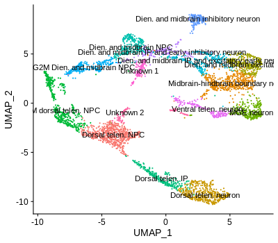
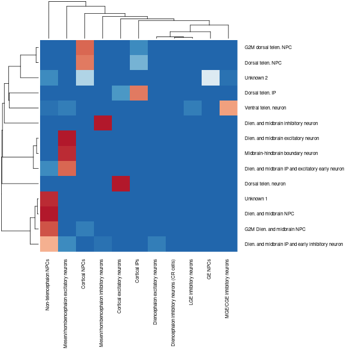

# Tutorial of single-cell RNA-seq data analysis in R
#### Compiled by Zhisong He, Barbara Treutlein
#### Updated on 2025-03-05
### Table of Content
  * [Introduction](#introduction)
  * [Preparation](#preparation)
  * [Now let's start Part 1](#now-lets-start-part-1)
    * [Step 0. Import Seurat package](#step-0-import-seurat-package)
    * [Step 1. Create a Seurat object](#step-1-create-a-seurat-object)
    * [Step 2. Quality control](#step-2-quality-control)
    * [Step 3. Normalization](#step-3-normalization)
    * [Step 4. Feature selection for following heterogeneity analysis](#step-4-feature-selection-for-following-heterogeneity-analysis)
    * [Step 5. Data scaling](#step-5-data-scaling)
    * [(Optional and advanced) Alternative step 3-5: to use SCTransform](#optional-and-advanced-alternative-step-3-5-to-use-sctransform)
    * [Step 6. Linear dimension reduction using principal component analysis (PCA)](#step-6-linear-dimension-reduction-using-principal-component-analysis-pca)
    * [Step 7. Non-linear dimension reduction for visualization](#step-7-non-linear-dimension-reduction-for-visualization)
    * [Step 8. Cluster the cells](#step-8-cluster-the-cells)
    * [Step 9. Annotate cell clusters](#step-9-annotate-cell-clusters)
    * [Step 10. Pseudotemporal cell ordering](#step-10-pseudotemporal-cell-ordering)
    * [Step 11. Save the result](#step-11-save-the-result)
    * [What else?](#what-else)
  * [Now starts Part 2: when you need to jointly analyze multiple scRNA-seq data sets](#now-starts-part-2-when-you-need-to-jointly-analyze-multiple-scrna-seq-data-sets)
    * [Step 0. Load data](#step-0-load-data)
    * [Step 1. Merge the two data sets](#step-1-merge-the-two-data-sets)
    * [Step 2-1. Data integration using Seurat](#step-2-1-data-integration-using-seurat)
    * [Step 2-2. Data integration using Harmony](#step-2-2-data-integration-using-harmony)
    * [Step 2-3. Data integration using LIGER](#step-2-3-data-integration-using-liger)
    * [Step 2-4. Data integration using MNN](#step-2-4-data-integration-using-mnn)
    * [Step 2-5. Data integration using RSS to BrainSpan](#step-2-5-data-integration-using-rss-to-brainspan)
    * [Step 2-6. Data integration using CSS](#step-2-6-data-integration-using-css)
    * [Step 3. How shall we compare different data integration methods](#step-3-how-shall-we-compare-different-data-integration-methods)
  * [Now starts Part 3: when you have an annotated reference data set and want it to facilitate the analysis of a new data](#now-starts-part-3-when-you-have-an-annotated-reference-data-set-and-want-it-to-facilitate-the-analysis-of-a-new-data)
    * [Step 0. Load data](#step-0-load-data)
    * [Method 1-1. Transcriptome similarity on cell cluster level](#method-1-1-transcriptome-similarity-on-cell-cluster-level)
    * [Method 1-2. Transcriptome similarity on cell level](#method-1-2-transcriptome-similarity-on-cell-level)
    * [Method 2. Seurat-based label transfer](#method-2-seurat-based-label-transfer)
    * [Other methods, and more to say](#other-methods-and-more-to-say)
  * [Now starts Part 4: more optional advanced analysis for scRNA-seq data](#now-starts-part-4-more-optional-advanced-analysis-for-scrna-seq-data)
    * [Part 4-1. Cluster connectivity analysis with PAGA](#part-4-1-cluster-connectivity-analysis-with-paga)
    * [Part 4-2. Pseudotime reconstruction without subseting into an unbranched trajectory](#part-4-2-pseudotime-reconstruction-without-subseting-into-an-unbranched-trajectory)
    * [Part 4-3. RNA velocity analysis](#part-4-3-rna-velocity-analysis)
    * [Part 4-4. Trajectory analysis with CellRank](#part-4-4-trajectory-analysis-with-cellrank)
    * [Part 4-5. Cell communication analysis](#part-4-5-cell-communication-analysis)


## Introduction
After getting the scRNA-seq data of your samples, you will want to analyze it properly.

Multiple toolkits and analytic frameworks have been developed to facilitate scRNA-seq data analysis. These options include but are not limit to [Seurat](https://satijalab.org/seurat/), developed by Rahul Satija's Lab in R, and [scanpy](https://icb-scanpy.readthedocs-hosted.com/en/stable/), developed by Fabian Theis's Lab in Python. Both toolkits provide functions and rich parameter sets that serve most of the routine analysis that one usually does on scRNA-seq data. However, one should be aware that these analytic frameworks do not cover all the interesting analyses that one can do when analyzing data. It is also important to get to know other tools for scRNA-seq data analysis.

Since this is a tutorial for beginners, we will mostly introduce how to use Seurat to analyze your scRNA-seq data in R. At the end, we will also mention some other additional tools (e.g. presto, destiny, Harmony, simspec, etc.), which provide additional functionalities that you may miss if you only use Seurat. In the most recent update, we also provide the briefly example of some commonly used advanced analysis, such as RNA velocity.

## Preparation
This tutorial assumes that the sequencing data preprocessing steps, including base calling, mapping and read counting, have been done. 10x Genomics has its own analysis pipeline [Cell Ranger](https://support.10xgenomics.com/single-cell-gene-expression/software/pipelines/latest/what-is-cell-ranger) for data generated with the 10x Genomics Chromium Single Cell Gene Expression Solution. At the end of the Cell Ranger pipeline, a count matrix is generated. If your scRNA-seq data is generated using another technology (e.g. well-based experiments using Smart-Seq2 and others), the Cell Ranger pipeline is likely unapplicable, and you will have to find another solution to generate the count matrix.

As part of this tutorial, we are providing two data sets (DS1 and DS2), both generated using 10x Genomics and preprocessed using Cell Ranger. They are both public scRNA-seq data of human cerebral organoids and are part of the data presented in this [paper](https://www.nature.com/articles/s41586-019-1654-9). The first part of this tutorial, which includes most of the general analysis pipeline, is based on DS1, while the second part, which focuses on data integration and batch effect correction, is based on both data sets.

As a test for yourself, please try to apply what is learned in the first part to DS2 and only then continue with part 2 of the vignette. This will also give you an idea which types of cells are in DS2 and how comparable it is to DS1, before doing any data integration of both data sets.

## Now let's start Part 1
### Step 0. Import Seurat package
First of all, please make sure that Seurat is installed in your R.
```R
library(Seurat)
```
This imports your installed Seurat package into your current R session. No error should be seen but some verbose information is likely. If it warns you that the package is unavailable, please install Seurat first
```R
install.packages("Seurat")
library(Seurat)
```

**IMPORTANT!!** The latest Seurat (version 5) introduces a new data structure called `Assay5`, as a more flexible replacement of the older `Assay` object introduced from Seurat v3. Both objects are used to store a single-modal measurement of cells. The main difference between the two is that an `Assay` object use a single $n \times N$ matrix($n$ for the number of genes and $N$ for the number of cells) to represent the counts/expression matrix of a scRNA-seq data set; while in an `Assay5` object, the matrix can be stored as multiple sub-matrices with another data frame to specify from which matrix to look for certain genes. The pros of the new `Assay5` object is that it bypasses a critical limitation of R, that a sparse matrix can include no more than 4294967295 non-zero items. This issue makes it impossible to use R for atlas-level (e.g. >1 million cells) scRNA-seq data analysis. The cons is that it complicates the data structure and makes the non-Seurat analysis much easier to fail due to the technical incompatibility. To keep everything simple, we will use the following code to tell `Seurat` to use `Assay` instead of `Assay5` as the default choice when creating the Seurat object.
```R
options(Seurat.object.assay.version = "v3")
```

If you want to reverse this opperation, do the following
```R
options(Seurat.object.assay.version = "v5")
```

### Step 1. Create a Seurat object
Seurat implements a new data type which is named 'Seurat'. It allows Seurat to store all the steps and results along the whole analysis. Therefore, the first step is to read in the data and create a Seurat object. Seurat has an easy solution for data generated using the 10x Genomics platform.
```R
counts <- Read10X(data.dir = "data/DS1/")
seurat <- CreateSeuratObject(counts, project="DS1")
```
What the ```Read10X``` function does is to read in the matrix and rename its row names and col names by gene symbols and cell barcodes, respectively. Alternatively, one can do this manually, which is probably what one would do when the data is not generated using 10x.
```R
library(Matrix)
counts <- readMM("data/DS1/matrix.mtx.gz")
barcodes <- read.table("data/DS1/barcodes.tsv.gz", stringsAsFactors=F)[,1]
features <- read.csv("data/DS1/features.tsv.gz", stringsAsFactors=F, sep="\t", header=F)
rownames(counts) <- make.unique(features[,2])
colnames(counts) <- barcodes

seurat <- CreateSeuratObject(counts, project="DS1")
```
If you look at the [Seurat tutorial](https://satijalab.org/seurat/v3.1/pbmc3k_tutorial.html), you would notice that some extra options are added to the ```CreateSeuratObj``` function, such as ```min.cells``` and ```min.features```. When these two parameters are set, an initial filtering is applied to the data, removing right from the beginning all genes with reads detected in too few cells, as well as cells with too few genes detected. This is fine, but I personally recommend to keep all genes (i.e. default or ```min.cells = 0```)

### Step 2. Quality control
After creating the Seurat object, the next step is to do quality control on the data. The most common quality control is to filter out
1. Cells with too few genes detected. They usually represent cells which are not sequenced deep enough for reliable characterization.
2. Cells with too many genes detected. They may represent doublets or multiplets (i.e. two or more cells in the same droplet, therefore sharing the same cell barcode).
3. Cells with high mitochondrial transcript percentage. As most of the scRNA-seq experiments use oligo-T to capture mRNAs, mitochondrial transcripts should be relatively under-representative due to their lack of poly-A tails, but it is unavoidable that some mitochondrial transcripts are captured. Meanwhile, there is also some evidence that stable poly-A tails exist in some mitochondrial transcripts but serve as a marker for degradation (e.g. this [paper](https://mcb.asm.org/content/25/15/6427.long)). Together, cells with high mitochondrial transcript percentage likely represent cells under stress (e.g. hypoxia) which produce a lot of mitochondria, or which produce an abnormally high amount of truncated mitochondrial transcripts.

While numbers of detected genes are summarized by Seurat automatically when creating the Seurat object (with nFeature_RNA being the number of detected genes/features; nCount_RNA being the number of detected transcripts), one needs to calculate mitochondial transcript percentages manually. Still, Seurat provides an easy solution
```R
seurat[["percent.mt"]] <- PercentageFeatureSet(seurat, pattern = "^MT[-\\.]")
```

Please note that there is no one-size-fits-all filtering criteria, as the normal ranges of these metrics can vary dramatically from one experiment to another, depending on sample origin as well as reagents and sequencing depths. One suggestion here is to **ONLY FILTER OUT OUTLIER CELLS**, i.e. the **minority** of cells with certain QC metrics clearly above or below the majority of cells. To do that, one needs to first know how these values are distributed in the data. One can look at the distribution by creating a violin plot for each of the metrics.
```R
VlnPlot(seurat, features = c("nFeature_RNA", "nCount_RNA", "percent.mt"), ncol = 3)
```
<br/><br/>
Or if you don't like the dots (individual cells)
```R
VlnPlot(seurat, features = c("nFeature_RNA", "nCount_RNA", "percent.mt"), ncol = 3, pt.size=0)
```
<br/><br/>

And as one would expect, number of detected genes and number of detected transcripts are well correlated across cells while mitochondrial transcript percentage is not.
```R
library(patchwork)
plot1 <- FeatureScatter(seurat, feature1 = "nCount_RNA", feature2 = "percent.mt")
plot2 <- FeatureScatter(seurat, feature1 = "nCount_RNA", feature2 = "nFeature_RNA")
plot1 + plot2
```
<span style="font-size:0.8em">*P.S. patchwork is an R package developed to facilitate layout of plots produced by ggplot2 (Seurat uses ggplot2 to produce plots if you use the plotting functions in the Seurat package). Without patchwork, it is illegal to run ```plot1 + plot2```.*</span>
<br/><br/>

Due to the correlation of gene number and transcript number, we only need to set a cutoff to either one of these metrics, combined with an upper threshold of mitochondrial transcript percentage, for the QC. For instance, for this data set, a detected gene number between 500 and 5000, and a mitochondrial transcript percentage lower than 5% would be quite reasonable, but it is fine to use different thresholds.
```R
seurat <- subset(seurat, subset = nFeature_RNA > 500 & nFeature_RNA < 5000 & percent.mt < 5)
```

It is worth to mention that sometimes more QC may need to be applied. One potential issue is the presence of doublets. As the amount of captured RNA varies a lot from cell to cell, doublets don't always show a higher number of detected genes or transcripts. There are several tools available now, which are designed to predict whether a 'cell' is indeed a singlet or actually a doublet/multiplet. [DoubletFinder](https://github.com/chris-mcginnis-ucsf/DoubletFinder), for instance, predicts doublets by first constructing artificial doublets by randomly averaging cells in the data, and then for each cell testing whether it is more similar to the artificially doublets or not. This helps with the decision whether a cell is likely a doublet or not. Similarly, mitochondrial transcript percentage may not be sufficient to filter out stressed or unhealthy cells. Sometimes one would needs to do extra filtering, e.g. based on [the machine learning based prediction](https://www.nature.com/articles/s41586-019-1654-9#Sec2).


### Step 3. Normalization
Similar to bulk RNA-seq, the amount of captured RNA is different from cell to cell, and one should therefore not directly compare the number of captured transcripts for each gene between cells. A normalization step, aiming to make gene expression levels between different cells comparable, is therefore necessary. The most commonly used normalization in scRNA-seq data analysis is very similar to the concept of TPM (Transcripts Per Million reads) - one normalizes the feature expression measurements for each cell to the total expression, and then multiplies this by a scale factor (10000 by default). At the end, the resulting expression levels are log-transformed so that the expression values better fit a normal distribution. It is worth to mention that before doing the log-transformation, one pseudocount is added to every value so that genes with zero transcripts detected in a cell still present values of zero after log-transform.
```R
seurat <- NormalizeData(seurat)
```
In principle there are several parameters one can set in the ```NormalizeData``` function, but most of the time the default settings are good.

### Step 4. Feature selection for following heterogeneity analysis
The biggest advantage of single-cell as compared to bulk RNA-seq is the potential to look into cellular heterogeneity of samples, by looking for cell groups with distinct molecular signatures. However, not every gene has the same level of information and the same contribution when trying to identify different cell groups. For instance, genes with low expression levels, and those with similar expression levels across all cells, are not very informative and may dilute differences between distinct cell groups. Therefore, it is necessary to perform a proper feature selection before further exploring the scRNA-seq data.

In Seurat, or more general in scRNA-seq data analysis, this step usually refers to the identification of highly variable features/genes, which are genes with the most varied expression levels across cells.
```R
seurat <- FindVariableFeatures(seurat, nfeatures = 3000)
```
By default, Seurat calculates the standardized variance of each gene across cells, and picks the top 2000 ones as the highly variable features. One can change the number of highly variable features easily by giving the ```nfeatures``` option (here the top 3000 genes are used).

There is no good criteria to determine how many highly variable features to use. Sometimes one needs to go through some iterations to pick the number that gives the most clear and interpretable result. Most often, a value between 2000 to 5000 is OK and using a different value doesn't affect the results too much.

One can visualize the result in a variable feature plot, but this is optional.
```R
top_features <- head(VariableFeatures(seurat), 20)
plot1 <- VariableFeaturePlot(seurat)
plot2 <- LabelPoints(plot = plot1, points = top_features, repel = TRUE)
plot1 + plot2
```
<br/><br/>

### Step 5. Data scaling
Since different genes have different base expression levels and distributions, the contribution of each gene to the analysis is different if no data transformation is performed. This is something we do not want as we don't want our analysis to only depend on genes that are highly expressed. Therefore a scaling is applied to the data using the selected features, just like one usually does in any data science field.
```R
seurat <- ScaleData(seurat)
```

At this step, one can also remove unwanted sources of variation from the data set by setting the parameter ```var.to.regress```. For instance,
```R
seurat <- ScaleData(seurat, vars.to.regress = c("nFeature_RNA", "percent.mt"))
```
Variables which are commonly considered to be regressed out include the number of detected genes/transcripts (nFeature_RNA / nCount_RNA), mitochondrial transcript percentage (percent.mt), and cell cycle related variables (see below). What it tries to do is to first fit a linear regression model, using the normalized expression level of a gene as the dependent variable, and the variables to be regressed out as the independent variables. Residuals of the linear model are then taken as the signals with the linear effect of the considered variables removed. I should note that this process of regressing out variables dramatically slows down the whole process, and it is not clear that the result will be satisfactory as the unwanted variation may be far from linear. Therefore, a common suggestion is not to perform any regress-out in the first iteration of data exploration, but first check the result, and if any unwanted source of variation dominates the cellular heterogeneity, try to regress out the respective variable and see whether the result improves.

### (Optional and advanced) Alternative step 3-5: using SCTransform
One problem of doing the typical log-normalization is that is [introduces the zero-inflation artifact](https://genomebiology.biomedcentral.com/articles/10.1186/s13059-019-1874-1) into the scRNA-seq data. To better resolve this issue, Hafemeister and Satija introduced an R package ```sctransform```, which uses a regularized negative binomial regression model to normalize scRNA-seq data. Seurat has a wrapper function ```SCTransform```.
```R
seurat <- SCTransform(seurat, variable.features.n = 3000)
```
The ```variable.features.n``` controls the number of highly variable features to identify. One can also add information about which unwanted sources of variation to regress out. For instance,
```R
seurat <- SCTransform(seurat,
                      vars.to.regress = c("nFeature_RNA", "percent.mt"),
                      variable.features.n = 3000)
```
This operation combines normalization, scaling and highly variable feature identification so it essentially replaces steps 3-5 from above. Drawbacks of running ```SCTransform``` include
1. It is relatively slow.
2. It makes the normalized expression measurements data-dependent. In the standard procedure, the normalization only relies on the cell itself; in ```SCTransform```, however, information from the other cells in the same data set is involved during normalization. This potentially introduces problems when multiple data sets need to be compared, since the normalized expression measurements of two data sets each individually normalized using ```SCTransform``` are not comparable.
3. There are steps in ```SCTransform``` which involve random sampling to speed up the computation. That means that there is some stochasticity in ```SCTransform``` and the result is slightly different every time, even if it is applied to the same data set.

Therefore, it should be used wisely. There are some scenarios in which trying SCTransform would be recommended. For instance, you might perform a differential expression analysis between cells of two conditions, and the results show a dramatic bias in DE, i.e. a huge amount of genes with increased expression but very few genes with decreased expression. If the data for the two conditions shows very different coverage (e.g. the condition with a lot of decreased expression shows significantly smaller number of detected gene/transcript numbers), such a biased DE result may be indeed an artifact introduced by the standard normalization procedure. In this case, using SCTransform may help to reduce the artifact.

### Step 6. Linear dimensionality reduction using principal component analysis (PCA)
In principle one can start to look at cell heterogeneity after identifying highly variable genes and scaling the data. However, applying a linear dimension reduction before doing any further analysis is strongly recommended and sometimes even seen as compulsory. The benefit of doing such a dimension reduction includes but is not limited to:
1. The data becomes much more compact so that computation becomes much faster.
2. As scRNA-seq data is intrinsically sparse, summarizing measurements of related features greatly enhances the signal robustness.

Any Drawback? Basically none. Well, one needs some extra lines in the script and needs to decide on the number of reduced dimensions to use in the following analysis, but that's it.

For scRNA-seq data, the linear dimension reduction mostly refers to principal component analysis, short PCA.
```R
seurat <- RunPCA(seurat, npcs = 50)
```
The number of principal components (PCs) that one can calculate for a data set is equal to the number of highly variable genes or the number of cells, whichever value is smaller. However, most of these PCs are not informative and only represent random noise. Only the top PCs are informative and represent differences among cell populations. Therefore, instead of calculating all possible PCs, Seurat uses truncated PCA to only calculate the first PCs, by default the top 50 PCs. One can change that by setting the ```npcs``` parameter.

Even then, one doesn't necessarily use all the calculated PCs. Determinting how many top PCs to use is an art. There is no golden standard, and everyone has his/her own understanding. The so-called elbow plot method can help with the decision. It consists of plotting the explained variation as a function of each PC, and picking the elbow of the curve as the number of PCs to use. 
```R
ElbowPlot(seurat, ndims = ncol(Embeddings(seurat, "pca")))
```
<span style="font-size:0.8em">*P.S. ```Embeddings``` is the function in Seurat to obtain the dimension reduction result given the name of the dimension reduction of interest. By default, the ```RunPCA``` function stores the PCA result in the embedding called 'pca', with each column being one PC. So here it tells Seurat to construct the elbow plot to show the standarized variation of all the PCs that are calculated*</span>

<br/><br/>

As it is defined, higher-ranked PCs explain more variation in the data (have higher standard deviations) than lower-ranked PCs. However, the decrease of standard deviation is not linear. The curve of the elbow plot drops dramatically for the first few PCs, and then slows down and becomes pretty flat. One would assume that the first phase of the curve represents the 'real' signal related to biological differences between cell populations, while the second phase mostly represents technical variation or the stochastic nature of individual cells. To that perspective, choosing the top-15 PCs is probably good and PCs ranked lower than 20 look quite unnecessary. However, even though this is a pretty good reference, it is far from perfect:
  * It is very difficult to precisely define the elbow point or turning point of the curve, as it is usually not a perfect elbow.
  * Higher-ranked PCs do explain more variation than lower-ranked PCs, but more explained variations does not necessarily mean higher information content. Sometimes there is interesting but weak signal buried in the noise and therefore as part of lower-ranked PCs.

There is another procedure implemented in Seurat called ```JackStraw``` which can also help to identify how many PCs to consider for the following analysis. However, in our experience this procedure is very slow because it relies on data permutation and it essentially does not provide much more information than the elbow plot. What it does is to estimate statistical significance of each PC, but similarly, a 'significant' PC doesn't mean it is informative. And when cell number increases, more and more PCs become statistically 'significant' even though their explained variation is not substantial. People interested in this method can take a look at the Seurat [vignette](https://satijalab.org/seurat/v3.1/pbmc3k_tutorial.html).

Apart from making an unbiased decision, one can also check which genes are mostly contributing to each of the top PCs . This can be informative if one knows the genes and the biology of the analyzed sample. It provides the opportunity to understand the biological implication of each of the top PCs, so that one can pick those representing useful information. 
```R
PCHeatmap(seurat, dims = 1:20, cells = 500, balanced = TRUE, ncol = 4)
```
<br/><br/>
Please be aware that it is not recommended to choose ONLY PCs represented by the "interesting" genes. There is a huge chance one misses interesting but unexpected phenomena by doing that.

In this example, we would use the top-20 PCs for the following analysis. Again, it is absolutely fine to use more or fewer PCs, and in practice this sometimes needs some iteration to make the final decision. Meanwhile, for most of the data, a PC number ranging from 10 to 50 would be reasonable and in many cases it won't affect the conclusion very much (but sometimes it will, so still be cautious).

### Step 7. Non-linear dimension reduction for visualization
A linear dimension reduction has both pros and cons. The good side is that every PC is a linear combination of gene expression so interpretation of PCs are straightforward. Also the data is compressed but not disorted, therefore information in the data is largely remained. The bad side, on the other hand, is that one usually needs more than 10 PCs to cover most of the information. This is fine for most of the analysis, but not for visualization where it is impossible to go over three dimensions for ordinary persons.

To overcome this issue, non-linear dimension reductions is introduced. The most commonly used non-linear dimension reduction methods in scRNA-seq data analysis are t-distributed Stochastic Neighbor Embedding (t-SNE) and Uniform Manifold Approximation and Projection (UMAP). Both methods try to place every sample in a low-dimensional space (2D/3D), so that distances or neighborhood relationships between different samples (here cells) in the original space are largely retained in the low-dimensional space. The detailed mathematically descriptions of the two methods are out of the scope of this tutorial, but for those who are interested in, you may check this [video](https://www.youtube.com/watch?v=RJVL80Gg3lA&list=UUtXKDgv1AVoG88PLl8nGXmw) for tSNE, and this [blog](https://towardsdatascience.com/how-exactly-umap-works-13e3040e1668) of Nikolay Oskolkov for UMAP. There are also more methods to create other low-dimensional embeddings for visualization, including but not limiting to [SPRING](https://kleintools.hms.harvard.edu/tools/spring.html), [PHATE](https://phate.readthedocs.io/en/stable/). Now let's focus on tSNE and UMAP which Seurat has included. The top PCs in the PCA analysis are used as the input to create a tSNE and UMAP embedding of the data.
```R
seurat <- RunTSNE(seurat, dims = 1:20)
seurat <- RunUMAP(seurat, dims = 1:20)
```
<span style="font-size:0.8em">*P.S. technically one can directly use the scaled expression of highly variable genes for these. It is however not recommended, as it is much slower and probably more noisy.*</span>

The results can be then visualized:
```R
plot1 <- TSNEPlot(seurat)
plot2 <- UMAPPlot(seurat)
plot1 + plot2
```
<br/><br/>
It is a hot topic whether tSNE or UMAP is superior to the other (for instance, this [blog](https://towardsdatascience.com/tsne-vs-umap-global-structure-4d8045acba17) of Nikolay Oskolkov and this [paper](https://www.biorxiv.org/content/10.1101/2019.12.19.877522v1) by Kobak and Linderman). To our experience, they both have their pros and cons and neither always work better than the other one. TSNE provides great visualization when cells form distinct cell groups, while UMAP perserves trajectory-like structure better when data contains 'continuum', e.g. the continuous cell state change during development and differentiation. It is therefore good to try both, and choose the one works better for your data.

Once the tSNE or UMAP embedding is created, one can start to check whether certain cell types or cell states exist in the data, by doing feature plots of some known canonical markers of the cell types of interest.
```R
plot1 <- FeaturePlot(seurat, c("MKI67","NES","DCX","FOXG1","DLX2","EMX1","OTX2","LHX9","TFAP2A"),
                     ncol=3, reduction = "tsne")
plot2 <- FeaturePlot(seurat, c("MKI67","NES","DCX","FOXG1","DLX2","EMX1","OTX2","LHX9","TFAP2A"),
                     ncol=3, reduction = "umap")
plot1 / plot2
```
<span style="font-size:0.8em">*P.S. with ```patchwork``` imported, ```plot1 / plot2``` generates the plotting layout that plot1 is put above plot2.*</span>

<br/><br/>
For people who are not familiar with those genes:
  * MKI67: a marker of G2M phase of cell cycle
  * NES: a neural progenitor marker
  * DCX: a pan-(immature) neuron marker
  * FOXG1: a telencephalon marker
  * DLX2: a ventral telencephalon marker
  * EMX1: a dorsal telencephalon (cortex) marker
  * OTX2: a midbrain and diencephalon neuron marker
  * LHX9: a diencephalon and midbrain neuron marker
  * TFAP2A: a midbrain-hindbrain boundary marker

So now we have some idea about what kinds of cells exist in this data.

### Step 8. Cluster the cells
Doing feature plot of markers is usually a good way to start with when exploring scRNA-seq data. However, to more comprehensively understand the underlying heterogeneity in the data, it is necessary to identify cell groups with an unbiased manner. This is what clustering does. In principle, one can apply any clustering methods, including those widely used in bulk RNA-seq data analysis such as hierarchical clustering and k-means, to the scRNA-seq data. However, in practice, this is very difficult, as the sample size in scRNA-seq data is too much larger (one 10x experiment usually gives several thousands of cells). It would be extremely slow to use these methods. In addition, due to the intrinsic sparseness of scRNA-seq data, even if data is denoised by dimension reduction like PCA, differences between different cells are not as well quantitative as those of bulk RNA-seq data. Therefore, the more commonly used clustering methods in scRNA-seq data analysis is graph-based community identification algorithm. Here, graph is the mathematical concept, where there is a set of objects, and some pairs of these objects are related with each other; or in a simplified way, a network of something, and here, a network of cells.

First of all, a k-nearest neighbor network of cells is generated. Every cells is firstly connected to cells with the shortest distances, based on their corresponding PC values. Only cell pairs which are neighbors of each other are considered as connected. Proportion of shared neighbors between every cell pairs is then calculated and used to describe the strength of the connection between two cells. Weak connections are trimmed. This gives the resulted Shared Nearest Neighbor (SNN) network. In practice, this is very simple in Seurat.
```R
seurat <- FindNeighbors(seurat, dims = 1:20)
```

With the network constructed, the louvain community identification algorithm is applied to the netowkr to look for communities in the network, i.e. cell groups that cells in the same group tend to connect with each other, while connections between cells in different groups are sparse.
```R
seurat <- FindClusters(seurat, resolution = 1)
```
Here, the ```resolution``` parameter is used to control whether the major and coarsed cell groups (e.g. major cell types), or the smaller but finer cell groups are returned (e.g. cell subtypes). The commonly used resolution ranges between 0.1 and 1, and which is the best option largely depends on the aim of the analysis. Here, a high resolution parameter is used to get a finer clustering. One can run multiple times of the ```FindClusters``` function with different resolutions. The newest clustering result can be obtained by ```Idents(seurat)``` or ```seurat@active.ident```. Other clustering results are also stored, as different columns in the meta.data slot (```seurat@meta.data```)

Next is to visualize the clustering result using the tSNE and UMAP embeddings that are generated before.
```R
plot1 <- DimPlot(seurat, reduction = "tsne", label = TRUE)
plot2 <- DimPlot(seurat, reduction = "umap", label = TRUE)
plot1 + plot2
```
<span style="font-size:0.8em">*P.S. if you don't want to see the cluster labels, set ```label = FALSE``` or remove it (by default ```label``` is set to FALSE).*</span>

<br/><br/>

### Step 9. Annotate cell clusters
Clustering the cells gives a identity label to each cell, and we can assume that cells with the same label are similar to each other and therefore can be seen to be of the same cell type or cell state. The next question is which exact cell types or cell states these cell clusters are representing. This is not an easy question to answer, and usually there is no perfect answer. There are several options one can try to resolve this issue. For instance,
1. Check the expression of canonical cell type and cell state markers in these clusters;
2. Identify signature genes, or marker genes, of each identified cell cluster. Based on the identified cluster marker genes, one can do literature search, enrichment analysis or do experiment (or ask people around) for annotation;
3. For each cluster, compare its gene expression profile with existing reference data.

Obviously, the first method requires some prior knowledge of the system being measured. One needs to have a list of convincing markers which are well accepted by the field. Particularly for the system of the example data set (cerebral organoid), some of the markers have been listed above. A longer list (never being complete though) includes
  * NES / SOX2: NPC marker
  * NHLH1: neuroblast (new-born neuron) marker
  * DCX / MAP2 / MAPT: neuron marker
  * FOXG1: telencephalon marker
  * EMX1 / EMX2: dorsal telencephalon (cortical) marker
  * EOMES: cortical intermediate progenitor (IP, proliferating neuroblast) marker
  * NEUROD6 / SLC17A7: dorsal telencephalic (cortical) glutamatergic neuron marker
  * BCL11B: deeper layer cortical neuron marker
  * SATB2: upper layer cortical neuron marker
  * RELN: Cajal-Retzius cell marker
  * DLX2 / DLX5: ganglionic eminence (GE) marker
  * ISL1: lateral ganglionic eminence (LGE) inhibitory neuron marker
  * NKX2-1: medial ganglionic eminence (MGE) inhibitory neuron marker
  * RSPO3 / TCF7L2 / LHX5 / LHX9: diencephalon marker (for different neuron subtypes)
  * OTX2 / LMX1A / EN1: midbrain marker (for different neuron subtypes)
  * CYP26A1: Purkinje cell (cerebellar) progenitor marker
  * TFAP2A / CA8: Purkinje cell marker
  * HOXB2 / HOXB5: hindbrain (medulla/pons) and spinal cord marker
  * SLC17A6: glutamatergic neuron marker
  * SLC32A1 / GAD1 / GAD2: GABAergic neuron marker
  * TH: doparminergic neuron marker
  * CHAT / ACHE: cholinergic neuron marker
  * TTR: choroid plexus marker
  * GFAP / AQP4 / S100B: astrocyte marker
  * OLIG1: oligodendrocyte precursor cell marker
  * MBP / SOX10: ologodendrocyte marker
  * SOX10: neural crest derivative marker
  * AIF1: microglia marker
  * CLDN5: endothelial cell marker
  * DCN: mesenchymal cell marker
  * MKI67: cell cycle G2M phase marker (proliferative cells)

<span style="font-size:0.8em">*P.S. Be careful! Many of those genes are not only expressed in the listed cell types. For instance, many ventral telen. neurons also express BCL11B, which is a famous deeper layer cortical neuron marker. Therefore, when doing the annotation, one needs to look at combinations of markers. For instance, only if the BCL11B+ cells also express EMX1 and NEUROD6, they would be annotated as deeper layer cortical neurons.*</span>

The easiest to visualize expression of marker genes of interest across cell clusters is probably by a heatmap.
```R
ct_markers <- c("MKI67","NES","DCX","FOXG1", # G2M, NPC, neuron, telencephalon
                "DLX2","DLX5","ISL1","SIX3","NKX2.1","SOX6","NR2F2", # ventral telencephalon related
                "EMX1","PAX6","GLI3","EOMES","NEUROD6", # dorsal telencephalon related
                "RSPO3","OTX2","LHX9","TFAP2A","RELN","HOXB2","HOXB5") # non-telencephalon related
DoHeatmap(seurat, features = ct_markers) + NoLegend()
```
<br/><br/>
Next, in order to do annotation in a more unbiased way, we should firstly identify cluster markers for each of the cell cluster identified. In Seurat, this can be done using the ```FindAllMarkers``` function. What it does is for cell cluster, to do differential expression analysis (with Wilcoxon's rank sum test) between cells in the cluster and cells in other clusters.
```R
cl_markers <- FindAllMarkers(seurat, only.pos = TRUE, min.pct = 0.25, logfc.threshold = log(1.2))
library(dplyr)
cl_markers %>% group_by(cluster) %>% top_n(n = 2, wt = avg_logFC)
```
<br/><br/>
Because of the nature of large sample size in scRNA-seq data (one cell is one sample), it is strongly recommended to not only look at p-values, but also detection rate of the gene in the cluster (```pct```) and fold change (```logfc```) between cells in and outside the cluster. That's why there are options ```min.pct``` and ```logfc.threshold``` in the function to require threshold on the effect size.

<span style="font-size:0.8em">*P.S. you need to have ```dplyr``` package installed and imported to use the pipe feature. Alternatively, one can use the old-school ```lapply``` combinations, e.g. ```do.call(rbind, lapply(split(cl_markers, cl_markers$cluster), function(x) x[order(x$avg_logFC, decreasing=T)[1:2],]))```, but probably not many people like it.*</span>

You may have felt that this process takes quite a while. There is a faster solution by the other package called "presto".
```R
library(presto)
cl_markers_presto <- wilcoxauc(seurat)
cl_markers_presto %>%
    filter(logFC > log(1.2) & pct_in > 20 & padj < 0.05) %>%
    group_by(group) %>%
    arrange(desc(logFC), .by_group=T) %>%
    top_n(n = 2, wt = logFC) %>%
    print(n = 40, width = Inf)
```
<br/><br/>
<span style="font-size:0.8em">*P.S. The latest presto requires DESeq2 to be installed. If you think Wilcoxon test is sufficient, an older version of presto would be enough. Do it by ```devtools::install_github("immunogenomics/presto", ref = "4b96fc8")```.*</span>

The ```presto``` output is very similar to the native solution of Seurat, but with some additional metrics.

No matter with which method, the identified top cluster markers can be next visualized by a heatmap
```R
top10_cl_markers <- cl_markers %>% group_by(cluster) %>% top_n(n = 10, wt = avg_logFC)
DoHeatmap(seurat, features = top10_cl_markers$gene) + NoLegend()
```
<br/><br/>
One can also check those markers of different clusters in more details, by doing feature plot or violin plot for them. For instance, we can use NEUROD2 and NEUROD6 as very strong markers of cluster 2, so let's take a closer look
```R
plot1 <- FeaturePlot(seurat, c("NEUROD2","NEUROD6"), ncol = 1)
plot2 <- VlnPlot(seurat, features = c("NEUROD2","NEUROD6"), pt.size = 0)
plot1 + plot2 + plot_layout(widths = c(1, 2))
```
<br/><br/>
<br/><br/>
So it seems that NEUROD2 and NEUROD6 are not only highly expressed in cluster 2, but also in cluster 6. And if you still remember where these clusters are in the tSNE/UMAP embedding, you will find that these two clusters are next to each other, suggesting that they may represent cell types related to each other and both show strong dorsal telencephalon identity. Their separation likely represents their maturity states. Neurons in cluster 6 is probably less mature as they are connected to cluster 0, which is likely dorsal telencephalic NPCs. In addition, cluster 6 show high expression of EOMES, a dorsal telencephalic IP marker. Taken them all together, we can quite confidently say, that cluster 0, 6, and 2 all represent dorsal telencephalic cells, cluster 0 is the progenitors, cluster 6 is the intermediate progenitors and cluster 2 is the neurons.

If we look at the other side of cluster 0, there is cluster 5 connected, and then it is cluster 10. Now look at the heatmap again, you will find that although they have their distinct markers and expression patterns, they all present similar signatures of dorsal telencephalic NPCs. On top of it, cells in cluster 5 and cluster 10 show high expression of cell cycle G2M phase markers. This suggests that cluster 5 and cluster 10 are also dorsal telencephalic NPCs, and their separation from cluster 0 is likely due to their difference on cell cycle phases.

Interesting, all these cells in cluster 10, 5, 0, 6 and 2 form a trajectory-like structure in the UMAP. It likely reflects the differentiation and neuron maturation process. We will come back to this soon.

This is how cell cluster annotation is usually done. You may feel it too subjective and too much rely on personal judgement. In that case, there are also more objective and unbiased ways to do automated or semi-automated annotation. There are tools emerging, such as [Garnett](https://cole-trapnell-lab.github.io/garnett/) developed by Cole Trapnell's lab, and [Capybara](https://github.com/morris-lab/Capybara) developed by Samantha Morris' lab. These tools use similar strategy, to firstly standarize cell type annotations of existing scRNA-seq data, train one or multiple prediction model using the annotated data, and then apply the models to a new data set for the automated annotation. Currently, those tools have limitations. Their application is usually limited to major cell types of commonly studied organs, and their performance largely depends on data and annotation quality of the training data sets. Details of using these tools won't be discussed here, but for people who are interested, it is good to try.

It is worth to mention that one doesn't always need to use a complex machine learning model trained on other scRNA-seq data to assist annotation of cell clusters. Caculating correlations of gene expression profiles of cells or cell clusters in the scRNA-seq data to those of bulk references can also be very informative. One example is [VoxHunt](https://github.com/quadbiolab/VoxHunt) developed by our group, which correlates expression profiles of cells or cell clusters to the in situ hybridization atlas of developing mouse brain in Allen Brain Atlas. This can be very helpful for annotating scRNA-seq data of cerebral organoid samples.

<span style="font-size:0.8em">*P.S. To do this the voxhunt package needs to be installed first. Please follow the instruction on the page and don't forget to also download the ABA ISH data, which also has a link on the page. Replace ```ABA_data``` below by the path towards the folder of the downloaded data.*</span>
```R
library(voxhunt)
load_aba_data('ABA_data')
genes_use <- variable_genes('E13', 300)$gene
vox_map <- voxel_map(seurat, genes_use=genes_use)
plot_map(vox_map)
```
<br/><br/>

From the projection we can also make similar conclusion, that cluster 10, 5, 0, 6 and 2 are belong to dorsal telencephalon. At the end, we can do a rough annotation for all clusters.
<style>
td {
  font-size: 0.8em
}
</style>

| Cluster | Annotation |
|---------|:----------:|
| 0 | Dorsal telen. NPC |
| 1 | Midbrain-hindbrain boundary neuron |
| 2 | Dorsal telen. neuron |
| 3 | Dien. and midbrain excitatory neuron |
| 4 | MGE-like neuron |
| 5 | G2M dorsal telen. NPC |
| 6 | Dorsal telen. IP |
| 7 | Dien. and midbrain NPC |
| 8 | Dien. and midbrain IP and excitatory early neuron |
| 9 | G2M Dien. and midbrain NPC |
| 10 | G2M dorsal telen. NPC |
| 11 | Dien. and midbrain inhibitory neuron |
| 12 | Dien. and midbrain IP and early inhibitory neuron |
| 13 | Ventral telen. neuron |
| 14 | Unknown 1 |
| 15 | Unknown 2 |

We can replace the cell cluster labels by the annotation, but this is optional
```R
new_ident <- setNames(c("Dorsal telen. NPC",
                        "Midbrain-hindbrain boundary neuron",
                        "Dorsal telen. neuron",
                        "Dien. and midbrain excitatory neuron",
                        "MGE-like neuron","G2M dorsal telen. NPC",
                        "Dorsal telen. IP","Dien. and midbrain NPC",
                        "Dien. and midbrain IP and excitatory early neuron",
                        "G2M Dien. and midbrain NPC",
                        "G2M dorsal telen. NPC",
                        "Dien. and midbrain inhibitory neuron",
                        "Dien. and midbrain IP and early inhibitory neuron",
                        "Ventral telen. neuron",
                        "Unknown 1",
                        "Unknown 2"),
                      levels(seurat))
seurat <- RenameIdents(seurat, new_ident)
DimPlot(seurat, reduction = "umap", label = TRUE) + NoLegend()
```
<br/><br/>

### Step 10. Pseudotemporal cell ordering
We finally move to the next step. As mentioned above, the trajectory-like structure formed by cells in the dorsal telencephalon clusters we can see in the UMAP embedding likely represents differentiation and maturation of dorsal telencephalic excitatory neurons. This is likely a continuous process, and therefore it is more proper to consider it as a continuous trajectory rather than distinct clusters. In that case, it is more informative to perform so-called pseudotemporal cell ordering, or pseudotime analysis on those cells.

So far, there are quite a lot of different methods for pseudotime analysis. Commonly used methods include diffusion map (implemented in ```destiny``` package in R) and [monocle](http://cole-trapnell-lab.github.io/monocle-release/). Here, we will show the example of using ```destiny``` to do pseudotime analysis on the dorsal telencephalic cells in the data. The mathematics of diffusion map and diffusion pseudotime (dpt) is out of the scope of this tutorial, but for those who are interested, please refer to the [DPT paper](https://www.nature.com/articles/nmeth.3971) by Fabian Theis's lab.

First of all, cells of interest are extracted. Afterwards, we re-identify highly variable genes for the subset cells, as genes representing differences between dorsal telencephalic cells and other cells are no longer informative
```R
seurat_dorsal <- subset(seurat, subset = RNA_snn_res.1 %in% c(0,2,5,6,10))
seurat_dorsal <- FindVariableFeatures(seurat_dorsal, nfeatures = 2000)
```
<span style="font-size:0.8em">*P.S. if you are sure that the clustering result you want to use to subset cells is the newest one, using ```seurat_dorsal <- subset(seurat, idents = c(0,2,5,6,10))``` gives you the same result. With this way it looks for cells in the active clustering result in the Seurat object, which is stored as ```seurat@active.ident```. In the metadata table (```seurat@meta.data```), there is also a column called ```seurat_clusters``` which shows the newest clustering result, and is updated every time when a new clustering is done. However, be careful. In real world when many iterations of parameter tryings are done, it is very common that one gets lost. So if you want to do it in this way, double check before doing the subset, to make sure that the active clustering result is the one to use.*</span>

As you may have noticed, there are two clusters of dorsal telencephalic NPCs separated from the third cluster because they are at different phase of cell cycle. Since we are interested in the general molecular changes during differentiation and maturation, the cell cycle changes may strongly confound the analysis. We can try to reduce cell cycle effect by excluding cell cycle related genes from the identified highly variable gene list.
```R
VariableFeatures(seurat) <- setdiff(VariableFeatures(seurat), unlist(cc.genes))
```
<span style="font-size:0.8em">*P.S. ```cc.genes``` is a list that is automatically imported by Seurat when the package is imported. It includes genes reported in this [paper](https://genome.cshlp.org/content/25/12/1860).*</span>

We can then check how the data look like, by creating a new UMAP embedding and do some feature plots
```R
seurat_dorsal <- RunPCA(seurat_dorsal) %>% RunUMAP(dims = 1:20)
FeaturePlot(seurat_dorsal, c("MKI67","GLI3","EOMES","NEUROD6"), ncol = 4)
```
<br/><br/>

Not so great. The G2M cells are no longer in separated clusters, but it still confounds the cell type differentiation trajectory. For instance, EOMES+ cells are distributed separately in two groups. We need to further reduce the cell cycle effect.

As briefly mentioned above, the ```ScaleData``` function has the option to include variables representing sources of unwanted variations. We can try to use that to further reduce the cell cycle influence; but before that, we need to generate cell-cycle-related scores for every cell to describe their cell cycle status.
```R
seurat_dorsal <- CellCycleScoring(seurat_dorsal,
                                  s.features = cc.genes$s.genes,
                                  g2m.features = cc.genes$g2m.genes,
                                  set.ident = TRUE)
seurat_dorsal <- ScaleData(seurat_dorsal, vars.to.regress = c("S.Score", "G2M.Score"))
```

We can then check how the data look like, by creating a new UMAP embedding and do some feature plots
```R
seurat_dorsal <- RunPCA(seurat_dorsal) %>% RunUMAP(dims = 1:20)
FeaturePlot(seurat_dorsal, c("MKI67","GLI3","EOMES","NEUROD6"), ncol = 4)
```
<br/>

It is not perfect, but at least we no longer see two separated EOMES+ groups.

Now let's try to run diffusion map to get the cells ordered.
```R
library(destiny)
dm <- DiffusionMap(Embeddings(seurat_dorsal, "pca")[,1:20])
dpt <- DPT(dm)
seurat_dorsal$dpt <- rank(dpt$dpt)
FeaturePlot(seurat_dorsal, c("dpt","GLI3","EOMES","NEUROD6"), ncol=4)
```
<span style="font-size:0.8em">*P.S. Here the rank of the estimated dpt, instead of the dpt itself, is used as the final pseudotime. Both options have pros and cons. In principle, the raw dpt contains not only the ordering, but also how big the difference is. However, its value range is usually dominated by some 'outliers' on both sides which are less represented by the data. Using the rank helps to restore those changes at medium dpt. Feel free to try both.*</span>

<br/><br/>
<span style="font-size:0.8em">*P.S. Unlike the example here where NPCs have smaller pseudotime, it is possible that one gets a pseudotime series starting from neuron. This is because diffusion pseudotime, as well as most of other similarity-based pseudotime analysis methods, is undirected. It estimates the gradient but doesn't know which end is the source if you don't tell it. Therefore, if you find the constructed pseudotime goes to the wrong direction, flip it (e.g. ```seurat_dorsal$dpt <- rank(-dpt$dpt)```)*</span>


To visualize expression changes along the constructed pseudotime, a scatter plot with fitted curve is usually a straightforward way.
```R
if (is(seurat_dorsal[['RNA']], 'Assay5')){
    expr <- LayerData(seurat_dorsal, assay = "RNA", layer = "data")
} else{
    expr <- seurat_dorsal[['RNA']]@data
}

library(ggplot2)
plot1 <- qplot(seurat_dorsal$dpt, as.numeric(expr["GLI3",]),
               xlab="Dpt", ylab="Expression", main="GLI3") +
         geom_smooth(se = FALSE, method = "loess") + theme_bw()
plot2 <- qplot(seurat_dorsal$dpt, as.numeric(expr["EOMES",]),
               xlab="Dpt", ylab="Expression", main="EOMES") +
         geom_smooth(se = FALSE, method = "loess") + theme_bw()
plot3 <- qplot(seurat_dorsal$dpt, as.numeric(expr["NEUROD6",]),
               xlab="Dpt", ylab="Expression", main="NEUROD6") +
         geom_smooth(se = FALSE, method = "loess") + theme_bw()
plot1 + plot2 + plot3
```
<br/><br/>
<span style="font-size:0.8em">*P.S. The recent Seurat upgrade (v5) introduces a new and more flexible data structure for assay data (Assay5 class), which is fundamentally different from the previous Array class. This is why in the above codes we have to firstly check whether the RNA assay is stored as an Assay5 object or not.*</span>

### Step 11. Save the result
These are basically everything in the Part 1 of this tutorial, covering most of the basic analysis one can do to a single scRNA-seq data set. At the end of the analysis, we of course wants to save the result, probably the Seurat object we've played around with for a while, so that next time we don't need to rerun all the analysis again. The way to save the Seurat object is the same as saving any other R object. One can either use ```saveRDS```/```readRDS``` to save/load every Seurat object separately,
```R
saveRDS(seurat, file="DS1/seurat_obj_all.rds")
saveRDS(seurat_dorsal, file="DS1/seurat_obj_dorsal.rds")

seurat <- readRDS("DS1/seurat_obj_all.rds")
seurat_dorsal <- readRDS("DS1/seurat_obj_dorsal.rds")
```

or use ```save```/```load``` to save multiple objects together
```R
save(seurat, seurat_dorsal, file="DS1/seurat_objs.rdata")
load("DS1/seurat_objs.rdata")
```

### What else?
There are of course more one can do, but it is impossible to involve everything here. One of them is RNA velocity analysis (see this [paper](https://www.nature.com/articles/s41586-018-0414-6)). This is a very cool concept jointly proposed by Sten Linnarsson's lab and Peter Kharchenko's lab, that while the exonic transcriptome represents the current state of a cell, the intronic transcriptome represents what the cell is going to be in the near future. By introducing a transcriptional dynamic model, RNA velocity analysis predicts the directional 'flow' of cell state transition, which greatly expands the application of scRNA-seq to capture dynamics of molecular changes. Fabian Theis's lab further improved the method by introducing a better transcriptional dynamic model and implemented [scVelo](https://scvelo.readthedocs.io/), which is faster and more accurate than the original [velocyto](http://velocyto.org/), and can do more analysis including estimating the directional velocity pseudotime.

Branching point analysis can be also interesting and informative. Particularly in many differentiation- or development-related systems, one stem cell can specify its fate into one of multiple possible options. This decision process can be in principle captured by scRNA-seq data, if the sample contains cells before fate specification and cells in all the specified fates. Branching point analysis is to identify the point on the cell fate specification trajectory where cell fate specification happens, so that one can get the cell fate specification tree or network. [PAGA](https://github.com/theislab/paga) and [monocle](http://cole-trapnell-lab.github.io/monocle-release/) are among the most widely used tools for this purpose. Another related analysis is to estimate fate bias in multipotent progenitors. [FateID](https://github.com/dgrun/FateID) developed by Dominic Gruen's lab is a tool for such an analysis.

There are also some more specific and detailed statistical analysis, e.g. to identify genes with significant expression changes along the pseudotime. Many of them may not have any good tool or algorithm available. What's described in this tutorial is just the beginning. To master the analysis of scRNA-seq data, we shall all never stop learning, and never stop innovating.

## Now starts Part 2: when you need to jointly analyze multiple scRNA-seq data sets
Nowadays, it is very rare that one would only do one scRNA-seq experiment and generate only one scRNA-seq data. The reasons are simple. First of all, current scRNA-seq technology only provides a molecular snapshot on limited measured samples at one time. To measure many samples across multiple experiments and different conditions, joint analysis of scRNA-seq data of multiple experiment on different samples is usually required. Although some experimental strategy, e.g. [cell hashing](https://genomebiology.biomedcentral.com/articles/10.1186/s13059-018-1603-1), as well as computational demultiplexing methods such as [demuxlet](https://github.com/statgen/demuxlet) and [scSplit](https://github.com/jon-xu/scSplit) to some extend allow pooling multiple samples together for the scRNA-seq library preparation and sequencing, it is unavoidable that certain steps, e.g. tissue dissociation, would have to be done separately for diffent samples. Therefore, just like when dealing with bulk RNA-seq data, batch effect is usually a critical confounder of the result that one has to resolve.

In this part of the tutorial, several scRNA-seq integration methods would be introduced. We will use DS1 which has been described in the first part of the tutorial, together with DS2 which you should have analyzed following this vignette. Please be aware that so far there is no 'best' integration method for all scenarios. It is therefore important to try different methods and compare, to at the end choose the one that works the best for every specific case.

### Step 0. Load data
Let's start with importing Seurat and load the saved Seurat object.
```R
library(Seurat)
library(dplyr)
library(patchwork)
seurat_DS1 <- readRDS("DS1/seurat_obj_all.rds")
seurat_DS2 <- readRDS("DS2/seurat_obj_all.rds")
```

### Step 1. Merge the two data sets
First of all, there is some chances that batch effect is small so that no integration is necessary. Therefore, we should firstly take a look at the two data sets by simply merging them together.
```R
seurat <- merge(seurat_DS1, seurat_DS2) %>%
    FindVariableFeatures(nfeatures = 3000) %>%
    ScaleData() %>%
    RunPCA(npcs = 50) %>%
    RunUMAP(dims = 1:20)
plot1 <- DimPlot(seurat, group.by="orig.ident")
plot2 <- FeaturePlot(seurat, c("FOXG1","EMX1","DLX2","LHX9"), ncol=2, pt.size = 0.1)
plot1 + plot2 + plot_layout(widths = c(1.5, 2))
```
<br/><br/>
Obviously, the two data sets separate from each other on the embedding. However, the marker expression patterns suggest that the two data sets indeed share quite many cell types. Ideally, cells of the same cell type in the two data sets should be mixed with each other. However, because of the batch effect, this is not happening. So we need to do data integration. What we hope is that after the integration, cells of the same cell type in the two data sets intermix, while cells of different cell types/states still separate.

Here we will try different methods, including
1. Seurat
2. Harmony
3. LIGER
4. MNN
5. RSS to BrainSpan
6. CSS

### Step 2-1. Data integration using Seurat
Seurat has its own data integration procedure implemented. In brief, it firstly applies canonical correlation analaysis (CCA) to the data sets that need to be integrated, rotating them separately so that the covariance of the two data sets is maximized. In other words, Seurat uses CCA to find the way maximizing the similarities between data sets. Next, Seurat introduces an anchoring mechanism, looking for cell anchors in the two data sets. Cell anchors are cell pairs with each cell in a different data set. The two cells are one of the nearest neighbors of each other in the CCA space, while the nearest neighbors of one cell in its own data set also tend to be neighbors of the nearest neighbors of the other cell of the cell pair. The two anchored cells are seen as corresponding cells from one data set to the other, and an integration procedure is then applied by subtracting expression of one data set by the transformation matrix calculated by comparing the anchoring cell pairs in the two data sets. People interested in its detailed methodology can read its [paper](https://www.sciencedirect.com/science/article/pii/S0092867419305598).

To do integration using Seurat, one needs to firstly normalize and identify highly variable genes for each of data set to be integrated (which should have been done). If it hasn't been done, do it first:
```R
seurat_DS1 <- NormalizeData(seurat_DS1) %>% FindVariableFeatures(nfeatures = 3000)
seurat_DS2 <- NormalizeData(seurat_DS2) %>% FindVariableFeatures(nfeatures = 3000)
```

Next, we identify anchors of data sets. At this step, Seurat takes a list of Seurat objects as the input. Please note that Seurat allows integration of more than two samples. One just needs to put them into a list.
```R
seurat_objs <- list(DS1 = seurat_DS1, DS2 = seurat_DS2)
anchors <- FindIntegrationAnchors(object.list = seurat_objs, dims = 1:30)
```
<span style="font-size:0.8em">*P.S. The ```dims``` parameter determines the number of CC components to take into account, and one should try different values to fine-tune the results.*</span>

Next, the identified anchor set is passed to the the ```IntegrateData``` function to do the expression level correction.
```R
seurat <- IntegrateData(anchors, dims = 1:30)
```

Running the ```IntegrateData``` function creates a new ```Assay``` object (by default it is called ```integrated```), where the batch-corrected expression matrix is stored. The uncorrected values are not lost, but store in the original ```Assay``` object (called ```RNA``` by default). The default assay of the resulted Seurat object is automatically set to ```integrated```, but one can switch to the other one by using e.g. ```DefaultAssay(seurat) <- "RNA"```.

Next, we just take the corrected Seurat object and re-run the procedure in Part 1, except for the first two steps (normalization and highly variable gene identification) which should be skipped here.
```R
seurat <- ScaleData(seurat)
seurat <- RunPCA(seurat, npcs = 50)
seurat <- RunUMAP(seurat, dims = 1:20)
seurat <- FindNeighbors(seurat, dims = 1:20) %>% FindClusters(resolution = 0.6)

# You may also want to save the object
saveRDS(seurat, file="integrated_seurat.rds")
```

Please be aware, that while the tSNE/UMAP embedding and clustering should be done with the ```integrated``` assay, the corrected values are no longer very reliable as the quantitative measure of gene expression. It is recommended that for the other analysis such as cluster marker identification and visualization, to use the uncorrected expression values instead, by setting the ```DefaultAssay``` back to ```RNA```
```R
DefaultAssay(seurat) <- "RNA"
plot1 <- UMAPPlot(seurat, group.by="orig.ident")
plot2 <- UMAPPlot(seurat, label = T)
plot3 <- FeaturePlot(seurat, c("FOXG1","EMX1","DLX2","LHX9"), ncol=2, pt.size = 0.1)
((plot1 / plot2) | plot3) + plot_layout(width = c(1,2))
```
<br/><br/>
It is not perfect but it does help to make the two data sets more comparable.

If you want to further improve the result, there are several parameters that one may consider to tune (all parameters above are either default or by gut feeling so there should be space for improvement). First of all, the ```FindIntegrationAnchors``` function chooses genes for integration based on their frequencies being identified as highly variable genes in individual data sets. Therefore, the ```nfeatures``` parameter when doing ```FindVariableFeatures``` on the two data sets definitely influence the gene set for integration. Next, since the anchoring step is the crucial step in Seurat integration, any parameter substantially affect the anchoring procedure can change the final integration. For instance, the ```FindIntegrationAnchors``` function chooses 2000 genes with the highest frequencies of being highly variable genes in individual data sets for integration by default, and this number of genes for integration can be changed by setting the ```anchor.features``` parameter in the ```FindIntegrationAnchors``` function. Similar to the issue of how many PCs to use for making tSNE/UMAP and clustering, one needs to decide which CCs to use to define cross-data-set neighbors, as set in the ```dims``` parameter. This is another parameter which can influence the result. There are more parameters which can affect in the same function, including ```k.anchor```, ```k.filter``` and ```k.score```, although they may not be the first parameters that you want to start with. Similarly, in thefunction  ```IntegrateData``` used at the next step there is also the ```dims``` parameter, that you may want to change as well.

It is worth to mention that Seurat also provides another strategy for integrative analysis, which is data transfer. It is used when there is an existed annotated reference data, and one wants to use the reference data to assist cell type/state annotation of a new query data. The major differences between data integration and data transfer include:
1. Instead of generating a joint space using CCA when doing data integration, data transfer by default applies the same PCA transformation in the reference data to the query data set to identify anchors
2. No expression value is corrected, and therefore no joint embedding of the two data sets is created; instead, one can project cells in the query data to the reference embedding. Besides the embedding, cell labels can also be projected so that one can 'transfer' labels in the reference atlas to the query data set for annotation.

This tutorial won't cover this part as it doesn't match with the data set we have in hand. For people would like to try, it won't be difficult to follow the respective [Seurat tutorial](https://satijalab.org/seurat/v3.1/integration.html).

### Step 2-2. Data integration using Harmony
Besides Seurat, there are more data integration methods available now. [Harmony](https://github.com/immunogenomics/harmony), developed by Soumya Raychaudhurils lab, is one of them. It is also the most highlighted integration method in the first [benchmark](https://genomebiology.biomedcentral.com/articles/10.1186/s13059-019-1850-9) on scRNA-seq batch effect correction tools. In brief, Harmony uses fuzzy clustering to assign every cell to multiple clusters. For each cluster, it then calculates a correction factor for each data set to move the centroid of the cluster of this data set towards the global centroid of the cluster. Since every cell is represented as a combination of multiple clusters, a cell-specific correction factor is calculated by averaging the correction factors of clusters that the cell belongs to while weighting by the cluster assignment ratio. This process will be iterated until convergence happens or reaching the iteration limits. To get more details of the method, please refer to the [paper](https://www.nature.com/articles/s41592-019-0619-0).

Harmony provides a simple API for Seurat object, which is a function called ```RunHarmony```, so it is very easy to use. It takes the merged Seurat object (the one generated at Step 1) as the input and one needs to tell the function which metadata feature to use as the batch identity. It returns a Seurat object, with a more reduction called ```harmony``` added. It is like the corrected PCA so one should then explicitly tell Seurat to use the ```harmony``` reduction for following analysis including making UMAP embedding and identifying cell clusters.
```R
seurat <- merge(seurat_DS1, seurat_DS2) %>%
    FindVariableFeatures(nfeatures = 3000) %>%
    ScaleData() %>%
    RunPCA(npcs = 50)
library(harmony)
seurat <- RunHarmony(seurat, group.by.vars = "orig.ident", dims.use = 1:20, max.iter.harmony = 50)
seurat <- RunUMAP(seurat, reduction = "harmony", dims = 1:20)
seurat <- FindNeighbors(seurat, reduction = "harmony", dims = 1:20) %>% FindClusters(resolution = 0.6)

# You may also want to save the object
saveRDS(seurat, file="integrated_harmony.rds")
```
<span style="font-size:0.8em">*P.S. The ```dims.use``` parameter determines which dimensions (by default, of PCA) to be used for the fuzzy clustering and to be corrected. By default it uses all the calculated dimensions. The ```max.iter.harmony``` controls the maximum number of iterations to be done. By default it is 10 but since ```Harmony``` is pretty fast, it is completely fine to increase the limit so that convergence can be ensured.*</span>

We can then visualize the integration results similar to before
```R
plot1 <- UMAPPlot(seurat, group.by="orig.ident")
plot2 <- UMAPPlot(seurat, label = T)
plot3 <- FeaturePlot(seurat, c("FOXG1","EMX1","DLX2","LHX9"), ncol=2, pt.size = 0.1)
((plot1 / plot2) | plot3) + plot_layout(width = c(1,2))
```
<br/><br/>
Not bad. Cells of the two samples are quite nicely mixed, and we can see some nice trajectories. Question marks may need to put at some of the mixed groups, particularly those of non-dorsal-telencephalic cells, whether or not they are indeed cells of the same cell type that should be mixed.

As you may have noticed, Harmony by default takes the PCA result as the input and iterations of correction are done to the PCs of each cell. Therefore, parameters affecting original PCA, including ```nfeatures``` in ```FindVariableFeatures``` to identify highly variable genes, should have effect on the integration. Next, when there is not specified parameter provided, the ```RunHarmony``` function takes all the available dimensions in the provided input (PCA by default). One can specify which dimensions to use by setting the ```dims.use``` parameter (this parameter is similar to the ```dims``` parameters in many Seurat functions).

### Step 2-3. Data integration using LIGER
Together with Harmony and Seurat, [LIGAR](https://macoskolab.github.io/liger/), developed by Evan Macosko's lab, is another data integration tool that was highlighted by the benchmark paper. It adapts integrative non-negative matrix factorization to identifying shared and dataset-specific factors for joint analysis. The detailed mathematics of the method can be found in the [paper](https://www.cell.com/cell/fulltext/S0092-8674%2819%2930504-5). It is implemented as the ```liger``` package in R, and it provides a wrapper for Seurat object, which relies also on the additional package ```SeuratWrappers``` in R.
```R
library(liger)
library(SeuratWrappers)

seurat <- merge(seurat_DS1, seurat_DS2) %>%
    FindVariableFeatures(nfeatures = 3000)
seurat <- ScaleData(seurat, split.by = "orig.ident", do.center = FALSE)
seurat <- RunOptimizeALS(seurat, k = 20, lambda = 5, split.by = "orig.ident")
seurat <- RunQuantileAlignSNF(seurat, split.by = "orig.ident")
seurat <- RunUMAP(seurat, dims = 1:ncol(seurat[["iNMF"]]), reduction = "iNMF")
seurat <- FindNeighbors(seurat, reduction = "iNMF", dims = 1:ncol(Embeddings(seurat, "iNMF"))) %>%
    FindClusters(resolution = 0.6)

# You may also want to save the object
saveRDS(seurat, file="integrated_liger.rds")
```
<span style="font-size:0.8em">*P.S. To install LIGER, do ```devtools::install_github('MacoskoLab/liger')```. If you have a Mac machine and there is any error happened, there are some suggestions on its page. To install ```SeuratWrappers```, do ```devtools::install_github('satijalab/seurat-wrappers')```*</span>

Similar to above, we next visualize the integration results with the UMAP showing data sets, clusters and also some feature plots.
```R
plot1 <- UMAPPlot(seurat, group.by="orig.ident")
plot2 <- UMAPPlot(seurat, label = T)
plot3 <- FeaturePlot(seurat, c("FOXG1","EMX1","DLX2","LHX9"), ncol=2, pt.size = 0.1)
((plot1 / plot2) | plot3) + plot_layout(width = c(1,2))
```
<br/><br/>
The result doesn't seem to be very easy to understand.

In case you want to improve the LIGER integration, besides the ```nfeatures``` parameter in the ```FindVariableFeatures``` function just like all the other methods, parameters in the ```RunOptimizeALS``` function also matters, such as ```k``` and ```lambda```. LIGER has two functions called ```suggestK``` and ```suggestLambda``` to help to set these two parameters. Unfortunately these two parameters don't have their corresponding Seurat wrapper functions, or one would have to use the standalone ```liger``` package with its LIGER data type in order to use these two functions, and they are actually pretty slow. One can also change by guess with some principles, such as a larger ```k```would be needed when there are more sub-structure of the data; a larger ```lambda``` penalizes dataset-specific effects more strongly, so should better mixing cells from different data sets but potentially at the cost of over-integration (e.g. mixing cells with different expression signatures).

### Step 2-4. Data integration using MNN
MNN, developed by John Marioni's lab in EMBL-EBI, is one of the first algorithms developed for scRNA-seq data integration or batch correction. It estimates a cell-specific correction vector based on the mutual nearest neighbors between cells from two different samples/batches to introduce correction to the dimension reduction (e.g. PCA) of the query cells. It also introduces an ordering mechanism so that it also supports integration of more than two samples/batches. Although not being the most highlighted methods in the benchmarking paper mentioned above, it is one of the best methods according to other benchmark effort (e.g. [Luecken et al.](https://www.biorxiv.org/content/10.1101/2020.05.22.111161v2)). To get more details of the method, please refer to the [paper](https://www.nature.com/articles/nbt.4091). In R, the MNN algorithm is implemented in the ```batchelor``` package, and the wrapper function for a Seurat object is included in the ```SeuratWrappers``` package (```RunFastMNN``` function).

The ```RunFastMNN``` function uses a list of Seurat objects, each of which is for one sample/batch, as the input. One can use the ```SplitObject``` function in the ```Seurat``` package to split a Seurat object given a metadata column.

```R
library(SeuratWrappers)

seurat_samples <- SplitObject(seurat, "orig.ident")
seurat_mnn <- RunFastMNN(seurat_samples)
seurat[['mnn']] <- CreateDimReducObject(Embeddings(seurat_mnn, "mnn")[colnames(seurat),], key="MNN_")
seurat <- RunUMAP(seurat, dims = 1:20, reduction = "mnn")
seurat <- FindNeighbors(seurat, reduction = "mnn", dims = 1:20) %>%
    FindClusters(resolution = 0.6)

# You may also want to save the object
saveRDS(seurat, file="integrated_mnn.rds")
```
<span style="font-size:0.8em">*P.S. To install batchelor, do ```BiocManager::install("batchelor")```. The ```batchelor``` package is required for the ```RunFastMNN``` function to work.*</span>

We can next check the the integration method via its UMAP embedding.

```R
plot1 <- UMAPPlot(seurat, group.by="orig.ident")
plot2 <- UMAPPlot(seurat, label = T)
plot3 <- FeaturePlot(seurat, c("FOXG1","EMX1","DLX2","LHX9"), ncol=2, pt.size = 0.1)
((plot1 / plot2) | plot3) + plot_layout(width = c(1,2))
```
<br/><br/>

The integration looks pretty promising. In most of the time MNN performs pretty well with default parameters. Still, one can easily introduce some tuning by e.g. changing the number of features or providing a fully customized feature set for the integration. This can be done by setting up the ```features``` parameter in the ```RunFastMNN``` wrapper function. There are also more parameters that one can pass to the original function (```fastMNN``` in the ```batchelor``` package, e.g. number of PCs to calculate).


### Step 2-5. Data integration using RSS to BrainSpan
Seurat, Harmony, LIGER and MNN are probably the most commonly used methods designed for generic scRNA-seq data integration, but there are also more methods and concepts available which can be applied to data integration. One of the concept is, if there is a reference data set with multiple sample, where differences among those samples contain information of the cell type heterogeneity in the samples, representing each cell by its transcriptome similarities to those reference samples rather than its transcriptome profile itself may efficiently clean up technical noise while preserving the essential information. The method derived from this concept is called [reference component analysis (RCA)](https://www.nature.com/articles/ng.3818) or [reference similarity spectrum](https://www.nature.com/articles/s41586-019-1654-9).

To do this analysis, one firstly needs a good reference. For cerebral organoid samples, the BrainSpan bulk RNA-seq data set of human brains from early fetal development to adult by Allen Brain Atlas is a very good one.
```R
ref_brainspan <- readRDS("data/ext/brainspan_fetal.rds")
```

Next we need to calculate similarity, or normalized Pearson's correlation between every cell and samples in the reference. There is a wrapper function for this step in the [*simspec*](https://github.com/quadbiolab/simspec) package. The resulted representation is stored as one dimension reduction in the Seurat object (called ```rss``` by default). One can then use this dimension reduction for analysis including tSNE/UMAP and clustering.
```R
library(simspec)
seurat <- merge(seurat_DS1, seurat_DS2)
seurat <- ref_sim_spectrum(seurat, ref)
seurat <- RunUMAP(seurat, reduction="rss", dims = 1:ncol(Embeddings(seurat, "rss")))
seurat <- FindNeighbors(seurat, reduction = "rss", dims = 1:ncol(Embeddings(seurat, "rss"))) %>%
    FindClusters(resolution = 0.6)

plot1 <- UMAPPlot(seurat, group.by="orig.ident")
plot2 <- UMAPPlot(seurat, label = T)
plot3 <- FeaturePlot(seurat, c("FOXG1","EMX1","DLX2","LHX9"), ncol=2, pt.size = 0.1)
((plot1 / plot2) | plot3) + plot_layout(width = c(1,2))
```
<span style="font-size:0.8em">*P.S. If you don't have ```simspec``` package, install it via ```devtools::install_github("quadbiolab/simspec")```*</span>
<br/><br/>

We got nice trajectories and cells from the two samples seem to mix in a reasonable way. Still, you may have realized problems when comparing the clustering results and for instance LHX9 expression.

Even if you like this result very much, there is a very obvious limitation of RCA/RSS, that there has to be a nice reference data set available so that one can calculate the similarities without lossing too much information. If your data set happened to have some interesting signals which are unavailable at all in the reference data, you would very likely miss it. As RSS represents the data purely by similarities to the reference data, if there is no change applied to the reference data, there is no much space for improving its result. The only effective parameter in the function which could be beneficial to change is the ```method``` parameter in the ```ref_sim_spectrum``` which defines the type of correlation to calculate. By default it is Pearson correlation (```method = "pearson"```) but using Spearman correlation is also possible (```method = "spearman"```).

### Step 2-6. Data integration using CSS
At the end we would try the last data integration method in this tutorial, which is the extended version of RCA/RSS, which is [cluster similarity spectrum (CSS)](https://github.com/quadbiolab/simspec) developed by our group. Instead of using external reference data set to represent cells in the data by similarities, it firstly does cell clustering to scRNA-seq data of each sample to be integrated, and uses the average expression profiles of the resulted clusters as the reference to calculate these similarities. More detailed description of the method can be seen in this [paper](https://www.biorxiv.org/content/10.1101/2020.02.27.968560v1).
```R
library(simspec)
seurat <- merge(seurat_DS1, seurat_DS2) %>%
    FindVariableFeatures(nfeatures = 3000) %>%
    ScaleData() %>%
    RunPCA(npcs = 50)
seurat <- cluster_sim_spectrum(seurat, label_tag = "orig.ident", cluster_resolution = 0.3)
seurat <- RunUMAP(seurat, reduction="css", dims = 1:ncol(Embeddings(seurat, "css")))
seurat <- FindNeighbors(seurat, reduction = "css", dims = 1:ncol(Embeddings(seurat, "css"))) %>%
    FindClusters(resolution = 0.6)

plot1 <- UMAPPlot(seurat, group.by="orig.ident")
plot2 <- UMAPPlot(seurat, label = T)
plot3 <- FeaturePlot(seurat, c("FOXG1","EMX1","DLX2","LHX9"), ncol=2, pt.size = 0.1)
((plot1 / plot2) | plot3) + plot_layout(width = c(1,2))
```
<br/><br/>
The result doesn't seem to be worse than the others, but the trajectories look a bit odds.

Since CSS does clustering on each data set using the PCA defined when data sets were merged, ```nfeatures``` in the ```FindVaraibleFeatures```, as well as the ```dims``` parameter in the ```cluster_sim_spectrum``` both affect the used PCs. In addition, CSS applies clustering to each data set separately, with the cluster resolution defined in the ```cluster_resolution``` parameter in the ```cluster_sim_spectrum``` function (by default ```cluster_resolution = 0.6```). A higher resolution considers finer structure of the data which may enhance the capacity of retaining data structure but potentially at the cost of keeping more data-set-specific differences.

### Step 3. How shall we compare different data integration methods
With data sets successfully integrated, we can next continue to do more analysis, which could cover anything mentioned in Part 1, including cell clustering, marker identification, re-annotation of cell clusters, pseudotime analysis, branching point analysis and RNA velocity analysis. More analysis can also be done, such as differential expression analysis between cells of the same cluster but from different samples/conditions.

However, before going further, a decision has to be made which data integration method to be used. As you may have noticed, none of the methods seems to be perfect for the two example data sets, and this is very common when doing data integration. So how shall we make the judgement which result is better? There is no clear answer to that. Every method has its pros and cons, and your requirement is likely also different from time to time. Still, there are some general guidelines that one may consider.

1. You do data integration expecting cells from different data sets mixed. Unless the data sets have no shared cell type at all, there should be partial or complete mixed of cells from different data sets;
2. You do data integration expecting more than just mixing cells from different data sets. You only want cells of the same cell types/states mixed. The intuitive solution is then of course to check cell type marker expression in the joint embedding (e.g. tSNE/UMAP), but for each data set separately. For instance, the ```cells``` parameter in the ```FeaturePlot```function could be useful. We can take the Seurat integration result as the example here.
```R
seurat <- readRDS("integrated_seurat.rds")
plot1 <- FeaturePlot(seurat, c("EMX1","DLX2"), ncol=1, pt.size = 0.1)
plot2 <- FeaturePlot(seurat, c("EMX1","DLX2"), ncol=1,
                     cells=colnames(seurat)[seurat$orig.ident == "DS1"], pt.size = 0.1)
plot3 <- FeaturePlot(seurat, c("EMX1","DLX2"), ncol=1,
                     cells=colnames(seurat)[seurat$orig.ident == "DS2"], pt.size = 0.1)
plot1 + plot2 + plot3
```
<br/><br/>
3. You want the heterogeneity structures of different data sets being preserved after integration. If you see a trajectory in one data set, you probably expect the same trajectory exists after the integration. The intuitive way is check this is of course to do some feature plots on each data set separately as well as in the joint analysis. We can take Seurat integration result again as the example.
```R
plot1 <- FeaturePlot(seurat, c("EMX1","DLX2"), ncol=1, pt.size = 0.1)
plot2 <- FeaturePlot(seurat_DS1, c("EMX1","DLX2"), ncol=1, pt.size = 0.1)
plot3 <- FeaturePlot(seurat_DS2, c("EMX1","DLX2"), ncol=1, pt.size = 0.1)
plot1 + plot2 + plot3
```
<br/><br/>
Be aware that sometimes existed trajectories may seem to be broken at the embedding due to data distortion and information compression. This is particularly common in t-SNE, especially if there were not many cells of the intermediate cell states at the middle of the trajectory. Therefore, be cautious when making judgement.
4. There are for sure more aspects and ways that one can use for the comparison. Be open and creative.

It is worth to mention, that people working on data integration methods have developed quite a few metrics aiming to evaluate and compare performance of different data integratino methods on different data sets **in an objective and quantitative manner**. In general, there are two groups of metrics, focusing on different perspective. The first group focuses on local level mixing, i.e. to evaluate whether neighbors of a cell are distributed in different data sets. One example is [Local Inverse Simpson's Index (LISI)](https://github.com/immunogenomics/LISI), which is used in both the Harmony [paper](https://www.nature.com/articles/s41592-019-0619-0) and the benchmark [paper](https://genomebiology.biomedcentral.com/articles/10.1186/s13059-019-1850-9).  The second group considers original cell heterogeneity structure of individual data sets, e.g. to check cell type purity of cell clusters after data integration. Examples include [Adjusted rand index (ARI)](https://link.springer.com/article/10.1007/BF01908075), which is also used in the benchmark paper. A good integration should find the best balance of them.

If you are interested in these methods, the two benchmark papers ([Tran et al.](https://genomebiology.biomedcentral.com/articles/10.1186/s13059-019-1850-9), [Luecken et al.](https://www.biorxiv.org/content/10.1101/2020.05.22.111161v2)) could be helpful. As mentioned, there are also some quantitative or semi-quantitative measurement of integration performance presented in the [Harmony](https://www.nature.com/articles/s41592-019-0619-0) and [CSS](https://www.biorxiv.org/content/10.1101/2020.02.27.968560v1) papers.


## Now starts Part 3: when you have an annotated reference data set and want it to facilitate the analysis of a new data
As more and more scRNA-seq data being generated all around the world, especially thanks to the effort by the Human Cell Atlas (HCA), there are more and more nicely annotated atlas-level scRNA-seq data set publicly available. It would be therefore a waste if, when analysing new but related data set, not to take the advantage of them to assist the analysis, at least to help with the annotation. This is a different scenario from the previous one, where we integrate multiple data sets with equal status. Here there is one reference data set which has been well annotated, and one query data set to be analyzed. Of course, it is still possible to use the same methods mentioned in the previous part integrating the reference and query data sets, followed by either the reference-query-joint or query-centric analysis. However, the more straightforward way is to do data transfer or projection analysis, where we fix the reference data set, and try to anchor cells or cell populations in the query data set to their counterpart in the reference.

In this part of the tutorial, we will introduce two or three strategies of how to use the reference data to help annotating the query data. We will use the DS1 which has been described above as the query data, and an annotated data subset from the same paper as the reference data. The reference data can be retrieved from this [link](https://polybox.ethz.ch/index.php/s/LXlD0cvP7bWAWfX). Among the metadata frame of the reference data, there is one column called "celltype" which shows the annotated cell type of each cell.

### Step 0. Load data
We start with importing Seurat and the data we need, including the saved Seurat object of DS1 and the newly downloaded Seurat object of the reference data set.
```R
library(Seurat)
seurat_DS1 <- readRDS("DS1/seurat_obj_all.rds")
seurat_ref <- readRDS("ref_seurat_obj.rds")
```

Let's look at how the reference data set looks.
```R
library(patchwork)
plot1 <- UMAPPlot(seurat_ref, group.by="branch")
plot2 <- UMAPPlot(seurat_ref, group.by="celltype")
plot3 <- FeaturePlot(seurat_ref, c("SOX2","DCX","FOXG1","EMX1","DLX2","LHX9"),
                     ncol=3, pt.size = 0.1)
((plot1 / plot2) | plot3) + plot_layout(width = c(1,3))
```
<br/><br/>

We can see that the reference data set has been properly annotated, and it contains cell types representing different brain regions and neuronal subtypes.

### Method 1-1. Transcriptome similarity on cell cluster level
The first strategy is very simple. We can compare the transcriptome profile of each cell population in the query data set, to the transcriptome profiles of different cell types in the reference data set. The query cell cluster can be then referred to the cell type in the reference data set which shows the highest similarity of transcriptome profiles. To do that, we need to firstly decide two things:
1. Based on which genes to calculate the transcriptome similarity.
2. How to define the similarity between two transcriptome profiles.

There are different options one can use. For the first issue, a very straightforward option is to use the highly variable genes of the reference data set. We can also intersect this gene set with the variable genes of the query data. Alternatively, we can firstly identify marker genes for each cell type in the reference data set and union them as the gene list used to represent the transcriptomic signatures.

For the second issue, one commonly used option is the correlation coefficient across genes. There are different types of correlations. The most commonly used ones include Pearson correlation and Spearman correlation. Pearson correlation focuses on the linear relationship between two vectors, while Spearman correlation is equivalent to Pearson correlation of the two ranked vector. This ranking operation allows Spearman correlation to assess also the non-linear monotonic relationship between the two vectors. Spearman correlation usually provides more robust estimate for its robustness to small amount of outliers. On the other hand, the typical ranking operation is usually time and resource consuming, especially for high-throughput data, which makes the calculation of Spearman correlation significantly slower than Pearson correlation.

In the following example, we will use the intersect of highly variable genes in the reference and query data set to calculate the Spearman correlation to represent transcriptome similarities.

First, we need to calculate the average transcriptome profiles for every annotated cell type in the reference data set and every cell cluster in the query data set.
```R
avg_expr_ref <- sapply(sort(unique(seurat_ref$celltype)), function(ct) rowMeans(seurat_ref@assays$RNA@data[,which(seurat_ref$celltype == ct)] ))
avg_expr_ds1 <- sapply(levels(seurat_DS1@active.ident), function(ct) rowMeans(seurat_ds1@assays$RNA@data[,which(seurat_ds1@active.ident == ct)]))
```

Next, we get the genes to represent transcriptome and calculate pairwise Spearman correlation across those genes' average expression between reference cell types and query clusters.
```R
genes2cor <- intersect(VariableFeatures(seurat_ref), rownames(seurat_ds1))
corr2ref_cl <- cor(avg_expr_ds1[genes2cor,], avg_expr_ref[genes2cor,], method="spearman")
```
<span style="font-size:0.8em">*P.S. In the output matrix of the ```cor``` function, different entries (columns) of the first input matrix are represented by rows, and those of the second input matrix are represented by columns. In this case, every row in the correlation matrix is one cluster in the query data set, and every column is one cell type in the reference data set.*</span>

Now we can use a heatmap to visualize the correlation matrix.
```R
library(gplots)
heatmap.2(corr2ref_cl, scale="none", trace="none", key=F, keysize=0.5, margins=c(15,17),
          labRow = colnames(avg_expr_ds1), labCol = colnames(avg_expr_ref), cexRow=0.8, cexCol=0.8,
          col=colorRampPalette(rev(c("#b2182b","#d6604d","#f4a582","#fddbc7","#f7f7f7","#d1e5f0","#92c5de","#4393c3","#2166ac")))(30))
```
<span style="font-size:0.8em">*P.S. The ```colorRampPalette``` function is used to generate a customized color palette function, which can be then used to generate a list of colors. In the example script, this function is used to generate a blue-white-red color palette and then create 30 colors along the color axis.*</span>

<br/><br/>

From the heatmap we can already judge, based on the transcriptome similarity to the annotated cell types in the reference data, whether the annotation we made previously for this data set makes sense. Many of the clusters in the query data set, e.g. the query cell cluster that we annotated as "Dorsal telen. IP", indeed shows the highest similarity to the "Cortical IP" cell type in the reference data set.

### Method 1-2. Transcriptome similarity on cell level
The first strategy tries to link clusters or cell types in the two data sets. While being simple, such a method also has an obvious limitation, that the clusters or cell types in the two data sets may not be defined with comparable resolution, and thus may not be comparable. This is particularly important for dynamic systems, e.g. those represent development or regeneration, where continuous cell states exist and the clustering analysis may break the continuums differently for different data sets. In that scenario, one alternative solution is thus to calculate also the transcriptome similarities to different reference cell types, but instead of doing for each query cell cluster, do it for each query cell.

Similarly, we use the intersect of highly variable genes of the two data sets as transcriptome signatures. In terms of the type of correlation to use, because of the high sparseness of the measured single-cell transcriptome profile, Spearman correlation is usually better in performance. However, as mentioned above, calculating Spearman correlation requires a ranking step. Ranking the expression of thousands of genes for thousand of cells is not only time-consuming, it also results in a huge dense matrix which needs a lot of memory, and sometimes it may be even out of the R environment capacity when the cell number is tremendous. Therefore, we shouldn't rely on the basic R function ```cor``` to do the calculation. We need a more elegant way to do the ranking while keeping the matrix sparseness, and then calculate Pearson correlation given the ranked sparse matrix using specific package designed to calculate Pearson correlation for sparse matrix.

Firstly, for the cell type average expression profiles of the reference data set, as it is not sparse and the number of entries (here the cell types) shouldn't be huge, we can use the basic ```rank``` function directly.
```R
ranked_expr_ref <- apply(avg_expr_ref[genes2cor,],2,rank)
```

Next, we will introduce two ways of fast ranking of sparse matrix. The first way is to use the ```rank_matrix``` function implemented in the ```presto``` package. Yes, the package introduced before for marker identification. This function implements a fast ranking algorithm in C and is therefore very fast.
```R
library(presto)
ranked_expr_ds1 <- rank_matrix(seurat_DS1@assays$RNA@data[genes2cor,])$X_ranked
```

Alternatively, we can implement the sparse ranking algorithm by ourselves. You don't have to get into all the details of the function, but just copy and paste. Explaining its details is out of the scope of this tutorial. But of course, if you are interested in, it is also not too complicated to understand.
```R
rank_matrix <- function (mat) 
{
    if (is.matrix(mat) | is.data.frame(mat)) {
        ranked_mat <- apply(mat, 2, rank)
    }
    else {
        df_mat <- Matrix::summary(mat)
        dfs_mat <- split(df_mat, df_mat$j)
        df_mat_ranked <- do.call(rbind, lapply(dfs_mat, function(df) {
            num_zeros <- nrow(mat) - nrow(df)
            ranks_nonzero <- rank(df$x)
            df$x <- ranks_nonzero + num_zeros - (1 + num_zeros)/2
            return(df)
        }))
        ranked_mat <- sparseMatrix(i = df_mat_ranked$i, j = df_mat_ranked$j, 
            x = df_mat_ranked$x, dims = dim(mat), dimnames = dimnames(mat))
    }
    return(ranked_mat)
}
ranked_expr_ds1 <- rank_matrix(seurat_DS1@assays$RNA@data[genes2cor,])
```

Finally, to quickly calculate Pearson correlation between two sparse matrix or one sparse matrix and one dense matrix, the ```corSparse``` function in the ```qlcMatrix``` package is highly recommended. Afterwards, a cell in the query data set can be assigned to a reference cell type if its transcriptome similarity is the highest to that cell type.
```R
library(qlcMatrix)
corr2ref_cell <- corSparse(ranked_expr_ds1, ranked_expr_ref)
ct_maxcor <- colnames(avg_expr_ref)[apply(corr2ref_cell, 1, which.max)]
seurat_DS1$celltype_maxcor <- ct_maxcor
```

Let's compare the annotation we did before and this projected annotation.
```R
plot1 <- UMAPPlot(seurat_DS1, label=T)
plot2 <- UMAPPlot(seurat_DS1, group.by="celltype_maxcor", label=T)
plot1 | plot2
```
<br/><br/>

It is not perfect, but it doesn't look bad.

We can also summarize the cell-level similarities to the query cell clusters by averaging the scaled similarities of cells in the cluster to different reference cell types, and then visualize as a heatmap similar to above.
```R
corr2ref_scaled <- scale(t(corr2ref_cell))
corr2ref_sum2cl <- t(sapply(levels(seurat_DS1@active.ident), function(cl)
  rowMeans(corr2ref_scaled[,which(seurat_DS1@active.ident == cl)]) ))
heatmap.2(corr2ref_cl, scale="none", trace="none", key=F, keysize=0.5, margins=c(15,17),
          labRow = colnames(avg_expr_ds1), labCol = colnames(avg_expr_ref), cexRow=0.8, cexCol=0.8,
          col=colorRampPalette(rev(c("#b2182b","#d6604d","#f4a582","#fddbc7","#f7f7f7","#d1e5f0","#92c5de","#4393c3","#2166ac")))(30))
```
<br/><br/>


### Method 2. Seurat-based label transfer
The above two methods are principally simple and straightforward. However, such simplicity also limits its performance. While every gene in the signature list is considered equally in those methods, those genes could have completely different power in distinguishing cell types. The projection performance would be then difficult to reach optimal if such differences on feature importances are not taken into account. Therefore, you may want to try some other more sophisticated approaches that do more than just calculating the correlations.

Here we will introduce the currently most commonly used label transfer method, which is the anchor-based label transfer implemented in Seurat. Its principle is not too complicated. It firstly applies the same dimension reduction transformation used in the reference data set (e.g. PCA) to the query data. Next, it tries to identify so-call anchors between the two data sets. Each anchor is a pair of cells, one from the reference and one from the query, which are mutual nearest neighbors with each other when calculating distances based on the transformed data. Those anchors get further filtered, requiring certain similarity on the original expression space between the two cells. Afterwards, a weights matrix is constructed, defining associations between each query cell and each anchor. This weights matrix is then used to summarize labels/values of the anchor reference cell to each query cell using the weights.

All these steps have been implemented into two functions in Seurat: ```FindTransferAnchors``` and ```TransferData```. Following are the example scripts applying to our reference and query cerebral organoid data sets.
```R
anchors <- FindTransferAnchors(reference = seurat_ref, query = seurat_DS1, dims = 1:30, npcs = 30)
predictions <- TransferData(anchorset = anchors, refdata = seurat_ref$celltype, dims = 1:30)
seurat_DS1$celltype_transfer <- predictions$predicted.id

plot1 <- UMAPPlot(seurat_DS1, label=T)
plot2 <- UMAPPlot(seurat_DS1, group.by="celltype_transfer", label=T)
plot1 | plot2
```
<span style="font-size:0.8em">*P.S. There are several parameters in this pipeline that could be critical to the result. By default, the ```FindTransferAnchors``` function reruns PCA on the reference data, and then applies the same transformation to the query data, using highly variable genes in the reference data set which is also detected in the query data. Besides PCA, there are other possible transformation, with CCA as the one which worths a mentioning. When doing data integration, it is CCA being used instead of PCA to maximize similarity between data sets. This is not necessary when doing data transfer, while it might distort the data too much and create artifact that may affect the performance of data transfer. For scRNA-seq data, reciprocal PCA is the third option, which not only projects the reference PCA to query but also the query PCA to reference. One can try when the default PCA doesn't work well enough. What's more, the ```weight.reduction``` parameter in the ```TransferData``` function is also important, as it defines the dimension reduction representation used to calculate weights between every query cells and the anchors. By default it uses the reference-projected PCA to define the distances, but one can also change it to other dimension reduction representation of the query data for it. Last but not least, which dimensions to use (the ```dims``` parameters) also matters.*</span>

<span style="font-size:0.8em">*P.S.2. If you use SCT instead of the typical logNormalize method for normalization, do set ```normalization.method="SCT"``` in the ```FindTransferAnchors``` function, and better to also set ```recompute.residuals = T```*</span>

<br/><br/>

The output of the ```TransferData``` function contains more information than just the predicted labels. For the categorical information to be transferred (like the cell type labels here), the output data fram also contains prediction scores of each cell to different reference cell types, which can be seen as the estimated probabilities that every query cell being different cell types. We can thus summarize those scores to the query cell clusters to compare.
```R
pred_scores_sum2cl <- t(sapply(levels(seurat_DS1@active.ident), function(cl)
  colMeans(predictions[which(seurat_DS1@active.ident == cl),-c(1,ncol(predictions))]) ))

heatmap.2(pred_scores_sum2cl, scale="none", trace="none", key=F, keysize=0.5, margins=c(15,17),
          labRow = colnames(avg_expr_ds1), labCol = unique(seurat_ref$celltype), cexRow=0.8, cexCol=0.8,
          col=colorRampPalette(rev(c("#b2182b","#d6604d","#f4a582","#fddbc7","#f7f7f7","#d1e5f0","#92c5de","#4393c3","#2166ac")))(30))
```
<br/><br/>


### Other methods, and more to say
Above we only introduce two (or three) methods, but there are of course more. For instance, some integration methods, such as CSS and Harmony mentioned above, supports query data projection to the reference data (natively supported by CSS, and [Symphony](https://github.com/immunogenomics/symphony) for Harmony-integrated reference). The limitation, though, is that the reference data would have to be processed using those methods. There are also deep-learning-based models which can be used to represent a given reference data set, and then being applied to other data sets for query. Examples include [Sfaira](https://genomebiology.biomedcentral.com/articles/10.1186/s13059-021-02452-6) developed by the Theis lab. Obviously, this also requires the reference data being processed with the framework. All those methods could work better than the introduced methods in some scenarios, while the two/three being introduced here don't have much limitation on analysis being done with the reference data set, and therefore would be the ones we usually try first.

One issue that we should always to keep in mind is that the above analysis actually assume that the reference data set is comprehensive, i.e. it contains all the cell types/states that the query data set contains. This, of course, is not always correct. Therefore, we shouldn't blindly rely on the comparison to the reference without further checking marker gene expression, and/or to use some quantitative metrics to assess how similar the projected cell types/states are to the cell populations we have in the query data.


## Now starts Part 4: more optional advanced analysis for scRNA-seq data
The analysis mentioned above are mostly about scRNA-seq data preprocessing (e.g. normalization, dimension reduction and data integration) as well as the most basic analysis (e.g. clustering and marker identification). Depending on the systems that the scRNA-seq data represents, more analysis can be potentially applied to investigate the relevant biological insight. These analysis include but not limit to pseudotime analysis (which has been mentioned above), differential expression analysis between conditions, RNA velocity analysis, branching point analysis, cell-cell communication analysis with ligand-receptor pairing, and gene regulatory network inferences. In the following section, we will briefly introduce some of those advanced analysis on scRNA-seq data.

### Part 4-1. Cluster connectivity analysis with PAGA
The clustering analysis described above is the most commonly used way to summarize the cell type/state heterogeneity in the data. However, the basic clustering analysis does not provide the information about how each cluster of cells may have connected with each other. This is very important for understanding dynamical systems related to development and regeneration, for instance. There are different ways to complement this issue. One option is to do branching analysis, which instead of defining clusters, describes the cell type/state landscape as a tree, with the very initial cell state as the root and every time when two different cell types/states are derived from the same ancestor state, a branching point is defined. There are quite some tools available for this branching analysis, with the most commonly used ones including [monocle/monocle2/monocle3](https://cole-trapnell-lab.github.io/monocle3/), [URD](https://schierlab.biozentrum.unibas.ch/urd), and [Slingshot](https://bioconductor.org/packages/release/bioc/html/slingshot.html). Actually, the branch analysis is usually coupled with pseudotime reconstruction, both as parts of the trajectory analysis. Therefore, those tools for branching analysis usually contain the function to estimate pseudotimes; and many tools developed to generate pseudotimes, e.g. diffusion map as described above, also include the function to identify branching points.

Besides the branching analysis, another strategy is to rely on the clustering results, and apply certain statistcs to evaluate the strength of connectivity between every two clusters. In most of the time, this connectivity is defined by how likely cells in one cluster being one of the nearest neighbors of a cell in another cluster. The most commonly used tool for this analysis is [PAGA](https://genomebiology.biomedcentral.com/articles/10.1186/s13059-019-1663-x) developed by Fabian Theis lab in Helmholtz Center Munich, which is included as a part of the ```scanpy``` toolkit in Python.

Next, we will use DS1 as the example to show how to run PAGA using the ```scanpy``` package in R, with the help of the Python interface provided by the ```reticulate``` package.

First, we should load the DS1 Seurat object with the above preprocessing being done.
```R
library(Seurat)
library(Matrix)
seurat_DS1 <- readRDS("DS1/seurat_obj_all.rds")
```

As ```scanpy``` is a python package and doesn't support a Seurat object as the input, we need to store its information in a format that ```scanpy``` supports. Possible format include ```h5ad``` and ```loom```. Following is the example we use the ```loomR``` package to create a loom file with the information needed (e.g. PCA, UMAP, and cell type annotation).
```R
library(loomR)
cell_attrs <- list(pca = Embeddings(seurat_DS1,"pca")[,1:20],
                   umap = Embeddings(seurat_DS1,"umap"),
                   celltype = seurat_DS1@active.ident)
loom <- loomR::create("DS1/loom_obj.loom",
                      data = seurat_DS1[['RNA']]@data,
                      layers = list(counts = seurat[['RNA']]@counts),
                      cell.attrs = cell_attrs)
loom$close_all()
```
<span style="font-size:0.8em">*P.S. To install [loomR](https://github.com/mojaveazure/loomR), one can use devtools as following ```devtools::install_github(repo = "mojaveazure/loomR", ref = "develop")```*</span>

These operations generate a new file (DS1/loom_obj.loom) which can be then used as the input to run ```scanpy```.

Alternatively, one can use the ```anndata``` package to create a h5ad file with similar information. Now this is actually more recommended, as anndata is more accepted as the default file format for many scRNA-seq analysis tools in Python, such as ```scanpy```, ```scvelo```, and ```cellrank```.
```R
library(anndata)
adata <- AnnData(X = t(seurat_DS1[['RNA']]@data),
                 obs = data.frame(celltype = seurat_DS1@active.ident, row.names = colnames(seurat_DS1)),
                 var = seurat_DS1[['RNA']]@meta.features,
                 layers = list(counts = t(seurat_DS1[['RNA']]@counts)),
                 obsm = list(pca = Embeddings(seurat_DS1,"pca")[,1:20],
                             umap = Embeddings(seurat_DS1,"umap"))
                )
adata$write_h5ad("DS1/anndata_obj.h5ad")
```
<span style="font-size:0.8em">*P.S. Installing ```anndata``` can be easily done via ```install.packages("anndata")```*</span>

These generate the new file DS1/anndata_obj.h5ad which can also be used as the input to run ```scanpy```.

Next, one has the option to then swtich to Python (>=3.6) with ```scanpy``` installed to do the next steps. If you want to stay in R, you need the R package called ```reticulate```. This [package](https://rstudio.github.io/reticulate/), developed by RStudio, provides the R interface to Python, so that one can easily run Python scripts in the R environment. In principle, it should have been installed when the ```Seurat``` package was installed. One can make sure by explicitly installing it with ```install.packages(reticulate)```. One can also install the develop branch of ```reticulate``` with ```remotes::install_github("rstudio/reticulate")```.

Please be aware that ```reticulate``` only provides the interface to Python, not the Python itself. Therefore, one still need to install a Python (>=3.6) which can be called by ```reticulate```. Next, we import the ```reticulate``` package, install the ```scanpy``` package, and import it to the R environment.
```R
library(reticulate)
py_install("scanpy", pip=T)
sc <- import("scanpy")
```
If you don't see any error, you have ```scanpy``` successfully installed in your Python and also have it imported. As mentioned above, ```scanpy``` is a comprehensive toolkit for scRNA-seq data analysis, similar to Seurat but implemented in Python. It therefore contains a lot more functionalities than just PAGA. Here, we just use the PAGA analysis in the package, and rely on the Seurat analysis result to provide the information needed.
```R
adata_DS1 <- sc$read_loom("DS1/loom_obj.loom") # option1: load the loom file
adata_DS1 <- sc$read("DS1/anndata_obj.h5ad") # option2: load the h5ad file

sc$pp$neighbors(adata_DS1, n_neighbors=20L, use_rep='pca')
sc$tl$paga(adata_DS1, groups='celltype')
adata_DS1$write_h5ad("DS1/anndata_obj.h5ad")
```
The rationale of PAGA is to firstly construct a k-nearest neighbor network of cells using the provided dimension reduction matrix (in the example it is 'pca'), and then count the number of edges connecting two cell clusters. This number will be then compared with the expected edge number in a random network to estimate the PAGA connectivity between the two clusters. The resulted connectivity is a value between 0 and 1, with 0 meaning no connectivity and 1 meaning full connectivity. It is therefore straightforward to see that critical parameters that could have affected the PAGA results, besides the clustering result, include 1) the dimension reduction used to identify cell neighbors (the ```use_rep``` parameter in the ```neighbors``` function) and 2) the number of neighbors per cell (the ```n_neighbors``` parameter). It is also worth mentioning that there are additional parameters in the ```neighbors``` function, e.g. the ```method``` parameter to determine the method to quantify cell connectivity, and the ```metric``` parameter to determine the type of distance being calculated between cells, which could lead to changes of the neighboring network, and therefore the PAGA result.

Next, we can plot the PAGA estimated cluster connectivity.
```R
plt <- import("matplotlib")
plt$use("Agg", force = TRUE)
sc$pl$paga(adata_DS1,
           color='celltype',
           fontsize=7,
           frameon=FALSE,
           save="DS1_paga.png")
```
This generates a PNG image in the figures subfolder (figures/DS1_paga.png)
<br/><br/>
It is not perfect, but one can see that the summarized graph on the cluster level somehow recapitulates the general heterogeneity of the data set. Many of those thickest edges with the strongest connectivity between two clusters, indeed represent the differentiation process, e.g. the strong connectivity between dorsal telen. IP and dorsal telen. neurons.

<span style="font-size:0.8em">*P.S. When running with reticulate, it is possible to encounter errors like ```ImportError: /lib64/libstdc++.so.6: version `CXXABI_1.3.8' not found```. That is due to the C version conflict between the one in the system that being used in R, and the one used in the conda environment that reticulate thought to be used. In that case, running PAGA in Python directly would be the easiest solution.*</span>

### Part 4-2. Pseudotime reconstruction without subseting into an unbranched trajectory
In a previous [section](#step-10-pseudotemporal-cell-ordering) we have shown how to reconstruct pseudotimes for cells at an unbranched trajectory using diffusion map. However, when the system is complex and includes lots of different terminal, as well as initial/intermediate states which are shared by trajectories of multiple terminal states, finding cells representing a single unbranched trajectory becomes a very difficult task, and by itself becomes a challenge that we would have to develop or apply specific tools to solve. Interestingly, many of those tools rely on random walk across the neighborhood graph of cells and strongly recommend to include pseudotimes as one input. Obviously, this makes the pseudotime analysis and trajectory analysis into a loop. There are multiple approaches to solve this issue. For example, we can use other analysis than the transcriptome similarity based pseudotimes to provide clues about cell state progression, and one of the most pronounced methods in this category is the RNA velocity analysis which will be introduced in the next section. Alternatively, we can try to perform pseudotime analysis without subseting into a single unbranched trajectory.

For example, we can directly apply diffusion map and diffusion pseudotime (DPT), which have been introduced earlier, to the complete DS1 data rather than just the cortical portion.
```R
library(Seurat)
library(destiny)

seurat_DS1 <- readRDS("DS1/seurat_obj_all.rds")
dm <- DiffusionMap(Embeddings(seurat_DS1, "pca")[,1:20])
dpt <- DPT(dm)
seurat_DS1$dpt <- rank(dpt$dpt)

FeaturePlot(seurat_DS1, c("dpt","SOX2","NHLH1","DCX"), ncol=4)
```
<br/><br/>
It doesn't look bad! Although one obvious issue is that the reconstructed pseudotimes seem to be flipped, with the SOX2+ progenitors having higher pseudotime than the DCX+ neurons. The easy way to fix it of course is to manually flip it.
```R
seurat_DS1$dpt <- max(seurat_DS1$dpt) - seurat_DS1$dpt
FeaturePlot(seurat_DS1, c("dpt","SOX2","NHLH1","DCX"), ncol=4)
```
<br/><br/>
Alternatively, we can specify the 'tip' cell for the random walk to start. Let's randomly pick three progenitor cells as the tips, and then run DPT again.
```R
set.seed(12345)
idx <- sample(which(seurat@active.ident %in% c('Dorsal telen. NPC',
                                               'G2M dorsal telen. NPC',
                                               'Dien. and midbrain NPC',
                                               'G2M Dien. and midbrain NPC')),3)
dpt2 <- DPT(dm, tips=idx)
seurat_DS1$dpt2 <- rank(dpt2$dpt)

FeaturePlot(seurat_DS1, c("dpt","dpt2"), ncol=2)
```
<br/><br/>
The problem of this approach is that as the NPC clusters actually represent a range of cell states along the progenitor to neuron differentiation, the randomly picked tip cells might not be at the actual beginning of the trajectory but somewhere in the middle. To further solve this issue, we can try to firstly use the `random_root` function in the `destiny` package explicitly, which firstly randomly pick a cell and then identify the cell with the largest DPT from the selected cell, to identify tip candidates (this is also how the default `DPT` function works). Next, we can subset the candidates with the cells annotated as progenitors, and use the intersect as the tip cells for DPT.
```R
tips_cand <- sapply(1:100, function(i){ random_root(dm) })
idx_NPC <- which(seurat@active.ident %in% c('Dorsal telen. NPC',
                                            'G2M dorsal telen. NPC',
                                            'Dien. and midbrain NPC',
                                            'G2M Dien. and midbrain NPC'))
tips_cand <- as.numeric(names(which.max(table(tips_cand[tips_cand %in% idx_NPC]))))
dpt3 <- DPT(dm, tips=tips_cand)
seurat_DS1$dpt3 <- rank(dpt3$dpt)

FeaturePlot(seurat_DS1, c("dpt","dpt2", "dpt3"), ncol=3)
```
<br/><br/>

And of course, there are a lot of other approaches and algorithms developed in the past years to reconstruct pseudotimes. In R, the famous options besides the diffusion pseudotime used in the above examples include [Monocle](https://cole-trapnell-lab.github.io/monocle3/) developed by the Trapnell lab, [Slingshot](https://github.com/kstreet13/slingshot) by the Dudoit lab, and [URD](https://github.com/farrellja/URD) by the Regev lab and Schier lab. There are also more options available in Python, which can also been used in R by using `reticulate`, similar to how we do the PAGA analysis. One of those Python options is [Palantir](https://github.com/dpeerlab/Palantir) developed by the Pe'er lab. Besides, diffusion pseudotime (implemented in Scanpy) and Slingshot ([pyslingshot](https://github.com/mossjacob/pyslingshot)) are also available in Python. Many of those methods not only provide pseudotime reconstruction, but also trajectory analysis inspired by the calculated pseudotime.


### Part 4-3. RNA velocity analysis
RNA velocity analysis was firstly proposed by La Manno et al. in Sten Linnarsson lab in Karolinska institute and Peter Kharchenko lab in Harvard Medical School in 2018. It is an analysis based on a simple model of transcriptional dynamics. In this model, the transcript number of a certain gene that one can measure in a cell is determined by several processes: transcription, splicing and degradation. Considering that the current mature RNAs represent the current state of the cell, such a state may stay steady if the dynamics of RNA degradation and transcription+splicing reach equilibrium, or it may change over time. Assuming the cell state is not steady, the time lag between transcription and RNA processing (e.g. splicing) make it possible to infer how the cell state is going to change, if the degradation rates of different transcripts are known. Based on this concept, La Manno et al. developed the first algorithm, to use the exonic reads as the proxy of mature RNA transcripts, and the intronic reads as the proxy of the immature RNA transcripts to be spliced. The details of the method can be found in the published [paper](https://www.nature.com/articles/s41586-018-0414-6). The R implementation of this method is available in the [```velocity.R``` package](https://github.com/velocyto-team/velocyto.R).

Based on their work, Bergen et al. in Alexander Wolf lab and Fabian Theis lab in Helmholtz Center Munich further generalized the transcriptional dynamics model estimation procedure, so that it no longer relies on the assumption of steady cell states. The description of the method can be found in the [paper](https://www.nature.com/articles/s41587-020-0591-3). They also developed the python package [```scvelo```](https://scvelo.readthedocs.io/index.html), which is not only methodologically more general, but also computationally more efficient.

Next we will use DS1 as the example to show how to apply RNA velocity analysis using the ```scvelo``` package in R, similar to above with PAGA.

As RNA velocity analysis requires the exonic and intronic count matrices separately for the cells, these two matrices need to be generated. Unfortunately, for 10x Genomics scRNA-seq platform which is the most commonly used one right now, its routine preprocessing pipeline [CellRanger](https://support.10xgenomics.com/single-cell-gene-expression/software/pipelines/latest/what-is-cell-ranger) only counts the transcript number per cell for those overlapping with exonic regions. Therefore, one needs to do extra counting to generate the matrices in need. There are in general two strategies:
1. Use the CellRanger mapping result (in BAM format) and the gene annotation, generate count matrices with transcript counting software (e.g. [dropEst](https://github.com/kharchenkolab/dropEst)).
2. Use pseudomapping to generate exonic and intronic count matrices, with tools like [kallisto](https://pachterlab.github.io/kallisto/about).

Here, the example matrices of DS1 was generated with dropEst.

Firstly, let's load the DS1 Seurat object with the above preprocessing being done, as well as the exonic and intronic count matrices in R. The dropEst-generated count matrices include all detected cellular barcodes, so we shall subset only cells included in the Seurat object.
```R
library(Seurat)
library(Matrix)

seurat_DS1 <- readRDS("DS1/seurat_obj_all.rds")
mats <- readRDS("DS1/mats_dropest.rds")
mats <- lapply(mats, function(mat) mat[,colnames(seurat_DS1)])
```

Next, we need to create the loom or h5ad file which contains the information we need for running ```scvelo```. This is very similar to above for PAGA, but the spliced and unspliced data matrix would have to be used.

The following is how to create the loom file:
```R
library(loomR)
cell_attrs <- list(pca = Embeddings(seurat_DS1,"pca")[,1:20],
                   umap = Embeddings(seurat_DS1,"umap"),
                   celltype = seurat_DS1@active.ident)
shared_genes <- intersect(rownames(mats$exon),rownames(mats$intron))
loom <- loomR::create("DS1/loom_obj_scvelo.loom",
                      data = mats$exon[shared_genes,],
                      layers = list(spliced = mats$exon[shared_genes,],
                                    unspliced = mats$intron[shared_genes,]),
                      cell.attrs = cell_attrs)
loom$close_all()
```
Following is the way to create the h5ad file:
```R
library(anndata)
shared_genes <- intersect(rownames(mats$exon),rownames(mats$intron))
adata <- AnnData(X = t(mats$exon[shared_genes,]),
                 obs = data.frame(seurat_DS1@meta.data, celltype=seurat_DS1@active.ident),
                 var = NULL,
                 layers = list(spliced = t(mats$exon[shared_genes,]),
                               unspliced = t(mats$intron[shared_genes,])),
                 obsm = list(pca = Embeddings(seurat_DS1,"pca")[,1:20],
                             umap = Embeddings(seurat_DS1,"umap"))
                )
adata$write_h5ad("DS1/anndata_obj_scvelo.h5ad")
```

And then, similar to when doing PAGA analysis, one can swtich to Python (>=3.6) with ```scvelo``` installed to do the next steps, or to use the ```reticulate``` R package.

Next, we import the ```reticulate``` package, install the ```scvelo``` package, and import it to the R environment.
```R
library(reticulate)
py_install("scvelo", pip=T)
scvelo <- import("scvelo")
```
If you don't see any error, you have ```scvelo``` successfully installed in your Python and also have it imported. Next, it's time to run the RNA velocity.
```R
adata_DS1 <- scvelo$read_loom("DS1/loom_obj_scvelo.loom") # option1: load the loom file
adata_DS1 <- scvelo$read("DS1/anndata_obj_scvelo.h5ad") # option2: load the h5ad file

scvelo$pp$filter_and_normalize(adata_DS1,
                               min_shared_counts=as.integer(10),
                               n_top_genes=as.integer(3000))
scvelo$pp$moments(adata_DS1,
                  n_neighbors = as.integer(30),
                  use_rep = "pca")
scvelo$tl$velocity(adata_DS1)
scvelo$tl$velocity_graph(adata_DS1)
```
<span style="font-size:0.8em">*P.S. You may have noticed the ```as.integer``` function. This is used because Python is type-sensitive and the called Python function expects an integer rather than a float number. However, numbers are considered as double float type by default in R, so it would return errors if the values are not converted to integer explicitly with ```as.integer```.*</span>

There are parameters that one can change and tune in scvelo. Also with velocity estimated, one can do more analysis with ```scvelo```, e.g. velocity pseudotime estimation; but these are out of the scope of this tutorial. To get more details, please visit the scvelo manual page (https://scvelo.readthedocs.io/index.html). At the end of this part, let's visualize the velocity estimates.
```R
plt <- import("matplotlib")
plt$use("Agg", force = TRUE)
scvelo$pl$velocity_embedding_stream(adata_DS1,
                                    basis="umap",
                                    color="celltype",
                                    dpi=120,
                                    figsize = c(8,8),
                                    save="DS1_scvelo_stream.png")
```
This generates a PNG image in the figures subfolder (figures/DS1_scvelo_stream.png)
<br/><br/>
See the nice arrows! They point out the estimated cell state transitions and one can clearly see the transition from NPC to neurons, which indicates the neuronal differentiation and maturation processes.

Besides, ```scvelo``` also allows to generate pseudotimes based on the estimated RNA velocity. There are two possible velocity pseudotimes supported by ```scvelo```. One is called "velocity pseudotime" which is estimated using a similar way as the diffusion pseudotime introduced above. The difference is that when doing random walk, it is the symmetric transition matrix that is estimated based on diffusion map embedding being used in the diffusion pseudotime estimation, while it is the directional transition matrix estimated by RNA velocity being used in the velocity pseudotime estimation. The other is called "latent pseudotime" which is fully based on the velocity dynamics.

```R
scvelo$tl$velocity_pseudotime(adata_DS1)
scvelo$tl$recover_dynamics(adata_DS1)
scvelo$tl$recover_latent_time(adata_DS1)
```
<span style="font-size:0.8em">*P.S. It is required to have the full splicing dynamics being recovered to estimate the latent time (the ```recover_dynamics``` function). However, this step is very slow and has to go through every gene. One has to prepare for that.*</span>

Afterwards, we can extract the estimated pseudotimes, and project them on the UMAP as feature plots for visualization and comparison.

```R
seurat_DS1$velocity_pseudotime <- adata_DS1[['obs']]$velocity_pseudotime
seurat_DS1$latent_time <- adata_DS1[['obs']]$latent_time

FeaturePlot(seurat_DS1,
            c("velocity_pseudotime", "latent_time")) & NoAxes()
```
<br/><br/>

Here it is quite obvious that the velocity pseudotime can represent the NPC-to-neuron differentiation trajectory much better than the latent time. This often happens but also not always. There are also data sets where the latent time shows better the trajectory. One needs to check and compare.

<span style="font-size:0.8em">*P.S. You may have expected some interactions between ```scvelo``` and ```scanpy```, as they are developed by the same group. And you are right! For instance, in the PAGA function there is one parameter called ```use_rna_velocity```, which is False by default. However, if your anndata object contains the RNA velocity results by ```scvelo```, you can set this parameter to True, and PAGA will then run based on the directed cell graph estimated by the RNA velocity analysis.*</span>

Last, let's again save the processed AnnData and the Seurat object with the velocity-based pseudotime information
```R
adata_DS1$write_h5ad('DS1/anndata_obj_scvelo.h5ad')
saveRDS(seurat_DS1, file='DS1/seurat_obj_all.rds')
```


### Part 4-4. Trajectory analysis with CellRank
The pseudotime analysis and RNA velocity analysis give us very rich information about cell state dynamics on the single cell level. And when we have a complex and dynamic system like developing primary tissues or stem cell models like organoids, we would definitely want to use those information to characterize how cells move from the initial stem cell state through different intermediate cell states and eventrally reach different terminal cell types. `PAGA`, which has been introduced earlier, is somehow on this line, but it is performed on the cluster level and somehow lack of flexibility of which information to use (either similarity-based or velocity-based connectivities). Other trajectory analysis tools such as Monocle, Slingshot and URD can estimate how the cell state trajectories branch, and assign every cell to one partition of the branched trajectory. However, those methods mostly rely on only the similarity-based pseudotime and it is not very easy to hack them in order to use also the RNA velocity information. Considering limitations of those approaches, people in the field are therefore eagerly looking for a method which can perform analysis on the single-cell level and have the flexibility to consider different information, including transcriptome similarity, pseudotime, RNA velocity, as well as other meta information (e.g. time points and metabolic labeling) and analysis (e.g. [CytoTRACE](https://www.science.org/doi/10.1126/science.aax0249)) which can inform the system dynamics, in a customizable manner. Further considering the growing amount of single-cell data to analyze, the scalability of a computational method is also getting more and more important. [CellRank](https://cellrank.readthedocs.io/en/latest/index.html), a Python-based framework to study cellular dynamics based on Markov state modeling of single-cell data, provides a great balance and functionalities on those topics.

Similar to other Python-based tools we have introduced above, it is possible to import CellRank via reticulate in R. The standard procedure of CellRank is also not very complicated. There are comprehensive [tutorials](https://cellrank.readthedocs.io/en/latest/notebooks/tutorials/index.html) in the CellRank webpage that guide you through the whole process.

Here in our example, we can start with the H5AD file we saved after the scVelo analysis, after making sure that CellRank is successfully installed (with `py_install('cellrank', pip=TRUE)` in R). 
```R
library(reticulate)
sc <- import('scanpy')
cr <- import('cellrank')
adata_DS1 <- sc$read_h5ad('DS1_scvelo.h5ad')
```

Next, we can initialize different kernels based on pseudotime, transcriptomic similarity (PCA), as well as scVelo results. In CellRank, kernels are used to compute cell-cell transition matrices, which are later analyzed. Here with what we have we can construct three different kernels: the pseudotime kernel which can calculate transition probabilities between cells based on the provided pseudotime, for example, the diffusion pseudotime we reconstructed earlier; the connectivity kernel which do the calculation based on transcriptomic similarities between cells (usually estimated as Euclidean distance in the dimensionality reduction space like PCA or any integrated latent representations); and the velocity kernel which calculates the transition probabilities based on the RNA velocity analysis we did above.
```R
pk <- cr$kernels$PseudotimeKernel(adata_DS1, time_key="dpt3")$compute_transition_matrix()
ck <- cr$kernels$ConnectivityKernel(adata_DS1)$compute_transition_matrix()
vk <- cr$kernels$VelocityKernel(adata_DS1)$compute_transition_matrix()
```

We can further create combined kernels based those kernels with different customized weights. Unfortunately from this step it is a bit problematic to run the code in R. Luckily, `reticulate` provides the option (`repl_python`) to open a Python interactive environment directly in R, from where we can still access objects we make in the R environment (via `r.object`). Also, any object we create in that Python environment can also be accessed later when we are back to the R (via `py$object`). Let's first open the Python interactive session.
```R
repl_python()
```
Now we can continue with coding in the opened Python session.
```Python
import cellrank as cr
import numpy as np

combined_kernel = 0.5 * r.vk + 0.3 * r.pk + 0.2 * r.ck
```
Now we have the combined kernel created. It is a combination of the three kernels, with the velocity kernel contributing to 50% of the final kernel, and the pseudotime kernel and connectivity kernel contributing 30% and 20% respectively. Next we can try to infer terminal states based on the combined kernel.
```Python
g = cr.estimators.GPCCA(combined_kernel)
g.fit(n_states=15, cluster_key="celltype")
g.predict_terminal_states(method="top_n", n_states=6)
g.plot_macrostates(which="terminal")
```
<br/><br/>
So actually it doesn't look too bad! Different types of neurons are successfully inferred as terminal states. On the other hand, the result is also not perfect, for example, there is a group of NPCs considered as potential terminal states. Of course, one should in principle look into that population and see whether it actually represents any unknown terminal cell states in the system, which could lead to exciting findings. But let's assume this is an artifact, then we can also choose to manually set the terminal states as the combined randomly subsets (30 cells in the following example) of different annotated neuronal cell types.

```Python
g = cr.estimators.GPCCA(combined_kernel)
g.set_terminal_states({"Midbrain-hindbrain boundary neuron": r.adata_DS1[r.adata_DS1.obs['celltype'] == "Midbrain-hindbrain boundary neuron"].obs_names[:30],
                       "Ventral telen. neuron": r.adata_DS1[r.adata_DS1.obs['celltype'] == "Ventral telen. neuron"].obs_names[:30],
                       "Dorsal telen. neuron": r.adata_DS1[r.adata_DS1.obs['celltype'] == "Dorsal telen. neuron"].obs_names[:30],
                       "Dien. and midbrain excitatory neuron": r.adata_DS1[r.adata_DS1.obs['celltype'] == "Dien. and midbrain excitatory neuron"].obs_names[:30],
                       "Dien. and midbrain inhibitory neuron": r.adata_DS1[r.adata_DS1.obs['celltype'] == "Dien. and midbrain inhibitory neuron"].obs_names[:30]})
g.plot_macrostates(which="terminal")
```
<br/><br/>
<span style="font-size:0.8em">*P.S. It is also possible to do even more flexible terminal state specification. For example, one can firstly run the data-driven terminal state prediction, and then extract the inferred states via `g.terminal_states` and manipulate the returned Series object (for example, to exclude some labels that are not supposed to be terminal states), and then assign the manipulated result back to the estimator using the `g.set_terminal_states` function.*</span>

Now we can start to calculate for every cell the fate probabilities of how likely it will in the end turn into each of the terminal states.
```Python
g.compute_fate_probabilities()
g.plot_fate_probabilities(legend_loc="right", basis='umap', same_plot=False)
```
<br/><br/>
We can then extract the fate probability estimates, save them into a data frame.
```Python
import pandas as pd
prob = pd.DataFrame(g.fate_probabilities).set_index(g.terminal_states.index).set_axis(g.terminal_states.cat.categories, axis=1)
```
And now, we can quit the interactive Python session with `exit` to go back to R, and save the fate probability data frame into the Seurat object
```Python
exit
```
```R
library(Seurat)
seurat_DS1 <- readRDS(file='DS1/seurat_obj_all.rds')
seurat_DS1@meta.data[,colnames(py$prob)] <- py$prob[colnames(seurat_DS1),]

FeaturePlot(seurat_DS1, colnames(py$prob), ncol=5)
```
<br/><br/>
With the fate probabilities estimated on the cell level, one can potentially do more analysis, for example, to identify potential driver genes which correlate to changes of probability into each cell fate. One can try to place the cells into different part of the branched differentiation trajectory based on the estimated probability. For example, in our previous papers studying cell fate specification in [brain organoids (Fleck, et cl. 2023)](https://www.nature.com/articles/s41586-022-05279-8) and [retinal organoids (Wahle, et al. 2023)](https://www.nature.com/articles/s41587-023-01747-2), we summarized the single-cell level fate probabilities into meta-clusters and visualize how different cell types in the system are gradually specficied.


### Part 4-5. Cell communication analysis
The above analysis focus mostly on cell states of single cells. In biology, what can be equally or even more important is communications among different cells. Unfortunately, such communications cannot be directly measured by scRNA-seq data. However, as the communications usually rely on receptor proteins and ligand molecules that specifically bind to its corresponding receptor, given a list of the paired ligand and receptor, it is possible to infer the existence of such communications, assuming that cells/cell types that communicate with each other co-express the interacting ligands and receptors. This is the principle of most of the existed tools to investigate putative cell-cell communications. Among those tools, [CellPhoneDB](https://github.com/Teichlab/cellphonedb), developed by Sarah Teichmann's lab in Wellcome Sanger Institute, is one of the most commonly used one. More details of the method can also been found in the [paper](https://www.nature.com/articles/s41596-020-0292-x).

In this part of the tutorial, we will use DS4 as the example to show how to infer communications between cell types using scRNA-seq data and cellphonedb. Just to mention, DS4 is not about cerebral organoid, but a subset of developing human duodenum scRNA-seq data presented in this [paper](https://www.biorxiv.org/content/10.1101/2020.07.24.219147v1). It is suggested that the interactions between epithelial and mesenchymal populations are critical for gut development. Therefore, it would be interesting to see whether we can infer such interaction from the scRNA-seq data and identify ligand-receptor pairs contributing to it.

First of all, we need to have CellPhoneDB installed. It is a Python package and one can install it following the tutorial in its github page. If you are a conda user, you can also use conda to manage the environment. For example,
```shell
conda create -n env_cellphonedb python=3.7
conda activate env_cellphonedb
pip install cellphonedb
```

Next, we need to generate the input files for CellPhoneDB, which include:
1. A TSV table of gene expression in single cells (rows as genes, columns as cells)
2. A TSV table with two columns, the first column being cell IDs (the same as the column names in the expression table), the second column being cell type annotation

Let's load the data into Seurat and take a look at it. Please note that the cell annotation is already included in the provided metadata.
```R
library(Seurat)
library(Matrix)
library(dplyr)

counts <- readMM("DS4/matrix.mtx.gz")
metadata <- read.table("DS4/metadata.tsv.gz")
features <- read.table("DS4/features.tsv.gz")[,1]
dimnames(counts) <- list(features, rownames(metadata))
seurat <- CreateSeuratObject(counts = counts, meta.data = metadata)

seurat <- NormalizeData(seurat) %>%
  FindVariableFeatures(nfeatures = 3000) %>%
  ScaleData() %>%
  RunPCA(npcs = 50) %>%
  RunUMAP(dims=1:20)

UMAPPlot(seurat_int, group.by="Cell_type", label=T) & NoAxes() & NoLegend()
```
<br/><br/>

Now it's time to generate the tables that CellPhoneDB requires
```R
expr_mat <- as.matrix(seurat@assays$RNA@data)
write.table(expr_mat, file="DS4/expr.txt", quote=F, sep="\t")
write.table(data.frame(Cell_bc = colnames(seurat), Cell_type = seurat$Cell_type),
            file="DS4/metadata.txt", row.names=F, quote=F, sep="\t")
```
<span style="font-size:0.8em">*P.S. CellPhoneDB requires the densed expression table being stored in a text file, and this becomes impractical when the scRNA-seq data is big. In that case, one needs to decrease the number of cells for CellPhoneDB to read by e.g. subseting the data. This is not necessary in this example because the data has already been subset.*</span>

Next, we move back to the shell to run CellPhoneDB
```shell
# go to the folder with the generated expr.txt and metadata.txt files
cd DS4

# make sure to activate the cellphonedb conda environment, if conda is used
conda activate env_cellphonedb

# run cellphonedb
cellphonedb method statistical_analysis --counts-data gene_name metadata.txt expr.txt
```
<span style="font-size:0.8em">*P.S. if you are using the newest numpy package, running CellPhoneDB may return the error of ```AttributeError: type object 'object' has no attribute 'dtype'```. This is because the pandas version which cellphonedb depends on does not work with the latest numpy version (see this page https://github.com/Teichlab/cellphonedb/issues/266). As mentioned in the same page, there are at least two solutions: 1. if the cellphonedb is installed in a conda environment, installing tensorflow with ```conda install tensorflow``` can make sure that a compatible numpy version is installed; 2. downgrade the numpy version ```pip install --force-reinstall numpy==1.19.5```*</span>

CellPhoneDB estimates significance of ligand-receptor interactions between cell types using permutation of cell type labels (by default 1000 times). Therefore, it takes quite some time to get the final results. One needs to be patient here. When it is done, a folder called ```out``` by default is created with the cellphonedb output inside. It should include four files:
1. deconvoluted.txt
2. means.txt
3. pvalues.txt
4. significant_means.txt

CellPhoneDB has two plotting functions implemented (dotplot and heatmap) that one can try. Alternatively, one can use R to do the plotting. The following example is to plot the number of inferred interacting pairs between every two cell types. Columns represent cell types secreting ligands, while rows represent cell types receiving the signals.
```R
library(gplots)

p <- read.csv("DS4_cellphonedb/out/pvalues.txt", header=T, sep="\t", check.names=F)
num_pairs <- colSums(p[,-(1:11)] < 0.01)
num_pairs <- data.frame(partner1 = sapply(strsplit(names(num_pairs),"\\|"),"[",1),
                        partner2 = sapply(strsplit(names(num_pairs),"\\|"),"[",2),
                        num = num_pairs)
mat_num_pairs <- sapply(sort(unique(num_pairs$partner1)), function(x)
  sapply(sort(unique(num_pairs$partner2)), function(y)
    num_pairs$num[which(num_pairs$partner1 == x & num_pairs$partner2 == y)]))

bluered_colscheme <- colorRampPalette(c("#4575B4","#9DCEE3","#EFE9C3","#FA9D59","#D73027"))
heatmap.2(mat_num_pairs + t(mat_num_pairs) - diag(diag(mat_num_pairs)),
          trace="none", scale="none", col = bluered_colscheme(30), key=F, keysize=0.8, margins = c(9,9))
```
<br/><br/>

One can also separate source and target based on the information in the CellPhoneDB output
```R
p <- p[p$secreted=="True" &
         ((p$receptor_a == "True" & p$receptor_b == "False") |
          (p$receptor_a == "False" & p$receptor_b == "True")),]

idx <- which(p$receptor_a == "False")
num_pairs <- colSums(p[idx,-(1:11)] < 0.05)
num_pairs <- data.frame(from = sapply(strsplit(names(num_pairs),"\\|"),"[",1),
                        to = sapply(strsplit(names(num_pairs),"\\|"),"[",2),
                        num = num_pairs)
idx <- which(p$receptor_a == "True")
num_pairs_2 <- colSums(p[idx,-(1:11)] < 0.05)
num_pairs_2 <- data.frame(from = sapply(strsplit(names(num_pairs_2),"\\|"),"[",2),
                          to = sapply(strsplit(names(num_pairs_2),"\\|"),"[",1),
                          num = num_pairs_2)
num_pairs$num <- num_pairs$num + num_pairs_2$num
mat_num_pairs <- sapply(sort(unique(num_pairs$from)), function(x)
  sapply(sort(unique(num_pairs$to)), function(y)
    num_pairs$num[which(num_pairs$from == x & num_pairs$to == y)]))

bluered_colscheme <- colorRampPalette(c("#4575B4","#9DCEE3","#EFE9C3","#FA9D59","#D73027"))
heatmap.2(mat_num_pairs,
          trace="none", scale="none", col = bluered_colscheme(30), key=F, keysize=0.8, margins = c(9,9),
          xlab="FROM", ylab="TO")
```
<br/><br/>

More can be done with the CellPhoneDB output. Here we are going to try another tool called [COMUNET](https://github.com/ScialdoneLab/COMUNET), which is a R package developed by Antonio Scialdone's lab in Helmholtz Zentrum Munich. It provides additional statistics (e.g. clustering of communications) given the CellPhoneDB output. More details can be found in its [paper](https://academic.oup.com/bioinformatics/article/36/15/4296/5836497), and more tutorials are available in its github page.

Now let's go back to R.
```R
# install COMUNET
devtools::install_github("ScialdoneLab/COMUNET/COMUNET")
# You may fail to install COMUNET with the error of SMDTools being missing and cannot be installed.
# This is because SMDTools has been removed from the CRAN repository.
# In that case, one can install the package from its archive, as following
install.packages("R.utils")
install.packages("https://cran.r-project.org/src/contrib/Archive/SDMTools/SDMTools_1.1-221.2.tar.gz")
devtools::install_github("ScialdoneLab/COMUNET/COMUNET")

library(COMUNET)
# read CellPhoneDB complex and gene info
complex_input <- read.csv("https://raw.githubusercontent.com/Teichlab/cellphonedb-data/master/data/complex_input.csv")
complex_input$complex_name <- gsub("_", " ", complex_input$complex_name)
gene_input <- read.csv("https://raw.githubusercontent.com/Teichlab/cellphonedb-data/master/data/gene_input.csv")

# read CellPhoneDB output
CellPhoneDB_output <- read.csv("out/significant_means.txt", sep = "\t", check.names = F)
CellPhoneDB_output <- CellPhoneDB_output[!duplicated(CellPhoneDB_output$interacting_pair),]
rownames(CellPhoneDB_output) <- CellPhoneDB_output$interacting_pair
CellPhoneDB_output$receptor_a <- CellPhoneDB_output$receptor_a == "True"
CellPhoneDB_output$receptor_b <- CellPhoneDB_output$receptor_b == "True"

# Convert to COMUNET format
interactions <- convert_CellPhoneDB_output(CellPhoneDB_output = CellPhoneDB_output,
                                           complex_input = complex_input,
                                           gene_input = gene_input)

# Run communication clusters analysis
lrp_clusters <- lrp_clustering(weight_array = interactions$weight_array,
                               ligand_receptor_pair_df = interactions$ligand_receptor_pair_df,
                               nodes = interactions$nodes)

# Do heatmap
plot_cluster_heatmap(dissim_matrix = lrp_clusters$dissim_matrix,
                    lrp_clusters = lrp_clusters$clusters)

# Plot the communication mode of cluster 10 pairs as an example
cluster <- "cluster 10"
plot_communication_graph(LRP = cluster,
                         weight_array = lrp_clusters$weight_array_by_cluster[,,cluster],
                         ligand_receptor_pair_df = interactions$ligand_receptor_pair_df,
                         nodes = interactions$nodes,
                         is_cluster = T)
```
 
